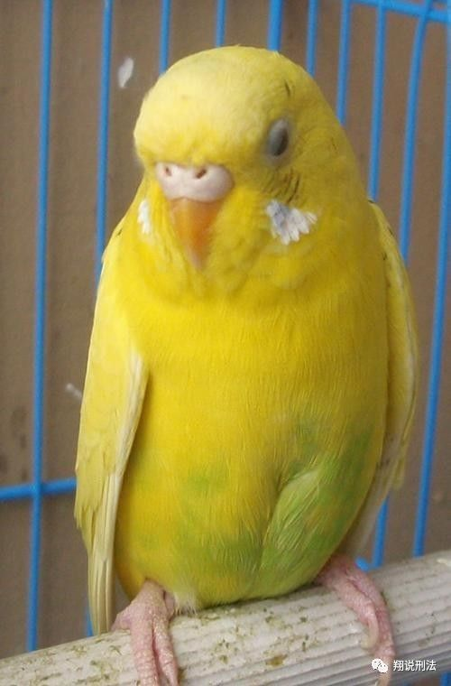
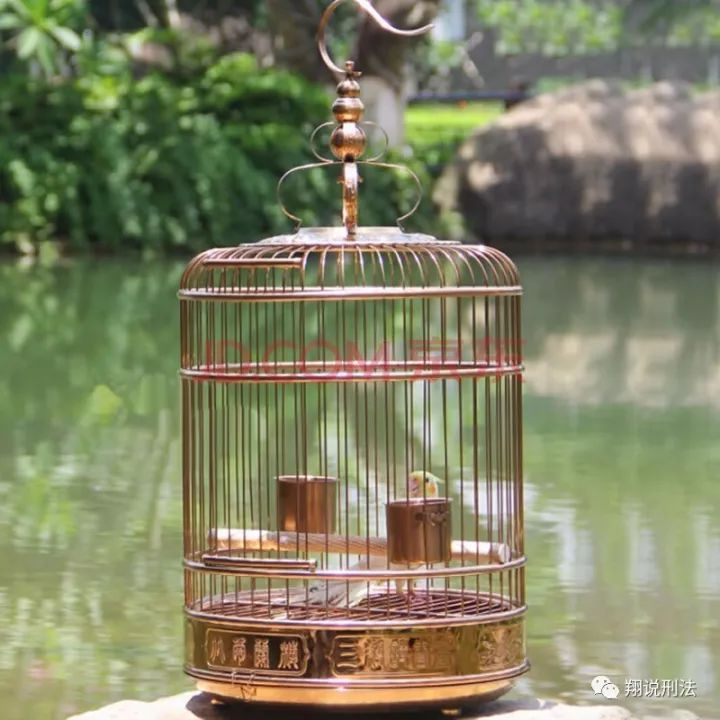
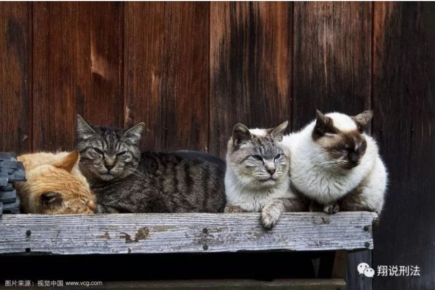
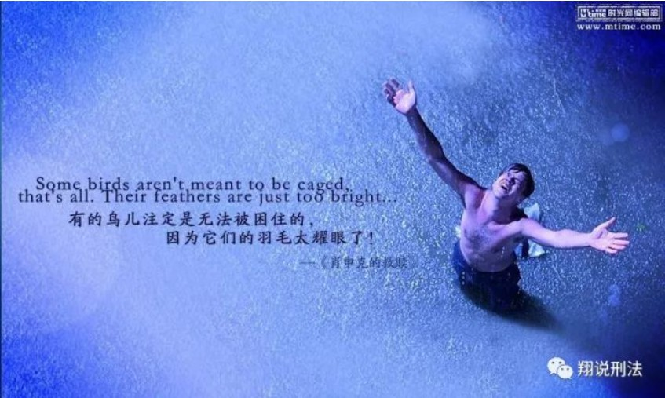

我曾经养过一只鹦鹉，后来这只鹦鹉越狱未遂，绝食而死。

这几天，因为一些讨论，我又想起了这只鹦鹉。

鹦鹉名叫“小米”，纯黄色，小巧秀丽，是一只非常普通的虎皮鹦鹉，卑贱不值钱，不会说话，生来就是做宠物的。它本是邻居所养，但后来邻居家又养了一只猫，添了一只狗，所以把这只鸟送给我。同时还搭送了一个鸟笼。

我觉得这种普通的竹制鸟笼太小太俗气，于是花了一百多块钱买了一只仿铜的大鸟笼。让小米从逼仄的“一居室”搬到了“大两居”。每天我会给它喂食，清理，有时还会给它吃有机的小米。它应该很喜欢我，每次我看书喝茶的时候，小米都会蹦蹦跳跳，叽叽咂咂。

一天午休的时候，我突然听到客厅里有很大的动静，扑哧扑哧的响动声，时断时续。不会是进了一只大虫子吧？我从床上一跃而起，走到客厅。吓我一跳，原来小米飞了出来。

我尝试抓住它。虽然在一个密闭的环境，但是想要捉住一只会飞的小鸟，还是很不容易。我越想捉住它，它越是拼命躲闪扑腾。后来，小米飞累了，掉在客厅的角落。我轻轻地把它捡起来，不料它用沟子一般的鸟嘴狠狠地咬住我的手，差点咬出血来。

我把小米重新放进鸟笼，然后仔细检查了一番。发现鸟笼顶端的格子太大，小米很可能是从这钻出来的。于是，我在顶部的格子上又缠了许多铜线。心想，这下它肯定逃不出来了。

后来小米居然又两次飞了出来，有一次还是半夜。

但是，最后都被我抓了回去。

从小米第一次飞出鸟笼，我明显发现一个变化，那就是它不怎么吃东西了。无论我怎么逗它，它好像都失去了往日的光彩。它每天最常见的举动就是不断地用头往每一个格子中钻，试图再次飞跃牢笼。

**我真的想把它放了。因为我知道，一个品尝过自由滋味的小鸟，你再也无法把它关在笼中。**

但是，我担心一旦把它放飞，它很难存活。它可生来就是宠物，从未在自然环境中生活。外面那么的危险，小区里光流浪猫就有数十只。

所以，我决定给它换一只鸟笼。

大鸟笼不适合它，处处都有越狱的机会。

以前那只鸟笼已经被我扔了，所以我又在淘宝上订了一个新的竹制小鸟笼。三天后到。

为了防止小米在这期间逃跑，我用塑料袋把鸟笼包了起来，只在鸟笼的最上部挖了几个透气的小洞。但是，小米居然把塑料袋都给啄破了。于是，除了透气孔以外，其他所有的地方我都用浴巾把鸟笼包住。

小米被关进了小黑屋，这下它是绝对飞不出去了。

每天我会两次给小米喂食换水，但是它根本不吃不喝。

当新鸟笼送来的那一天，小米死了。

我很难过，也很后悔，后悔当时没有放飞小米。

我时常想起小米，因为这个小小的生灵告诉我，自由比安全更可贵。

大学期间，有两部影片我非常喜欢，看过多遍。一部是《勇敢的心》，一部是《肖申克的救赎》。在我看来，这两部影片比绝大多数法学专著都要重要。

我经常想起《勇敢的心》结尾时主人公临刑前呐喊：“Freedom！”这个呐喊时常提醒我人生的意义。而《肖申克的救赎》中的经典对白更是让我泪流满面：有些鸟儿是永远关不住的，因为它们的每一片羽翼上都沾满了自由的光辉！

纪念这只追求自由的鹦鹉！
