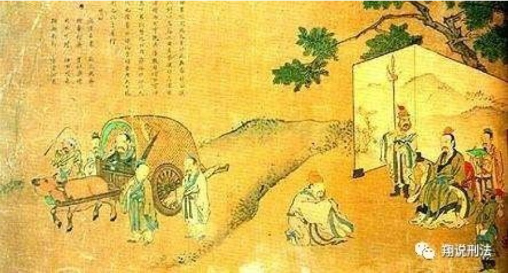
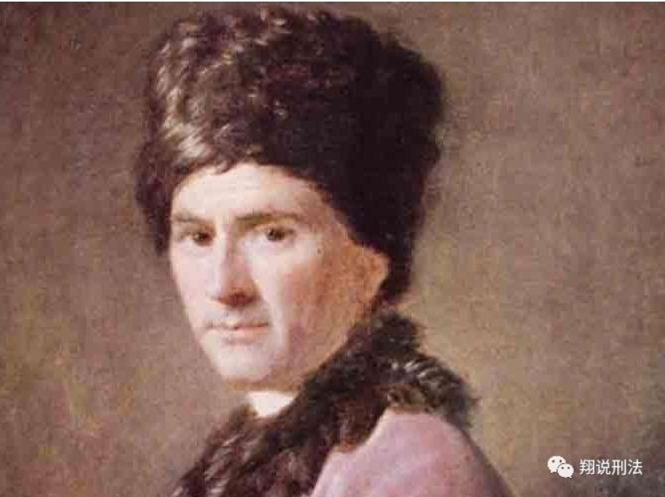
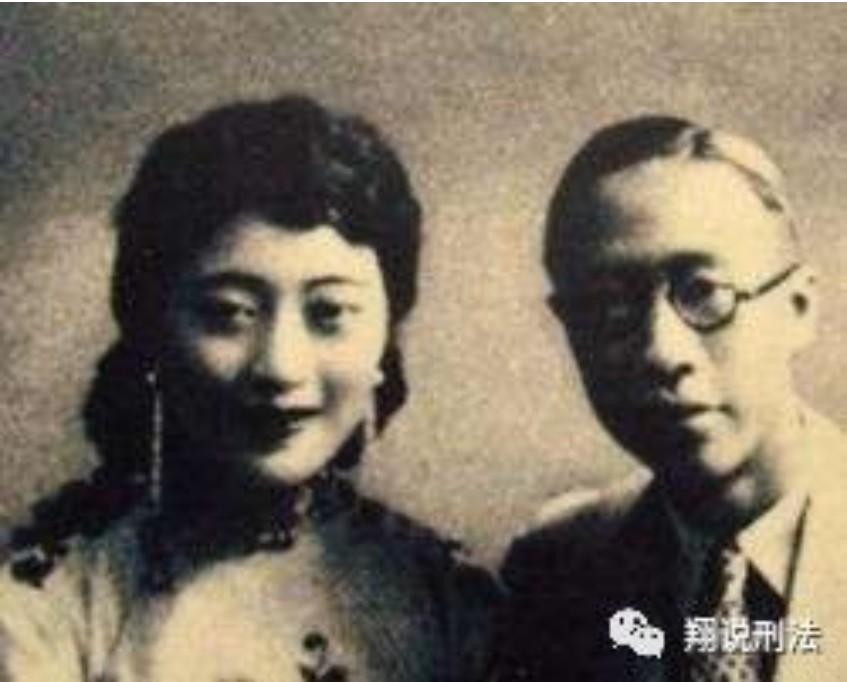

五仁月饼好吃，还是蛋黄月饼好吃？

国产片好看，还是美国片好看？

北大好，还是清华棒？

在网络上，只要你放置两组看似对立的观点，人们很快就会站队。

一开始只是温和的断言：

“五仁月饼好”

“我喜欢吃蛋黄月饼”

┄┄

但很快语言就会变得激烈，剑拔弩张，一言不合，立马开撕。

“当然是国产片好”

“美国片比国产片好一百倍”

“美狗才看好莱坞”

“土鳖才看国产片”

┄┄

“北大好”

“清华好”

“北大的月亮都比清华圆”

“呸！清华的狗都比北大的人有学问”

┄┄

如果有人超然一点，很可能会受到两派共同的指责。

“没在清北读过书，别说话。”

“没人把你当哑巴，滚”

 

**人的本性喜好拉帮结派，互拉仇恨，其中的根源在于人的自恋。**

当生命中缺乏一个终极的敬仰对象，人就不可避免地会把自己置于生命中最重要的地位，形成无法抑制的自恋。自恋让人总是自觉优越：或是出生的优越、种族的优越、或是智力的优越、知识的优越，或是财富的优越，阶层的优越、或是地域的优越，口音的优越、甚至是道德的优越、宗教的优越。正是这种自我的优越感使得人类冲突不断。无论是儒家的华夷之辨，满清的非我族类其心必异，本质上都是人类自恋的产物。

**自恋让人很容易发现并放大他人的问题，但却很少会反思自己也犯着相同的问题。** “为什麽看见你弟兄眼中有刺，却不想自己眼中有梁木呢？”我们很容易记起近代史的屈辱与伤害，但很少愿意思考我们曾经对外族，甚至是同胞犯下的同样罪过。

**自恋让人充满着对他人的利用，所有的人际交往都只是在满足自我的需要。** 如果他人不再有利用价值，人的爱也就会消失殆尽。人的天性是忘恩负义的，我们很容易记住对他人的恩惠，却很容易忘记他人对自己的恩情。

**自恋让人缺乏安全感。** 人知道自己的有限，无法主宰未来，但自恋让人靠不断的自我提升来对抗对未来的焦虑。但是，不断的自我成功，带来的却是更大的不安全感，以及对同类更深的敌意。人们总是在贪图虚名，互相嫉妒。在人的眼中，每个人都是他潜在的竞争对象，没有朋友，只有敌人。

正是自恋，让人与人之间，充满着仇恨。仇恨带来恐惧，恐惧又带来更多的仇恨。

恐惧让人选择结盟，盟友都是具有相同优越感的人，比如共同的出生，共同的种族，共同的国别。“人以群分，物以类聚”，盟友在对抗其他群体中，获得了短暂的安全，并让优越感得以强化，通过对敌人的同仇敌忾深化了盟友的自我优越感。

然而，这种安全极不稳定。一方面，结盟会让群体的冲突加大，产生更大的仇恨；另一方面，人自恋与仇恨的天性也会在盟友内部形成新的派别，新的冲突，新的仇恨。一个仇恨异族的人，也一定会在本族中分门别类，造成争端，人的本性就是如此，习惯拉帮结派，彼此为敌。

**仇恨是爱的缺失，是一种无望的虚空，唯有真正的爱可以填满这种虚空。** 我们这个民族习惯了仇恨，每天电视中充斥的抗日剧，宫廷剧，不断强化着这个民族对外对内的仇恨意识。人们根本不知何为“爱”。我们从小被教导的就是“世上没有无缘无故的爱，也没有无缘无故的恨”，人所定义的“爱”与仇恨只是一线之隔，“对待同志要像春天般温暖，对待敌人要像秋风扫落叶”。“爱”在很多时候，成为了放纵、堕落与伤害的遮羞布。

有人说，这个世界上最大的贫穷就是爱的缺乏。一个缺乏爱的人生活在自私自利的地狱中，而一个充满爱的人却生活在天堂里。

因为自恋，我们一贫如洗。

只有真正的爱才能让人走出自恋。

但这并不容易，因为世界上最远的距离就是知道和做到。

**爱不是爱抽象的概念，而是爱具体的人，** 不是爱“人类”，而是爱“人”。有许多伟大的知识分子都非常爱人类，但他们却很难爱真正具体的人。有一个叫卢梭的人，曾经写过《论人类不平等的起源》，据说他一想到人类的苦难就会伤心落泪。但他却把自己的四个孩子送往孤儿院。他太忙了，忙着爱人类，而没有时间去爱具体的人。

爱人类，不爱具体的人，是很多文人的通病。人类是抽象的，并无具体的对象，无需投入真心，收放自如，还可以为自己赢得道德上的优越感，但具体的人总是有那么多的问题，总是那么的不可爱的。爱是要付出代价，恒久忍耐的。当年，弘一法师李叔同抛弃妻女，在虎跑寺出家为僧，他的日本妻子抱着女儿到虎跑寺找他，弘一法师拒而不见，大雨滂沱中，这位日本女子抱着年幼的孩子痛哭，对李叔同说“你有爱天下人的大爱，唯独没有对我们母女的爱。”是的，真正的爱永远是对具体个人的爱。

有趣的是，在生活中的很多环节，我们好像都会碰到一些“对头”。在学校中总有人和你不对付，在单位里也有人老和你唱对台戏。这往往让我们非常生气。但在某种意义上，这正是环境在训练我们的爱心，因为真正的爱从来都是对不可爱之人的爱。

可爱之人，人皆爱之，这种爱不过是自恋的一种表现形式。你欣赏他人的可爱之处，你不过是把对自己的爱投放在了他人的身上。然而，只有当你在不可爱之人中看到值得爱的地方，你才能慢慢地走出自恋。

有时看到别人对我的批评，尤其是无理的指责，我也非常生气。但这个时候总有声音在提醒我，批评可以戳破人自恋的幻像，给人虚荣的气球放放气，让人不至飘到无边的高处。在坚实的地面中，人才能有真实的生活。

 

**走出自恋，走出仇恨，成为一个真正富裕的人。**

（写作本文，是想安慰一位在外地交换的同学。那位同学受到本地生的排挤，非常难受。但是真正可怜的，其实是那位排挤他人的本地学生，他的自恋和偏见让其一贫如洗。）