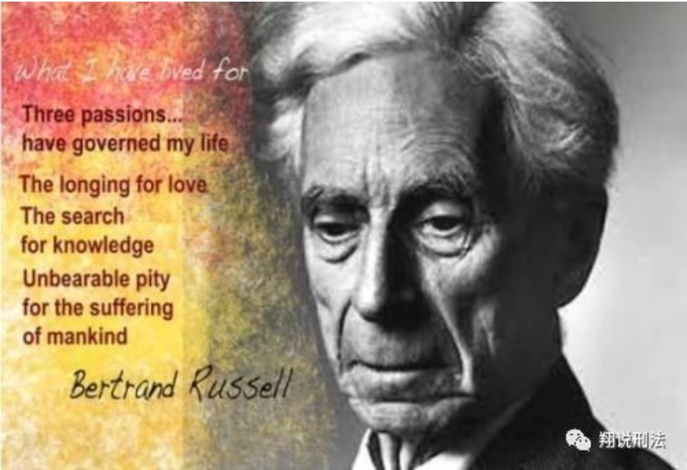
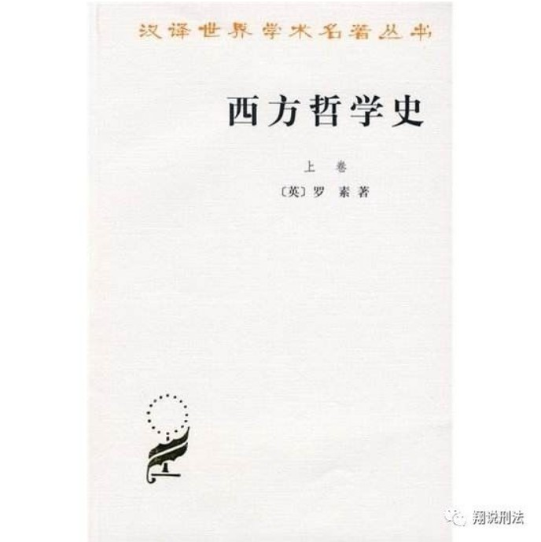
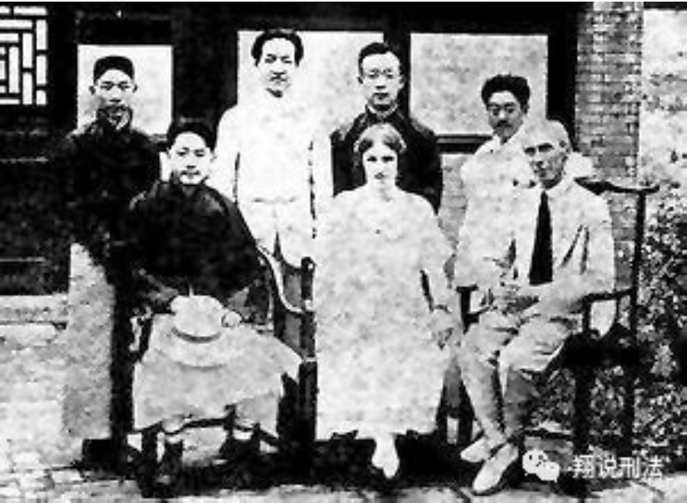

## 狂人罗大拿的故事

今天要讲一个罗姓大拿的故事，狂人中的狂人。

大拿当然不是我，他的名字叫做罗伯特·罗素。

罗姓的大人物还真是不少，像罗伯斯庇尔、罗尔斯、罗伯特·李等等，找机会以后都可以聊聊。

说起罗素，估计无人不知。他是英国著名的哲学家、数学家，1950年被授予诺贝尔文学奖。（非常有趣的是，诺贝尔奖项中不包括哲学奖和数学奖，所以有不少伟大的哲学家获得都是诺贝尔文学奖，比如罗素同时代的法国大哲学家伯格森）

从很多角度来说，罗素都是成功人士中的成功人士。

罗素出生豪门，他的祖父是第一代罗素伯爵，曾两次出任英国首相，被维多利亚女王封为伯爵。罗素的父母思想进步，但是颇有争议。但是，两岁的时候，年幼的罗素就失去了母亲与姐姐，两年后他的父亲也撒手人寰。罗素的父母在遗嘱中委托一些自由的思想家，比如约翰·穆勒抚育他的孩子。但最终养育罗素的还是他思想保守的祖父母。

罗素一生著述等身。他可能是活的最长的哲学家之一（1872-1970），在世存活近百年。在其漫长的一生中，著述等身。据不完全统计，他至少有68种著作。所涉学科之广，令人咋舌。除此以外，他还在报刊杂志上发表了大量的文章，几乎包含你所能想象到的所有的话题：比如唇膏的用法，旅游的礼仪，雪茄的选择等等。

罗素酷爱写作。据说一个最大的原因在于他发现写作于他易如反掌，而且可以靠此获得丰厚的收入。他每天清晨要出去独自散步一个小时，构思出一天所要写的东西，回来之后用早上余下的时间进行写作。他下笔非常轻松愉快，没有丝毫的修改。这种令其惬意的活动也为其带来了巨大的经济收入，他把每一笔发表的作品和在电台上说节目的酬金都一一记上小笔记本上，放在贴身的口袋里面，不时拿出来看看，并称之为最有益的消遣。

罗素也是一位世界级的导师。几乎对所有的重大问题向人类发表意见。比如中国问题、美苏关系，核裁军，和平主义，性道德等等等等。“五四”运动之后罗素应梁启超之邀来中国讲学，给中国留下著名的五大演讲，后来集结出版，名曰《中国问题》。当然罗素最后对中国之行非常的失望。上个世纪对于全世界的大多数人而言，罗素几乎成了哲学家的典范。哲学是什么？人们的回答是：就是罗素口中所谈的那些事。

你羡慕罗素的一生吗？

**说实话，我不羡慕。很多时候，我把他当成人生的反面教员。**

有人曾问罗素:「人生的意义为何？」

他觉得这个问题毫无意义，非常无聊。

在他的自传中，他认为自己之所以活着，有三个动力：**对爱情的渴望，对知识的追求，对人类苦难不可遏制的同情心。**
然而，我看到的却是一个极其自恋，极其空虚的可怜生命。

**对爱情的渴望，让罗素处处留情。** 罗素结过四次婚，一生绯闻不断，当时纽约城市大学以其道德不胜任教职将其解聘。罗素认为道德的束缚是人类不幸的根源。罗素的爱充满着对他人的利用，他爱的只是自己。他的空虚需要从一个女人又一个的女人身上获得满足，但却永远无法满足。

罗素1950年获得诺贝尔文学奖，获奖作品为《婚姻和道德》。获奖词中，称赞其“为人类的道德文化做出了贡献。”搞笑的是，在婚姻和私生活上，罗素恰恰抛弃了道德，从没有放弃过任何机会染指遇见的任何一个女人。甚至包括他的学生，1948年诺贝尔文学奖获得者诗人艾略特的妻子。除了数不清的情妇以外，罗素的受害者们还包括大量身份卑微的人：家庭女仆、保姆，或是经过屋子的随便哪位年轻、漂亮的女性。罗素的研究者说他有充分的证据证明罗素不顾高龄，仍在追逐他遇到的每一个穿裙子的人，他干这类事臭名远扬，甚至与年轻女仆，还不是背着妻子，而是就在她的眼前，当着哪些他屋里客人的面。（约翰逊：《知识分子》，p287）

**对知识的渴望，让罗素著述等身，但知识带给他是更多的骄傲，更多的自恋。** 知识常常让人自高自大，罗素可谓一个典范。因为知识，罗素觉得可以对人类的一切事物说话。在20世纪60年代，罗素的伦敦总部变得像一个微型的外交部，他发过不计其数的信件和电报给各国总理和国家首脑，包括中国的毛泽东和周恩来、苏联的赫鲁晓夫、埃及的纳赛尔、印尼的苏加诺等等，当这些信件越来越长，越来越频繁，没有节制时，他收到的回复也就越来越少，这就往往让他怒火中烧。

罗素是一位好斗的勇士，“与天斗,其乐无穷!与地斗,其乐无穷!与人斗,其乐无穷!” 他几乎批评他本人以外的一切人。当他被激怒时，他对不赞同自己观点的人义愤填膺，凭一时之冲动脱口就骂，很多时候指控毫无逻辑，完全忘记他本是“逻辑大师”。二战后，他认为苏联和纳粹一样坏，甚至比纳粹还要坏。但是没过多久，他又不再反苏，开始反美。他就核裁军问题同时去信给赫鲁晓夫和艾森豪威尔，收到前者的亲笔回信，但是没有收到后者的回信，于是他变得极端反美。他认为肯尼迪比希特勒大概坏50倍，肯尼迪和麦克米伦（当时的英国首相）是人类有史以来最邪恶的人┄┄

**对人类苦难不可遏制的同情心，让罗素不停的从事社会活动。** 但他爱的是抽象的人，而非具体的人。这是所有人文主义者的通病，爱人类，不爱具体的人。因为人类是抽象的，是完美的，并无具体的针对对象，无需投入真心，收放自如，还可以为自己赢得道德上的优越感，但具体的人总是有那么多的问题，总是那么的不可爱的。一个人越爱抽象的人类，越是无法爱具体的人。

尽管罗素热爱民众，并为他们的苦难而痛苦，但他依旧远离他们，因为他身上有贵族气质，同普通人缺乏联系。罗素养尊处优惯了，很少有比罗素更远离社会现实的人，他几乎不会操作最简单的机器装置，也不会从事任何日常事务，即便再娇生惯养的人也不可能像罗素那样缺乏基本的生活技能。他爱喝茶，却不会煮茶，当他的第三个妻子皮特不得不外出时，她要在厨房的石板上留言，告诉罗素如何烧水煮茶：“提起炊具上的衬垫，把壶放到加热板上，然后等水开，然后把水从水壶倒在茶壶里”。但是，在这般详细的提示之下，罗素还是失败了。

罗素主张人人平等，但是他从未放弃过自己伯爵的头衔。尤其当这种头衔能够为他带来好处时。罗素也主张男女平等。他认为男女都应该有完全的性自由，他严厉批评了当作传统美德流传的清规戒律以及人类自我牺牲的种种理论。但这种鼓吹女性解放的女权主义论调，似乎给了罗素更大的自由去沾花惹草。

有一部美国法学院学生的必看片《魔鬼代言人》。在影片的结尾，魔鬼说了一句意味深长的话“虚荣，无疑是我最爱的罪。”这句话也许可以作为罗素一生的总结。

**罗素的人生，你羡慕吗？**

