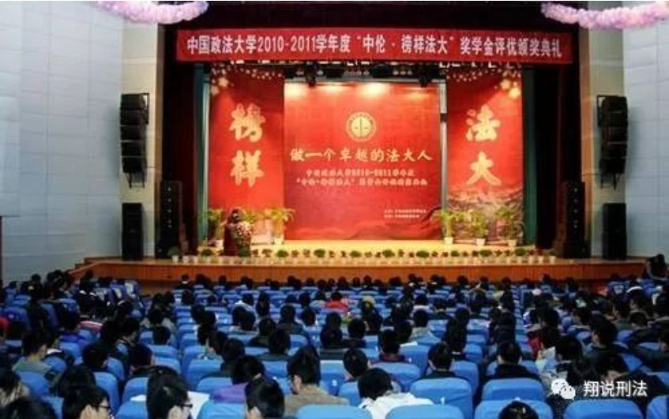
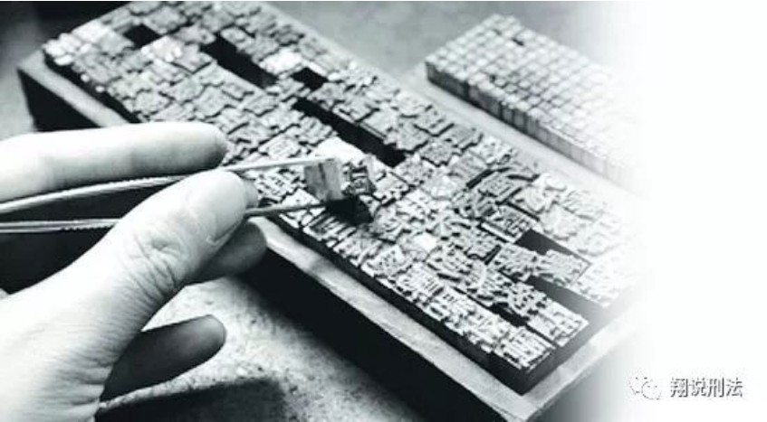
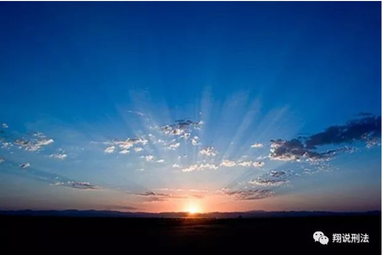

各位同学、各位老师，大家晚上好：

作为教师代表在此发言，我感到非常荣幸，也非常惶恐。我似乎回到我的大学时光。那时，每次颁奖典礼，我总是坐在礼堂的角落，看台上星光灿烂，心里暗自神伤，心想自己何日也能得到荣誉。所以，见到各位这么多的榜样，我有点感慨自己学生年代的庸碌无为。

关于榜样，我有三点体会和大家分享。

**首先，我想对没有获奖的同学说，榜样是可以复制的。** 在中文中，还有一个词和“榜样”读音类似，叫做“版样”。我是湖南人，区分不了前后鼻音。所以，在我看来，两者都是一样的。版样就是印刷的模板，比如印钞票，就需要一个货币的“版样”。无论是作为人们效仿的“榜样”，还是印刷钞票的“版样”，它们的性质都是一样的，都具有可复制性，可以批量生产。如果一个榜样，不能复制，那他只可能是天才或者奇迹。中央电视台每年都会搞一个十大经济人物的评比。当然，很多人物评出来之后就被抓了。而每年选出来的，不是达官显贵，就是公主贝勒，这可能就不是榜样，因为它的复制性不强。如果大家哪天可以选上，那可能就是奇迹了。当然，有时候，奇迹还是会出现的。至于你信不信，反正我是信了。

所以，对于没有成为榜样的同学们而言，不要灰心，也不要像我当年那样暗自神伤，羡慕嫉妒恨。你要相信，这些榜样都是可以复制的，只要你努力，明年你也是榜样。

**其次，我想对获奖的同学说，榜样是必然会腐朽的。** 无论是“榜”，还是“样”，它都是“木”字旁，这提醒我们，榜样是会朽坏的。无论是何种“榜样”，何种“楷模”，它都如草上之花，草必枯干，花必凋败。也许是给各位泼凉水，今天在颁奖晚会上，你获得了表彰，你感到非常开心，但这种幸福感，不久就会消失，也许明天早上一起床，这种幸福感就没了，有的只是空虚。

那么，如何让这种幸福感持续呢？有人会说，我要加倍努力，争取获得更多的荣誉，不再满足于榜样法大，要成为榜样中国，榜样世界，不断追求荣誉的高峰。但往往这样的人却容易摔的粉身碎骨。

让幸福感持续的唯一方法就是以感恩的心、谦卑的心接受一切成功与失败。

同学们获得荣誉，要感谢很多人。写出优秀的学术论文，要感谢图书馆的丰富资料，感谢食堂的饭菜没有地沟油、瘦肉精，感谢你宿舍的同学在睡觉时还忍受你敲击键盘的声音，甚至要感谢和你发生口角，进而动粗的同学，他让你灵机一动，想出了这样的选题：激情状态与刑事责任。

但是，你唯一不能感谢的，就是你自己。如果你认为是你自己的才干、智慧让你获得了成功，那你注定不会幸福。因为这样的你在成功时，你会目空一切，狂妄自大，在得意中自我毁灭；在失败时，你会自怨自艾，愤怒嫉妒，甚至自寻短见。

**一个朋友说，一瓶饮料，便利店里3块，饭店30块。一个人的价值取决于他所在的位置。我认为这是错误的：一个人的价值在于他处于高位，成为了三十元的水，而他自知自己本就是便利店的三元水。**

**最后，我想对所有的人说。真正的榜样不在这台上，它在我们的内心，也就是我们与生俱来的道德良知。** 良知才是最好的榜样。法律要追求公平和正义，而良知也是公平和正义的尺度。

顺从良知的呼召，做一个真实的人，无论在顺境和困境，都能彰显人性的光辉，克制人性的幽暗，一个行在光明之中的光明之子，才是真正的榜样。

一个卓越的法大人，并不取决于你的知识、财富、官职，而取决于你是否坚守了良知的底线。

（偶然翻到本人2011年某次颁奖典礼的致辞。这周不想写新东西，拿这个东西凑数吧！现场听过这个致辞的，估计现在很多都事业有成，不知是否还在继续向真正的榜样学习。）