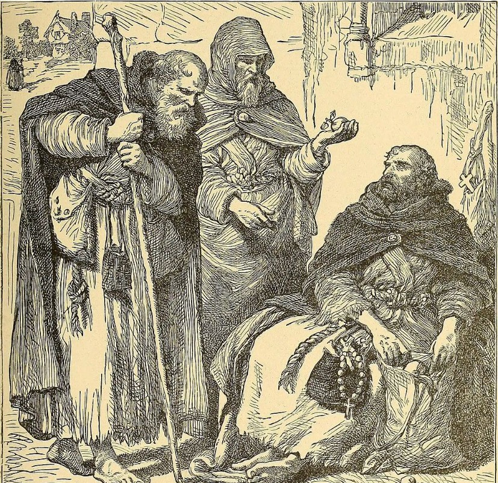
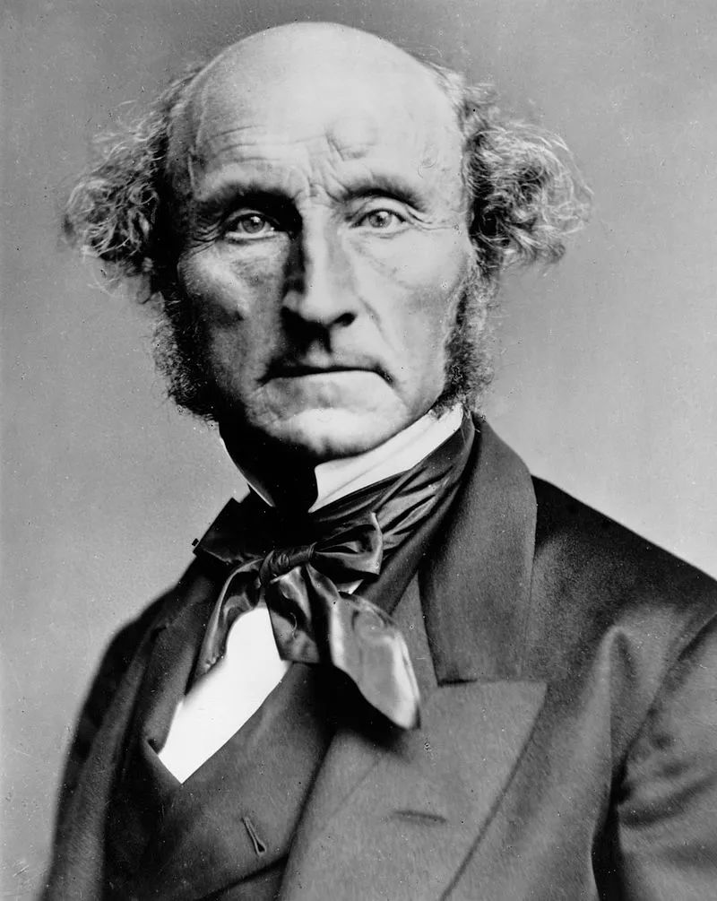
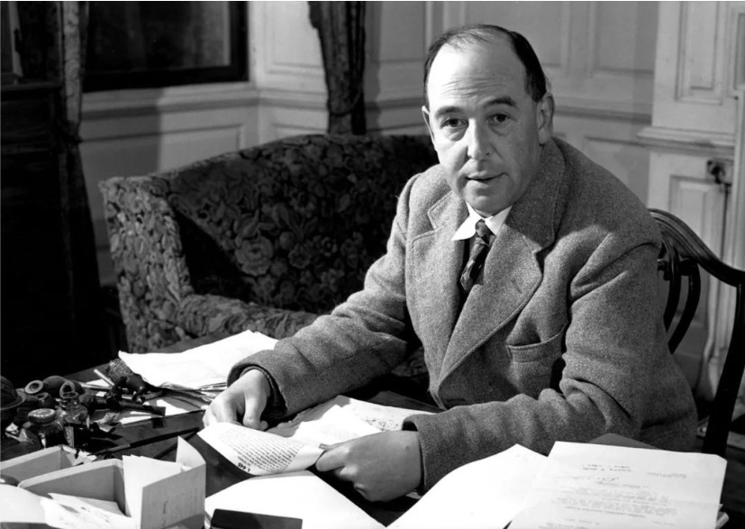

大家好，现在还是正月，祝大家新年顺利。

今年是牛年，估计大家收到很多“牛气冲天”“牛牛牛”的拜年祝福，其实和牛有关的词语非常多，很多都带有美好的寓意，但我想到的是另两个词：**汗牛充栋和对牛弹琴**。

汗牛充栋形容一个人藏书非常多，用牛运书，牛要累得出汗；用屋子放书，要堆到屋顶。我希望大家不仅能够买书藏书，也能够静下心来读书。只要我们不断地阅读，就能慢慢走出对牛弹琴的浅薄时代。

说到牛年，我就想起了中国政法大学校园里的标志性雕塑，除了我提过的“法治天下”碑，还有一座就是“**拓荒牛**”。

学生们经常约定在“牛前见”，我也写过一篇文章叫《做法治的笨牛》，作为《刑法罗盘》的前言。

“笨拙”算得上是牛的特点，看到拓荒牛雕像，我就想起了历史上一位与牛有关的先哲——托马斯·阿奎那（1225—1274），是自然法思想的倡导者，也是经院主义哲学的代表人物。

阿奎那长得就像头牛，身材跟葡萄酒桶差不多，步履蹒跚，笨重如牛。他上学时非常沉默，很少说话，有的时候会目无表情地发呆，神情恍惚，所以有“笨牛”的绰号。

当然阿奎那在智力上并不笨，能够真正理解所读过的每一页书，但是在很多方面确实跟牛一样“蠢”，死脑筋，不懂变通。

有一次有同学说，窗外有一只会飞的牛。阿奎那马上跑到窗边去看，结果并没有看到会飞的牛。**全班同学哄笑，取笑阿奎那的愚蠢，牛怎么会飞呢！阿奎那却说，相比于会飞的牛和同学的欺骗，后者更让人感到可笑和荒谬，自己宁愿相信牛会飞，也不愿意相信同学朋友会欺骗自己。**

 “蠢笨如牛”的阿奎那出生于意大利南部的名门望族，他的堂兄曾是神圣罗马帝国的皇帝，所以阿奎那是当之无愧的贵族。他的父亲兰德尔夫伯爵觉得阿奎那很笨，生性木讷不爱说话，所以对他期望不高，只希望他长大后能做个修道院的院长，好与家族地位相匹配。

但是有一天，年轻的阿奎那居然跑回父亲的城堡，平静地对父亲说，他决定做一名乞讨的托钵修士，成为新成立的多明我会中的一员，誓愿追求贫穷和简单的生活。父亲大动肝火，这也难怪，阿奎那的这个决定即便在当时看来，也是令人难以置信甚至骇人听闻。

他坚持要做托钵修士，不愿做普通的修士，不愿成为一名重要或杰出的修士，更不愿成为修道院的院长，他放弃了所有的雄心壮志，只愿成为层次最低的托钵修士。

整个家族都非常生气，认为这种离经叛道的行为是对家族荣耀和自身阶层的背叛。

当阿奎那和他的乞讨同行们前往巴黎时，路上却遭遇绑匪劫持。有谁会劫持一个以乞讨为生的修士呢？绑匪原来是他的两个哥哥，他们把阿奎那的修士袍撕成碎片，不容分辩地把阿奎那囚禁在城堡的高塔中。

哥哥们无法理解弟弟的行为，认为他誓愿绝对贫穷是对家族荣耀和自身阶层的背叛。事实上，阿奎那的“离经叛道”之举严重伤害了整个家族的骄傲。

阿奎那平静地接受了被囚禁的事实，历史记载他在绝大多数的时候像一尊石像一样被抬来抬去。在被囚期间，只有一次他表达了自己的强烈愤怒。这似乎是他这一生第一次也是最后一次发怒。

他的兄弟将一位妖娆的性工作者带进他的房间，想用肉体的欲望让弟弟屈服，或者至少制造一些绯闻。用当时甚至今天的道德标准来看，兄弟们的行为是卑鄙下作的，难怪阿奎那会认为这是对自己的极大侮辱。哥哥当然也知道这样做是对弟弟的侮辱，因为他们觉得弟弟会因为肉欲而放弃自己所起的誓言。

据说，当时身体笨拙的阿奎那从椅子上一跳而起，抄起火红的一块烙铁，像剑一样地挥舞起来，像一头疯牛一样把人都吓跑了。阿奎那关上房门，按照当时特有的习俗，他用烧红的烙铁在门上烫出一个黑色的十字架，然后重新坐到书桌上，并许下三个誓愿——贫穷、独身和顺从，让他把低级的身体欲望所产生的能量，转化成高级的思想目标，在他看来，思考比喝酒更让人沉醉。正如切斯特顿在阿奎那的传记中描述的那样，“在他思想的熔炉中，欲望几乎退去”。

阿奎那从不藐视身体的欲望，他对于物质生活也持积极肯定的态度。他甚至认为人的生活需要幽默，甚至需要一些恶作剧。如果说禁欲主义有悲观和乐观的区分，阿奎那显然属于后者。悲观主义的禁欲主义者因为对生活的憎恨而把自己折磨致死，其用意不是控制自然，而是尽可能地与自然作对。

但是，**乐观主义的禁欲主义从不放弃生活，但却因为某种更崇高的乐趣而能轻看今生。因为“今生活着的唯一的目的就是超越今生”。** 阿奎那是一位当之无愧的“圣徒”。切斯特顿说，“圣徒”跟普通人不一样的地方在于他愿意做一个普通人。“圣徒”早就超越了出人头地的愿望，正是这种不愿意出人头地的心态使他们卓尔不群。

六百年后的约翰·穆勒认为快乐有质和量的区别，越是体现人尊严的快乐越是能给人带来最大的快乐，我想其一定是从阿奎那的作品中汲取了灵感。

约翰·穆勒，19世纪英国著名哲学家，其著作《论自由》是古典自由主义集大成之作

阿奎那用对永恒的超验追求平息了斯多葛学派（德性主义）和伊壁鸠鲁学派（功利主义）的争论，也让后世的道德主义（如康德）和功利主义（如穆勒）可以走向合一——因着对永恒的盼望，人有力量坚守道德，因为这体现着人的尊严，也能给人带来最大的快乐。

现在的我们充斥着各种各样的欲望，金钱的欲望，情感的欲望，大家不妨想一想，你的欲望是太弱还是太强？

C.S.路易斯说，世人的欲望经常不是太强，而是太弱了，我们是三心二意的受造物，当无限的快乐摆在我们面前，我们却在酒色名利中胡闹鬼混。我们就像无知的小孩，当有人为他提供了去海边度假的机会时，他却仍然想要不停地在贫民窟中玩泥巴，因为他无法想象在海边游玩意味着什么，我们太容易满足。

**人们经常批判功利主义的结果导向，但是结果导向并不一定是错误的。**

有两种不同的结果导向：第一种是结果与事物之间没有自然的联系，它与该事物本应伴随的渴慕感无关。例如金钱与爱情，金钱并非爱情的自然结果，男人娶妻若只为对方的钱财，则是不道德的结果导向。

第二种则是结果与事物之间存在自然的联系，如婚姻就是真爱自然而然的结果，如果坠入爱河的男女双方渴望结婚，这种结果导向当然是合理的。**自然的结果并不仅仅是某种行为的添加物，行为走向完美本身就是自然的结果。**

因此，根据行为本身的属性去追求行为自然的结果既是道德的也是功利的，可谓道德的功利主义。如果大家在我的分享中感受到法治是重要的志业，那么我也想跟大家一起根据法治的属性来追求它自然的结果，而不能以法治之名追求其他的结果。

从诞生之日，法治就是为了约束权力，法律人的使命不是为了权力的垂青，不是为了群众的掌声，更不是为了一己的虚荣。

这就是为什么阿奎那在今天依然那么重要，因为阿奎那恢复了自然法的光彩，在他看来自然法有其独立的地位，因为自然法是人类理智尽善尽美的结晶，它无限地接近永恒的神圣之法。

人定法必须与自然法相一致，如果法律失去了公正，就不再是法律。凡违背自然法的法律皆非法律，而对于“恶法”人民没有服从的义务。阿奎那用法律来尊重权威，但也用法律来保障权威不至沦为专制。法律并非权力任意操控的工具，它要追求永恒的公义，绝不能唯权力马首是瞻。

阿奎那是一位13世纪的哲人，也是一位现代性的思想家。**切斯特顿说，所有向往良善之人都应该受到阿奎那的吸引，因为他的视野既是自由的，又是人文的。** 前者指向人的思想固有的自由，后者则强调人的身体固有的尊严。如果忽视这两点，灾难就不可避免。20世纪无数次战争与劫难一而再再而三地证明了这个论断。

如果法律没有对自然法的向往，没有对公正的渴望，不能约束权力，而沦为一种工具，那法律就失去了意义，没有存在的价值。每当我看到学校中心的那尊拓荒牛的雕像，我就想起了不懂变通的“笨牛”阿奎那。

他的话语始终在我心中萦绕：我们今生活着的唯一目的就是为了超越今生。

**这个世界有很多聪明人，但是真正能够改变世界的往往是那些看起来比较笨的人** ，除了阿奎那，过年期间我还看了《曾国藩传》，知道了曾国藩也是比较笨的，他考秀才据说考了7次，他老爹考了16次，他们是考场父子兵。

智力跟智慧其实是两码事，有智力的人不一定有智慧。这个世界上有许许多多智力发达的人，却很愚蠢。而真正有智慧的人，也许就会像曾国藩、阿奎那一样，看起来比较笨，大智若愚、大巧若拙。

**“天下之至拙，能胜天下之至巧。”**

今年我想用这四个字与大家共勉：君子尚拙。

真心祝愿同学们能够拥有更多的高级快乐。