## 申辩篇

大家都知道苏格拉底有一句名言：**未经省察的人生没有价值**。

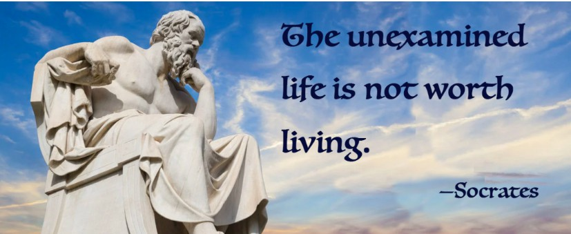

这句话正是出自柏拉图的《申辩篇》。公元前399年，70岁的苏格拉底被指控 *蛊惑青年，不信国教，崇奉新神*。在雅典城邦的广场上，苏格拉底对500名陪审员做出义正辞严的申辩，最终接受了死亡的判决，完成了自己作为雅典牛虻的使命，也留给我们一个永远思考不尽的哲学命题。

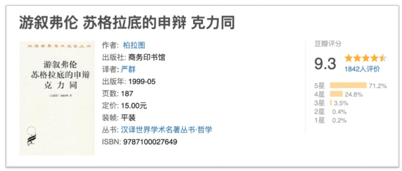

阅读《申辩篇》，能够了解苏格拉底至死捍卫的哲学生活，能更好地理解“未经省察的人生没有价值”这句话，也能够让我们触摸到有意义的生活。

《申辩篇》的内在逻辑十分清晰，可以分为三个部分：

> **第一部分是苏格拉底对非正式与正式指控的两波辩护。**
>
> **第二部分是在宣布有罪之后，苏格拉底提议的惩罚。**
>
> **第三部分是在宣判死刑之后，苏格拉底最后的陈述。**

### 1.非正式指控

在迈雷托士发起这次指控之前，苏格拉底早已遭受到很多人的控诉。这些控诉源自部分人的偏见，而当一个人接受了偏见，就会选择性地继续强化偏见，并把这种偏见传递给身边的人。这些人形成了第一批控告者，这种偏见也是迈雷托士控诉的依据和支撑。因此，苏格拉底选择从源头开始，清除人们的偏见。

**第一条控告：苏格拉底是无事忙的为非作恶的人，凡地下天上的一切无不钻研，能强词夺理，还把这些伎俩传授他人。**

这条指控认为苏格拉底是自然主义者，不断地探究天上地下的事情，用胡说八道的论证，驳倒大家公认的真理，并教给别人。当时的雅典人认为打雷等等自然现象是宙斯发怒的结果或受诸神的影响产生的，但自然主义者对传统观点发起挑战，用规律法则来解释自然事件，因此被认为是不虔诚的无神论者。

 

**第二条控告：听说（苏格拉底）教人，并且藉此得钱。**

这种指控认为苏格拉底善于狡辩，是游走各地，用智慧收费的智者学派。

在当时的雅典，有人要想当个政治家，一定要有良好的口才，所以这些人就向智者学派去学习雄辩术。智者学派能言善辩，可以就任何事展开辩论，但是他们不相信辩论的题目有任何意义，通俗来讲，他们的辩论只是一种技巧，并不借此寻求真理。我们通常说“真理越辩越明”，但是智者学派认为根本就不存在真理，所有的辩论都只是技巧的切磋，辩论任何题目都是为了取得胜利。

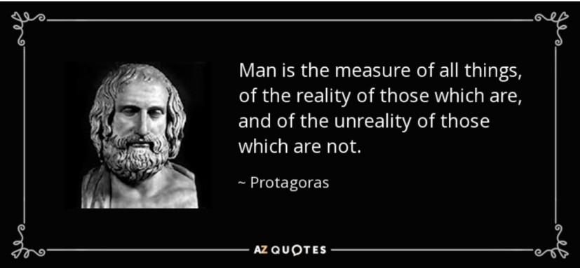

提出“**人是万物的尺度**”的普罗泰格拉就是一个典型的智者学派，他有一个著名的“半费之术”的官司：普罗泰格拉教学生如何打赢官司，但他允许学生先交一半学费，等学成后打赢第一场官司再交另一半。但有个学生迟迟不去打官司甚至不想去打官司。普罗泰格拉于是将他告上法庭，并说：不管你赢没有赢，你都需要偿还学费，因为如果法官判你输，那你应该遵守判决，补齐学费；如果法官判你赢，那根据我们的约定，你打赢了第一场官司，所以也需要补齐学费。

而学生却回答道：不管我赢没有赢，我都不需要偿还学费，因为如果法官判我输，那按照我们的约定，我没有赢得第一场官司，便不用补齐学费；如果法官判我赢，那遵从判决，我就不需要补齐学费。

不难看出，智者学派近似当前的相对主义者，不承认矛盾律的存在，不承认真理的存在，宣称关于任何事都有两面自相矛盾的论证。所以只要符合自己的需求，他们能够把黑的辩成白的，可以说一条狗既是狗也不是狗。

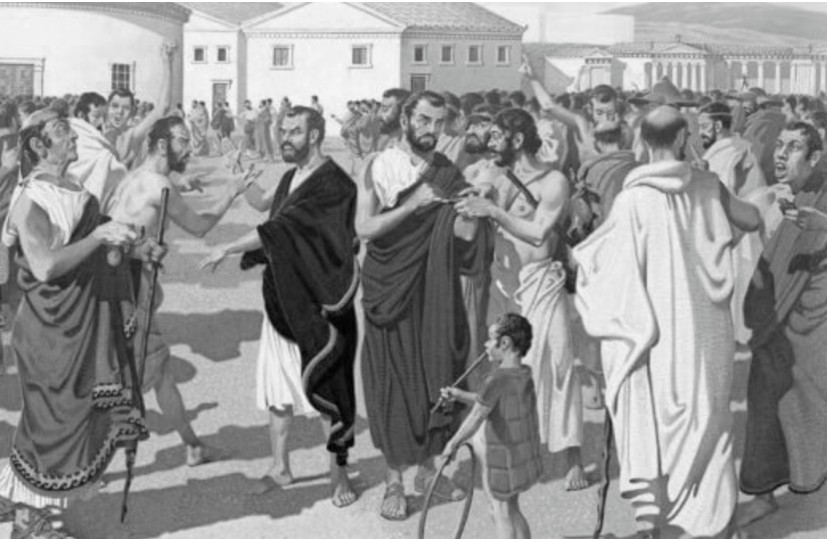

针对说自己是自然主义者和智者学派的指控，苏格拉底辩护称这完全是污蔑，自己对自然主义者关心的各种事情根本不感兴趣，同时认为世界上是有真理的，更为重要的是自己传授知识从来不收钱，贫穷就是最好的证明。

**那么，对苏格拉底的名声和污蔑都是从何而来呢？**

*雅典人啊，我无非由于某种智慧而得此不虞之誉。何种智慧？也许只不过人的智慧。*

苏格拉底口中“人的智慧”，就是“无知之知”。他还提到了著名的德尔斐神谕的故事：苏格拉底的伙伴凯瑞丰去德尔斐神庙，提出了问题：是否有人比苏格拉底更智慧？

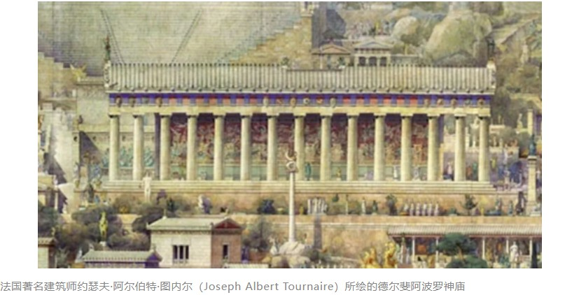

然而，女祭司拿起签说“没有人更智慧”。这个回答让苏格拉底震惊和困惑，他很清楚自己没有智慧，但是神却说自己是最有智慧的人。

神不可能说谎，苏格拉底就只能去拜访那些以智慧著称的人，但是苏格拉底渐渐发现所谓有智慧的人，不论政客、诗人、匠人，其实都是不懂装懂，还喜欢“跨界发言”，以为自己懂得一切万物。

**最终，苏格拉底知道了神所说的智慧，不是样样都懂的肯定性智慧，而是一种否定性的智慧。正是因为承认自己的无知，才最有智慧。**

 

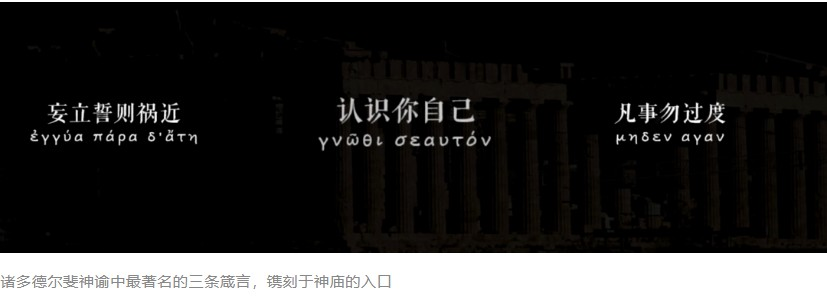

大家可以试想，苏格拉底的这番公开辩护极大地冒犯和惹怒了当时有名望的人，相当于说那些自诩有智慧的人不但没有智慧，反而是愚蠢无知的。

*由于这样的考察，雅典人啊，许多深仇劲敌指向我，对我散布了许多污蔑宣传，于是我冒了智者的不虞之誉。*

尽管如此，还是有很多年轻人愿意追随苏格拉底，雅典的年轻人非常喜欢听他省察人们，也模仿苏格拉底试着省察别人。而那些被省察的人们又对苏格拉底生气，说他是最有害的人，把年轻人都败坏了。

这就是对苏格拉底的非正式指控及其回应，苏格拉底自称不是智者学派，也不是自然主义者，所做的一切是为了发现真理，只不过他的真理是一种否定性的真理，承认自己是无知的，因为真理属于诸神。

 

### 2.正式指控

苏格拉底面临三项正式指控：**“*苏格拉底犯罪，他蛊惑青年，不信国教，崇奉新神*。”**

 

#### 第一条控告：蛊惑青年。

苏格拉底申辩道：教导青年向好当然是最重要的事，迈雷托士说我让青年变坏，那么谁让他们变好？迈雷托士：审判官。苏格拉底进一步问：还有别人么？元老院的元老呢？议会议员、听审的人呢？迈雷托士最后同意说，所有雅典人都能让青年们变好，只有苏格拉底让青年变坏。

苏格拉底的辩护逻辑是：如果所有人都想让青年学好，那就不需要教育了，就否定了教育是一种独特的技巧。

他还借用“驯马”的比喻结束了辩论：马术师是少数懂马的人，这种少数人才可能做出对马有益的事。如果大家做的事都对马有益，只有一个人做的事对马有害，那就不需要马术师了。

他反问迈雷托士：和好人在一起好，还是同坏人在一起好呢？坏人是否总会随时为害于与之接近的人，好人是否总会随时使同群者受益？迈雷托士：当然。苏格拉底：会不会有人愿意伤害自己，生活在邪恶的公民之中？迈雷托士：当然没有。

苏格拉底马上就抓到了迈雷托士的逻辑漏洞：如果我故意蛊惑青年，一旦这些青年变坏了，那就会让我生活在邪恶的公民之中，遭受他们的伤害。于是，这一条罪名并不成立。

 

#### 第二条控告：不信国教（城邦诸神）

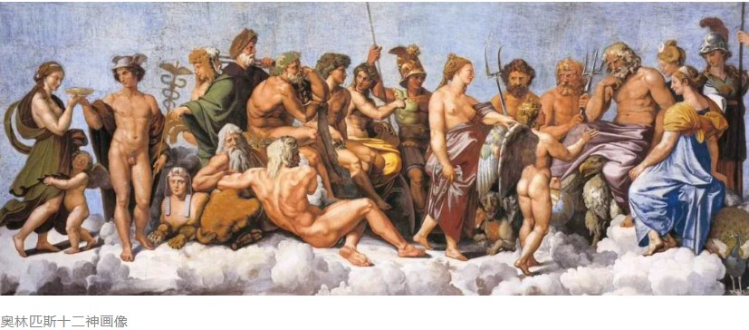

这一条主要是迈雷托士控告苏格拉底是彻彻底底的无神论者。

苏格拉底辩白的逻辑很简单：迈雷托士控告自己不信神，但同时控告我信仰新的神，这显然是自相矛盾。

*你想迷惑稍有脑筋的人，相信同一个人会信有鬼神踪迹而不信有神、有鬼、有英灵，世上无此骗人的机关*

这一套逻辑下来，苏格拉底提醒法官们：当一个人自相矛盾的时候，其实这种人根本不知道自己该相信些什么，而且他们从来没有认真考虑过自己的信念，也就显明他们的正式指控逻辑错落，自相矛盾。

 

### 3.苏格拉底真正的辩护

在辩护了他人对自己的控告之后，苏格拉底真正从自身使命出发，严肃地回应了那些污蔑与嫉妒。

苏格拉底一生从事爱知之学，为了这个使命不惜牺牲生命。苏格拉底告诉陪审团，自己是阿波罗神给雅典的恩赐，*神派我一个职务，要我一生从事爱智之学，检查自己，检查他人*，如果雅典人决定对他判处死刑，就会辜负神的恩赐，对雅典人的伤害比对自己的伤害更严重。在某种意义上，苏格拉底不是在为自己申辩，而是在为雅典公民申辩。

每次阅读这一段文字，我都发自内心地感动。

*“雅典人啊，我敬爱你们，可是我要服从神过于服从你们，我一息尚存而力所能及，总不会放弃爱智之学，总是劝告你们，向所接触到的你们之中的人，以习惯的口吻说：‘人中最高贵者，雅典人，最雄伟、最强大、最以智慧著称之城邦的公民，你们专注于尽量积聚钱财、而不在意、不想到智慧、真理，和性灵的最高修养，你们不觉得惭愧吗？’如果你们有人反辱相稽，还说注意这些，我不轻易放过他，自己也不离开他，必对他接二连三盘问，如果发现他自称有德而实无，就指责他把最有价值的当作轻微的、把微末的视为重要的。我遇人就要这么做，无论对老幼、同胞或异邦人，尤其是对同胞，因为他们和我关系较为切近。你们要明白，这是神命我做的事，我认为，我为神办此差是本邦向所未有的好事。”*

苏格拉底继续提到了著名的“马虻”的比喻：雅典城就像一只肥得不能再肥的良种马，但是因为它太肥胖了，于是日渐懒惰，需要有马虻的刺激。所以阿波罗神特意派他来到这里，执行马虻的职责，不停地“戳”，不停地唤醒“睡眠中的人”，唤醒、劝告、责备，让他告诉雅典人对焦错了，像他这样的人，再难找到第二个。

*“你们如果杀了我，不易另找如我之于本邦结不解之缘的人，有粗鄙可笑的话说，像马虻粘在马身上，良种马因肥大而懒惰迟钝，需要马虻刺激；我想神把我绊在此邦，也是同此用意，让我到处追随你们，整天不停对你们个个缓刑、劝告、责备。诸位，这样的人不易并遇，你们若听我劝，留下我吧……我这样的人是神送给此邦的礼物，在这方面你们可以见得：我自己身家的一切事务，多少年来经常抛之脑后，总是为你们忙，分别个个专访，如父兄之于子弟，劝你们修身进德，——这不像一般人情之所为。我若是有所图于此，或以劝善得钱，这还有可说；现在你们亲见，告我的人无耻地诬告了其他一切罪状，却不能无耻到伪造证据，说我要索报酬。我想，我有充分证据证明我说实话，那就是我的贫穷。”*

*“我想，我有充分的证据证明我说实话，那就是我的贫穷”*每次读这句话，真的是不断地在“戳”我的心。苏格拉底告诉陪审团，我不会放弃我的使命，也绝不会因为死亡就放弃自己的使命。他告诉陪审团：如果要以放弃使命为条件获得释放，我选择拒绝，我还会继续从事选择的事业，去省察别人，像马虻一样“戳戳戳”，我要唤醒你们。

我服从神谕超过服从你们，只要一息尚存，我就绝不放弃自己从事的哲学活动。我会规劝你们，向遇到的每一个人阐明真理，我会告诉你们对焦错了，你们的焦点放在身体、财产、名誉上，你们错了。你们要把焦点放在灵魂的最高福祉上。

**虽然智慧是人无法启及的目标，但人们仍然应当努力，追逐智慧依然是有意义的，就像我们画不出那个完美的圆，但是我们仍然应当努力，虽不能至心向往之。**

阿波罗神命令苏格拉底去医治雅典人的心病，其实雅典人和我们今天的人们是一样的，以追求功名利禄作为最大追求，但是苏格拉底告诉我们，这完全是对焦错误，我们应该追求智慧这个不可达及的目标，我们要省察我们的人生，而不是追逐金钱、名誉和政治权利。

所以，苏格拉底不认罪，不求情。不仅不认罪反而要请功，不仅不求情反而还在“戳”陪审团。不悔不改，是生是死，但凭天命。

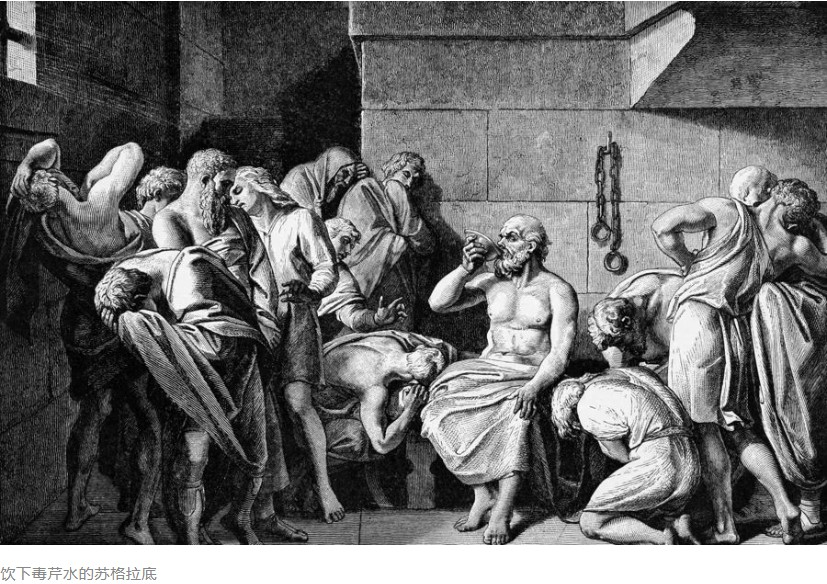

### 4.苏格拉底最后的陈述

由501名雅典公民组成的陪审团，在听完苏格拉底的申辩后进行投票，最终以281票对220票判决有罪。

尽管被大多数陪审员认为有罪，但是苏格拉底还是有机会提议用“流放”或“罚款”来代替“死刑”。

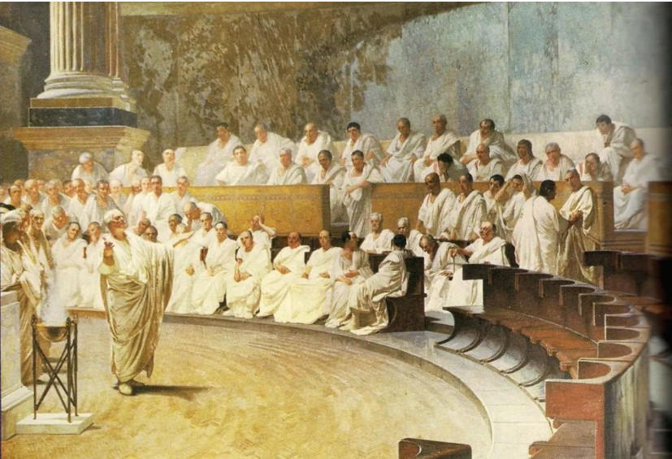

可是苏格拉底的建议居然是应该得到应有的奖赏而不是惩罚，作为神给雅典的恩赐，他是公众的祝福者，需要闲暇从事哲学思考，还应该在政府大厅用膳（在古典时代，在政府大厅用膳是极少数人能够享有的荣耀，需要6000人以上参加的公民大会才有权核准）。苏格拉底最后重申了自己的使命，勤勉地对待神谕，绝不缄默，绝不保持沉默，因为沉默就是违背神谕。

最后，他说了一句人类历史上掷地有声的话：*未经省察的人生没有价值。*

法庭自然没有接受苏格拉底的建议，苏格拉底宁愿因自己的措辞而死 也不愿意以失节的言行苟活，他接受了死刑，并且从容地探讨了死亡。

*诸位，逃死不难，逃罪恶却难得多，因此罪恶追人比死快。我又钝又老，所以被跑慢的追上，控我者既敏且捷，所以被跑快的——罪恶——追上。现在我被你们判处死刑，行将离世，控我者却被事实判明不公不义，欠下罪孽的债；我受我的惩罚，他们受他们的惩罚。*

*我对你们说，杀我的人啊，帝士为证，我死之后，惩罚将立即及于你们，其残酷将远过于你们之处我死刑。现在你们行此事，以为借此可免暴露生平的隐匿，可是，我说，效果适得其反。将来强迫你们自供的人更要多，目前被我弹压住，你们还不知道呢。他们年轻，更苛刻，更使你们难堪。你们以为杀人能禁人指摘你们生平的过失，可想错了。这种止谤的方法绝不可能，又不光彩；最光彩、最容易的不在于禁止，却在于自己尽量做好人。*

苏格拉底还告诉人们，死亡并不一定是一件最大的坏事，死后无非两种可能：

一种是什么都不存在了、没有任何感觉，就和安眠、沉睡一样，没有什么好可怕的。

另一种就是灵魂转移到其他地方，那么他就有机会和人类历史上最伟大的那些人对话了，比如荷马、赫西俄德等等。

最后，苏格拉底向雅典公民嘱咐说，即便死后，他仍然希望自己的儿子能够关心德性胜过功名利禄，希望民众能够像自己对待雅典公民一样对待自己的儿子，不断警醒他们要省察，要去过值得过的生活。

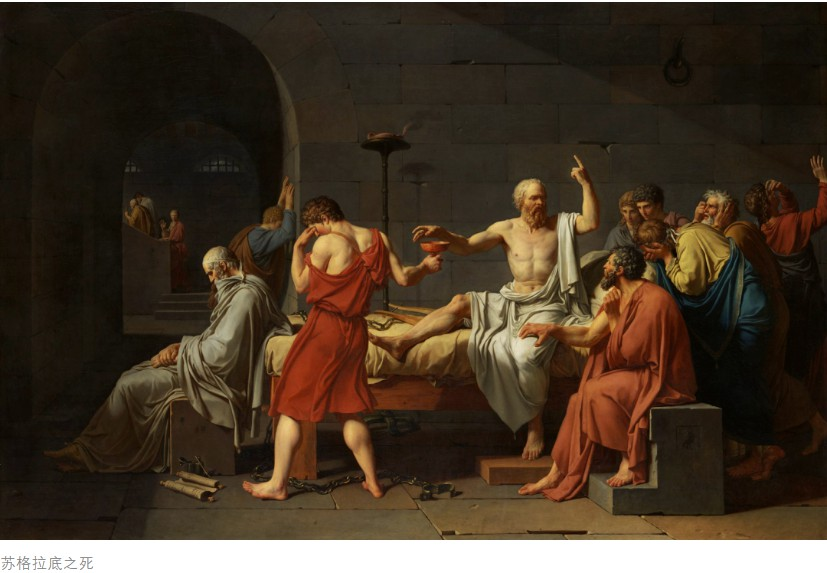

 

### 5.三个问题

读完了《苏格拉底的申辩》，我想问大家三个问题：

#### 1.大家觉得苏格拉底否定性的智慧和智者学派的相对主义有什么区别呢？

苏格拉底不断地驳斥人们那些自以为拥有智慧的人，相对主义者也是不断地辩驳他人。但是两者有根本性的区别，因为苏格拉底认为世界上有真理，只不过人类对真理的认识太有限了，所以人拥有的智慧是否定性的智慧，承认自己的无知，乃是开启智慧的大门；但是相对主义者却认为，一切的辩论都只是为了利益，没有真理，没有绝对的对，也没有绝对的错，但这恰恰反映了智者学派严重的逻辑漏洞，因为这句话本身就是绝对的。

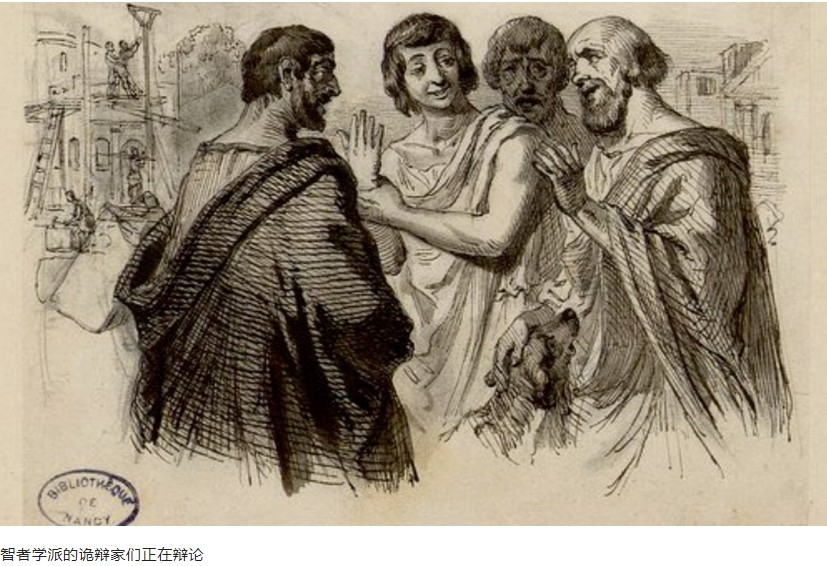

也有同学提出，苏格拉底说“我只知道一件事，那就是我一无所知”，也是自相矛盾的。

表面上好像真的很相似，难怪会有人认为苏格拉底是智者学派，但苏格拉底是为了追求真理，智者学派是为了消解真理。苏格拉底的话其实是一种比喻，因为苏格拉底肯定是触摸到了真理，才会感到在真理面前，自己所知的根本不值一提，就像杯中的水面对广袤的大海一样不值一提。这就是为什么当你知道的越多，你越觉得自己什么都不知道。

智者学派是似是而非，而苏格拉底是似非而是。

 

#### 2.苏格拉底为什么要一再地激怒陪审团？

请大家注意，苏格拉底是在用生命践行使命，苏格拉底通过这次审判告诉陪审团：你们以为你们的审判是公正的，其实你们是无知的，审判是不公正的。我在任何时候，都能够诚实地对待我的使命，但你们作为雅典票选出来的陪审团，发誓要按诸神的意志来审判，你们却做不到。

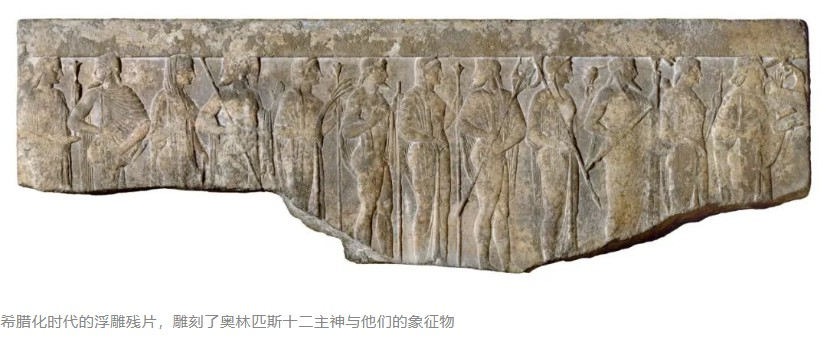

如果大家对这次审判的后续感兴趣，还可以继续阅读柏拉图的《裴洞篇》（即《斐多篇》），记载了苏格拉底死前在监狱里和朋友们相伴的日子，记录了他们当时进行的主要是围绕“灵魂”的哲学讨论。

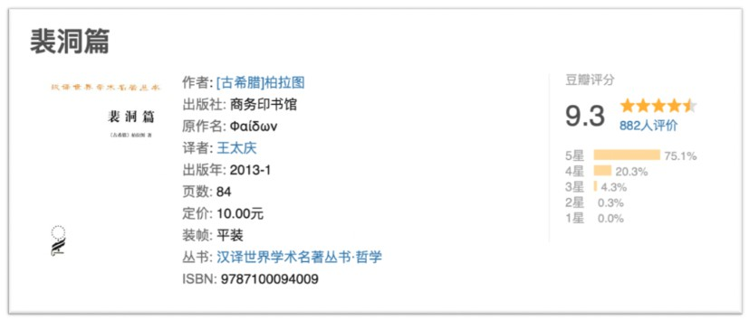

#### 3.你有没有值得一生追寻的使命？

我们都应该问问自己，有没有找到能够为之生也为之死的信念和使命，这种信念和使命能够让我们超越有限的人生。

苏格拉底的审判发生在公元前399年，当时的柏拉图28岁，七年之后的公元前392年，柏拉图写下了这篇《申辩篇》。我不知道他当时回忆起他的老师，内心是什么感受，但是我想他一定会被他老师崇高的人格和伟大的志向所激励。

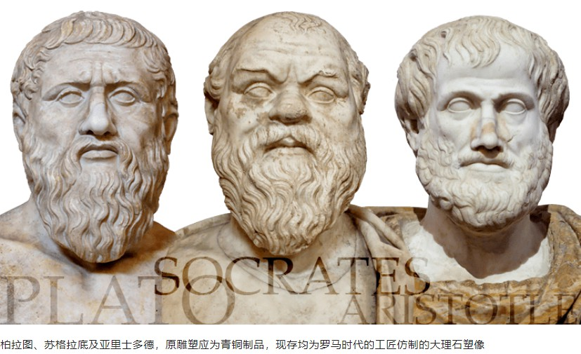

据传，柏拉图在写作《论灵魂》的时候，他向学生宣读，只有一个学生坚持听完，这个学生就是亚里士多德。

公元前385年，也就是在苏格拉底审判后的第14年，雅典大会重审苏格拉底案，自然成功平反，并宣告诬告者迈雷托士死刑，并将其他的诬告者全部驱逐出雅典。当时的雕刻家留西波斯为苏格拉底创作了一座雕像，作为平反的一项举措。

.jpg)

留西波斯所塑苏格拉底雕像，原始青铜铸件已佚失，现存为罗马时代的工匠仿制品，上图为诸多仿制品中最著名的一件，现存于卢浮宫古典与希腊化艺术展区第15展厅

**引用参考及注释说明：**

1.文中所有蓝色斜体字样，如*神派我一个职务，要我一生从事爱智之学，检查自己，检查他人*，为原文引用，原文及人名及专有名词的参考译本均为：[古希腊]柏拉图．游叙弗伦 苏格拉底的申辩 克力同[M]．严群译．北京：商务印书馆．1983。

2.封面图为法国新古典主义画派奠基人雅克-路易·大卫（Jacques-Louis David）于1787年创作的油画《苏格拉底之死》（La Mort de Socrate）。

3.苏格拉底在文中所起誓的“帝士”，即是“宙斯”。

4.文中部分内容参考：[美]霍普·梅. 苏格拉底 [M]. 瞿旭彤译. 北京：中华书局. 2014。

