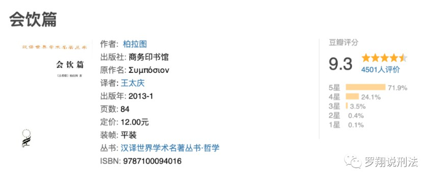
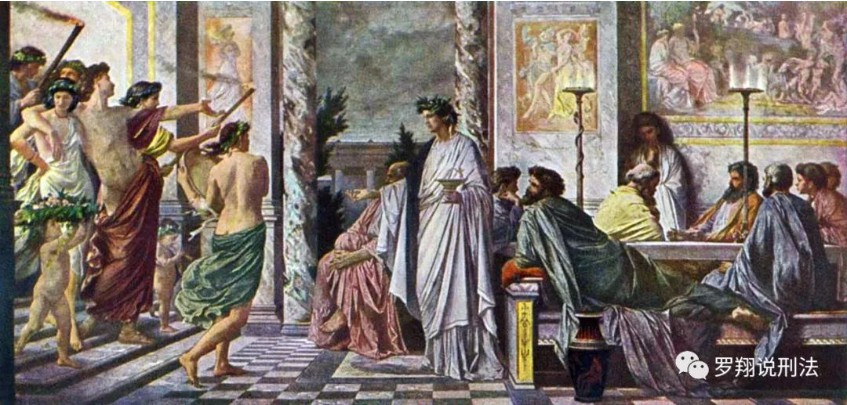
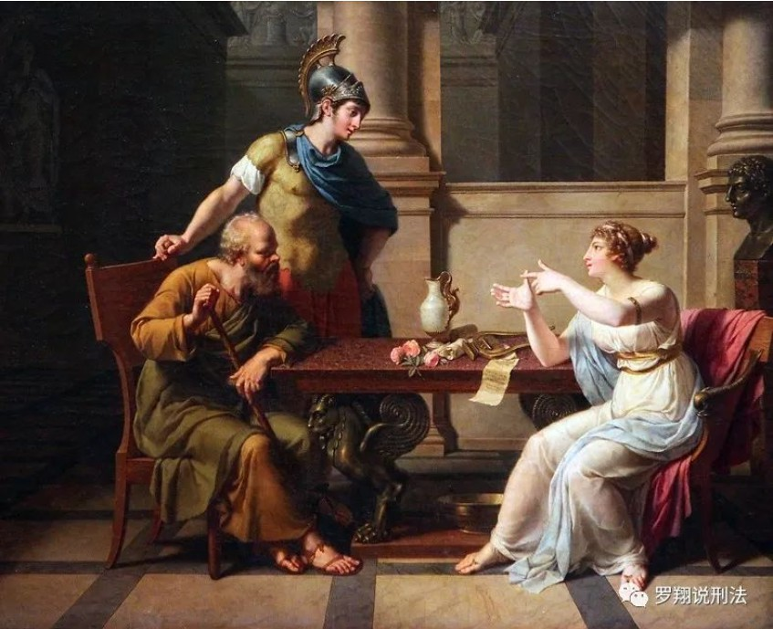
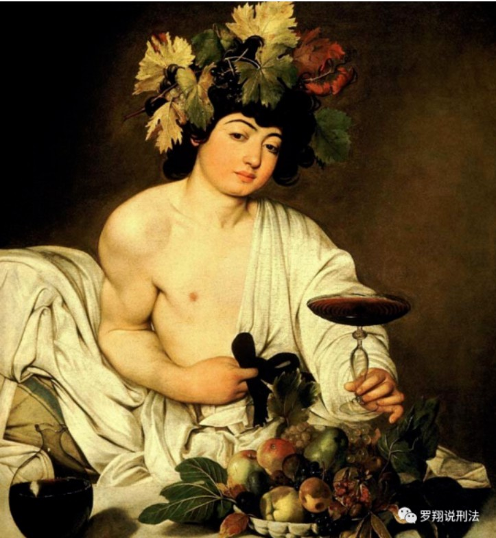

## 《会饮篇》理解爱的严肃与崇高

七夕前，我带领学生读了柏拉图的《会饮篇》。

《会饮篇》记叙了在一次酒宴中，苏格拉底与几位古希腊智者对小爱神“爱若”的赞颂与逻辑探讨。

古希腊的爱神是阿佛洛狄忒（本文参考译本中译作：阿莆若狄德。她在罗马神话中演变为我们熟悉的“维纳斯”），但她并不直接影响人类的爱情，真正对于爱情起作用的，是被称为“小爱神”的“爱若”（Eros，亦作爱若斯，在罗马神话中演变为我们熟知的“丘比特”）。

**所以《会饮篇》也被称为《论爱情》，阅读这本书能够帮助我们理解“爱”的本质。**

### 一、《会饮篇》的内容概要

每年的酒神祭典，古希腊人都会在露天剧场举行戏剧会演，并由在场的3万观众评定优胜。这一年，阿伽通的第一部悲剧就获了奖，他在第二天举行了庆祝酒会。

参加这次会饮的都有：阿伽通的恋人包萨尼亚、修辞学家裴卓（也有人译为“斐德若”）、喜剧作家阿里斯多潘、医生鄂吕克锡马柯、阿伽通以及苏格拉底。六人按照上述顺序围坐入席。

阿伽通在家中欢迎喝醉的阿尔西比亚德斯，安塞姆·费尔巴哈绘画，1869年

众人用过餐后，照惯例应当开始饮酒诵诗，但是阿伽通表示他前夜为了庆祝饮酒过量，无力再饮；席上的医生也建议众人节制饮酒。大家讨论一番后，决定以裴卓提议的话题轮番发表演说。这个话题是：**礼赞爱神**。

#### 裴卓：爱可以激发人的勇气

最先发言的裴卓，他的讲辞通篇都在告诉大家，爱情可以激发人的勇气。主要有两个观点：一是认为爱神是最古老的神祇，由此可见其地位；二是认为爱神能使相爱的人变勇敢，特别是让“爱人”勇敢。

裴卓是一位美少年，在爱情中处于被爱的一方，通常也被认为是比较弱的一方。所以他特别想表达自己作为爱人的“不弱”，也就是勇敢。

（注：古希腊，在贵族阶层流行成年男性与少年的恋爱关系，也近似师生关系。成年男性作为“爱的一方”，承担传授智慧，教育保护少年的主动角色，被称为“情人”；少年作为“被爱的一方”，通常在12-17岁，向长者学习知识与技能，被称为“爱人”。请注意，两名成年男性之间的爱情在当时会为人所不齿。被爱一方会被认为缺乏阳刚气质，而爱的一方则会被认为无法克制欲望。阿伽通和包萨尼亚就是一对成年的同性情侣。）

#### 包萨尼亚：追求美德的爱情才值得赞扬

包萨尼亚将爱神分为两位：天上的爱神和凡间的爱神。希腊神话中，第二代天帝乌拉诺（Uranus，又译乌拉诺斯，天王星的名字即来源于此），被儿子们砍碎投入大海，海中涌出白浪，乌拉诺变身为天上的爱神。凡间的爱神，则是宙斯和他的女儿宙尼生下的。

天上的爱神出身与女性无关，其爱情对象只是少年男子，也不会荒淫放荡。而凡间的爱神由男女生出，其爱情对象可以是少年男子，也可以是女子，并且眷恋的是肉体而不是灵魂。

包萨尼亚认为，我们在赞美之前要先分清对象，只有属天的爱神才值得赞美。爱情本身不分美丑，全由行为的方式决定。钟爱优美品德的人是高尚的；爱肉体过于爱灵魂的人是卑鄙的，因为“一旦所爱之人的肉体衰败了，他就远走高飞，毁弃从前的一切信誓。”

（注：包萨尼亚的发言其实也是在为自己辩护，因为四十岁的他跟三十岁的阿伽通依然保持恋人关系，这在当时是与社会习俗相抵触，会遭人非议的。）

#### 鄂吕克锡马柯：爱情使万事万物达成和谐状态

鄂吕克锡马柯作为一名医生，代表了技术主义的观点。他首先肯定了包萨尼亚“两个爱神”的观点，但是又补充说爱情所司掌的领域不仅仅在人世间，而且包括动、植物在内的一切存在物都依照爱情的规律运行。人的身体中有健康与不健康两种爱情的存在，对立的事物（冷热、干湿等）之间互相克制，而医生可以通过医术变相克为相生，以此达到让身体中产生和谐的作用。

不仅如此，音乐的和谐、四季的推移、星辰的变动都是出于爱神的多方面、巨大的、普遍的威力，只有当她以公正和平的精神在人类和神祇之间成就善事的时候，才能使人们友好相处，得到幸福，并与诸神维持敬爱的关系。

#### 阿里斯多潘：爱情令人变得完整

阿里斯多潘提出了一种有趣的“圆球理论”，说爱神最伟大的地方，在于她治好了人类的一种病。

从前的人有三种性别，太阳生下男人，大地生下女人，月亮生下亦男亦女的“阴阳人”。不仅如此，人从前就像太阳、大地、月亮一样，是一个圆滚滚的形体，腰和背都是圆的，圆圆的头上，一前一后两张脸，四条胳膊四条腿，其他器官都翻倍。走起路来，可以随意向前或向后。快跑起来，就像杂技演员翻筋斗，可以滚得非常快。

当时人们非常强壮，企图和诸神交战。诸神不愿意灭绝人类，最后宙斯想出个办法：把人类劈成两半，不仅人的力量削弱了，而且数量还增加了。

被劈开的人总想找回另一半，合拢恢复成完整的样子。因此，人与人之间就产生了相爱的欲望，要治好被劈成两半的伤痛，这也是为什么存在异性恋和同性恋的原因。

#### 阿伽通：爱是从满溢流向匮乏之处

阿伽通认为前面的人赞美爱神，都是在赞美其所给予的幸福，而不是真正地赞美爱神本身。要赞美爱神本身，应该先说明爱神是什么。他认为爱神是一个年轻、娇嫩、柔韧和平、远离暴力、公正审慎、勇敢无畏、充满智慧的最美最善良的神祇。爱神不仅自己美丽善良，而且也产生所有美好善良的事物。

在《会饮篇》最开始的时候，阿伽通要挨着苏格拉底坐，因为智慧就像满满的一杯水，通过一根毛线，就可以从充满智慧的人那里流进空虚的人心里。在阿伽通看来，爱情也是如此，是满溢流向匮乏之处。

#### 苏格拉底：爱就是寻找永恒的美本身

苏格拉底不同意前面几人对于爱神的颂词，他认为这些人的颂词都只是为了颂扬而颂扬，以至于把许多不符合爱神的东西强加于其上。与其说这是在颂扬爱神，倒不如说是一群智者和雄辩家在比赛口才。

苏格拉底与阿斯帕西亚辩论，尼古拉斯·安德烈·蒙西绘画，约1800年

批评完几人颂词的不真诚后，苏格拉底要求要用“自己的方式”来称颂爱神。

苏格拉底先通过对阿伽通的一系列询问，得到了一个共识：“爱神首先是对某某东西的爱，其次是对他所欠缺的东西的爱。”

而阿伽通在他的颂词里说，爱神追求的是美的东西。在《会饮篇》的语境里，美与善（好）是可以互换的，基于这个结论，爱神也不可能是善（好）的。

随后，苏格拉底开始了他对于爱神的赞颂，他说自己关于爱的知识都是从女先知狄欧蒂玛那儿得到的，他开始转述狄欧蒂玛的观点：

首先，爱神是匮乏之神贝妮娅和丰饶之神波若的孩子，他兼具其父母的特点，即缺乏美好，却又不坏；既不贫穷，也不富裕；即缺乏智慧，却也并不无知。因为一切神祇都是美的，所以爱神事实上并不是神祇，而是介于会死的凡人和不死的神祇之间的大精灵，居于二者之间，将人与神祇联成整体。

其次，当人们追求爱时，美的东西并不是他的最终目的，其最终的目的是在美的东西中生育繁衍。一个人想要永远拥有美的、好的东西，必定会要追求永恒，而生育正是人类通往永恒的途径。

最后，凡人通过生殖所能达到的不朽并非真正的永恒，只是在新事物替代旧事物的不断变化中维持不灭。通过生育达到的人类形体、灵魂、知识、美德的不朽只是永恒的影子，并非神祇所拥有的永恒。永恒是永远存在，并且始终如一，从不变化的。

**爱神的存在就是为了帮助人们去追逐永恒，在爱人身上发现我们原初的美好。爱其实就是寻找美的过程。所有人都爱的美好，就是美的源泉，那永不变化的美本身。**

#### 阿尔基弼亚德

当苏格拉底说完，闯进来一个醉汉阿尔基弼亚德，一幅酒神的装扮，头上戴着常春藤和紫罗兰编的花冠，手上缠了很多飘带。他是雅典出了名的贵族美男子，但轻浮好名，最终在伯罗奔尼撒战争中出卖雅典。

酒神，卡拉瓦乔绘画，约1596年

阿尔基弼亚德把飘带缠到了苏格拉底身上，暗示了苏格拉底关于智慧讨论的胜利。他转而控诉起苏格拉底，声称自己曾经用美色来引诱苏格拉底，想换取智慧，但是苏格拉底却不为所动。说完之后，阿尔基弼亚德又称赞苏格拉底克制、勇敢，追求美德与智慧，是一个真正将高尚的思想用到言行上的人。

《会饮篇》内容基本如上所述。

### 二、关于《会饮篇》的探讨与思考

#### 在三组对立矛盾中寻找爱情

受限于时代背景，在古典典籍中，常常流露出对女性不够尊重，但是在《会饮篇》中，最有分量的发言，恰恰来自于苏格拉底所引用的女先知狄欧蒂玛的话。

苏格拉底关于爱的论述，被很多人认为是一种自恋式的爱。因为我在爱人身上找到了一种抽象的爱。又因为这种抽象的爱，我要顺着爱的阶梯不断地往上爬，以使自己能够变得更好。

如果我们爱人只是在具体的人身上去寻找一种爱，是不是把对方当成了攀登爱的阶梯的工具？这也是很多人对柏拉图的爱情观的误解，要弄清这个问题，重点要理清三组矛盾：

**1.灵魂与肉体，到底哪个更重要？**

**2.自足与缺乏，两者具有怎样的张力关系？**

**3.抽象和具象，哪个更值得去爱？**

##### 灵魂与肉体

很多人认为，古希腊人重视灵魂，不重视肉体。但是在《会饮篇》中，从喜剧作家阿里斯多潘提出的“圆球理论”中，我们会发现他们并没有排斥肉体结合，而且认为人与人肉体的结合恰恰是为了追寻最初的圆。

苏格拉底一直认为灵魂是高于肉体的，但在《斐德若篇》里，他把人的灵魂比作一架马车，一匹象征高尚情操的白马，一匹象征肉体欲望的黑马，同时还有一个驾驭灵魂的骑手。这三种力量缺一不可，肉体欲望的满足并不是毫无意义。欲望的满足，都是为了灵魂更高的追求。

换言之，我们越追求灵魂的高尚，越是对肉体的满足有一种感恩，而不要为了追求灵魂的高尚就贬低肉体的享受。吃一顿美食，喝一杯美酒，看一场好电影，这些都不应该视作错误。

当你举目望天，你并不会失去地上的美好；但你只注目于地下，你永远不知道天有多么地美好。**所以喝酒吃肉没错，只不过我们不要沉溺于黑马的享受，我们还有一匹白马和灵魂的骑手，这个三角形恰恰才是一个稳定的三角形。**

所以从这个意义上来讲，虽然古希腊人认为灵魂是高于肉体的，但是肉体并不是一个不堪的、沉重的、邪恶的牢笼。

**人的肉体满足都是为了更好地去追求灵魂，所以我们的理智需要情感的节制，我们的情感也需要理智的限缩。**

##### 自足与缺乏

阿伽通觉得自己是自足的，他的爱会满溢出去，但你会发现他其实是“缺啥补啥”。因为阿伽通是一个接受爱的爱人，本身就是缺的一方。人常常通过语言来掩饰自己的缺乏。我们一定是缺乏爱，才会去追寻爱。

> 所有的神祇都不从事爱智的活动，并不盼望自己智慧起来，因为他们是智慧的，已经智慧的就不去从事爱智慧的活动了。无知之徒也不从事爱智慧的活动，并不盼望自己智慧起来。因为无知的毛病正在于尽管自己不美、不好、不明白道理，却以为自己已经够了。不以为自己有什么欠缺的人就不去盼望自己以为欠缺的东西了。

所以，自足状态的神祇不会去追求爱，他的爱自足丰盈到满溢出去，他是因此而爱人的；没有意识到自己缺乏的人也不会追求爱，阿伽通就过于自恃，以为自己的爱是自足的；真正会追求的就是介于两者之间的人，就是承认自己无知并且爱智慧的人。

**我们是缺乏的，同时不断地朝不缺乏状态去追寻。尤其是对于智慧，我们始终处于的智慧的缺乏状态，承认自己的无知乃是开启智慧的大门。**

##### 抽象和具象

在苏格拉底的视野中，我们为什么要爱？因为我们在被爱者中看到了我们自己，所以我们爱他是把他当成了一个工具，让我们能够走向更好的自己。

也就是说，我爱一个人并不是因为他独特，而只是因为他身上有一种吸引我的美好的气质，而这种气质可能放在张三身上，也会让我爱上他。很多人无法接受这样的观点。

但这可能是对苏格拉底的一种误读，他说我们这一生的学习都只是回忆。在爱情中，我们能够在爱人身上，回忆起原初的美好，看到自己能够达到的更好的状态。

我们在对方身上看到了自己，并不是看到了现在的自己，而是看到了过去的自己，并因此看到了将来，希望自己变成更美好的人。

我们在爱人身上放弃了自我，又发现了自我。因为我们回忆起我们原初的美好，回忆起我们的过去，并且盼望我们的将来。所以我的自恋不是对我现在的自恋，而是对我原初丢弃的美好的一种回忆。

但是苏格拉底留下了一个没有解决的问题。当我们放弃自我并发现了自我，我们还能真正的重塑自我吗？我们的重塑自我要不要放弃面前这个具体的人呢？

**当我在他身上发现了我原初的美好，我爱上了抽象的美好，开始不断向美好的目标攀登，会不会就把面前具体的人抛弃了？**

**在我个人看来，我希望变得更好，也希望我的爱人能够变得更好。在具体人中发现抽象的美，从抽象的美中更好地爱具体的人，可能会达成一种美好的状态。**

而当我们没有变得更好的时候，往往会羞愧难当。最后闯来的阿尔基弼亚德，在苏格拉底身上看到了可以去追逐的那种美好状态。但遗憾的是，他最终没有追逐上，活成了自己所厌恶的样子。

你看到了一个美好的状态，但是你最终依然离这个美好的状态如此遥远。或许阿尔基弼亚德最后的背叛，是不是也意喻着希腊哲学中一个无法解决的鸿沟：知道与做到。

很少有哪个词汇像“爱”一样被庸俗对待，但却可以承载真正严肃与崇高。我们爱，因为我们匮乏；我们爱，因为我们希望超越每日的锱铢必较。在爱中，我们放弃自我，发现自我，重塑自我。

**我们回忆起人性失落的美好，并希望告别当下的平庸苟且，攀登美善的阶梯。愿我们能为尘世中每次正当的满足而感恩，不悲伤、不放纵、不羞愧，一无所惧，在爱中臻于至善。**

**注：**

1.本文的相关译名和引文段落出自：《会饮篇》，（古希腊）柏拉图著，王太庆译，北京商务印书馆，2013。

2.封面图为拉斐尔绘《雅典学院》，以手指天者为柏拉图，右为亚里士多德。