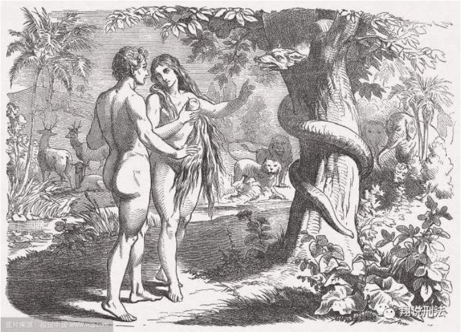

**01**

> “跨学科的”大格局多领域著作

莱斯利·史蒂文森对西方众多对人性进行思考和论述的思想进行深入了解、仔细分析和比较后，提炼出七种人性论观点，包括柏拉图的理想国、基督的创世论、马克思的马克思主义、弗洛伊德的生死本能、萨特的无神论的存在主义、斯金纳的行为的条件作用、洛伦兹的与生俱来的攻击性。

**在书中，史蒂文森对上述人性论予以全面介绍和批判思辨，并以宇宙论、人性论、诊断和处方四个方面呈现。**

尽管这是由一位哲学家所著，内容也是以哲学方面的言说为主，但它对一些从学术上讲并不属于哲学范畴的某些作家、主题和内容也进行了探讨，甚至还涉及心理学、生物学、社会学、政治、神学等方面的问题，跨越了人文科学、自然科学、社会科学和神学这些学科之间的通常界限，**可以说是一本“跨学科的”的大格局、多领域著作。**

**02**

> 柏拉图的宇宙观

柏拉图的宇宙观主要可以归结为四方面，即**逻辑学、形而上学、认识论和伦理**，认为灵魂不灭，而且在人死后也将永存，将人的形体和精神人为地对立。

**他的人性论则将灵魂三分为理性、意志和情欲，根据占主宰地位的因素不同而将人分为三种，他们的欲望分别是知识、成功和利益。**

人的理想状态是上述三种因素的和谐一致，而只有哲学家能够达到这样的理想状态，所以社会应当由“哲学王”来治理，至于被统治的阶级应当安于各自的职分。

**03**

> 基督教的原罪论

基督教认为，存在着一种超越宇宙而存在的力量即上帝，他不仅创造还统治世界，历史（His story）只是上帝意旨的展开。

**在人性论上，基督教持原罪论，即每个人生来就是有罪的，每个人都可能犯错，都不是完美而无缺的，在一定程度上都违背了上帝的旨意，导致我们和上帝的疏远。**

因此，基督教提倡人们要接受上帝的拯救，通过上帝的宽恕得到救赎，与其和好，得以重生。

**04**

> 马克思的唯物论

马克思认为物质决定意识，世界是物质的运动发展的，社会也是如此，即由处于基础地位的物质生产方式和生产关系决定处于社会上层的政治、文化等制度，也就是所谓的**“经济基础决定上层建筑”**。

因此，他认为通过政治改革不能真正做到社会的飞跃，而必须通过暴力的革命，直接打碎现有的体系重建，才能使世界达到理想状态。

**05**

> 弗洛伊德精神分析理论

弗洛伊德的精神分析理论包括了精神层次理论、人格结构理论、性本能理论和心理防御机制理论这四个基本理论，可归纳为四点：精神领域严格应用决定论的原则、相关无意识精神状态的假设、关于本能或驱动力的理论以及发展或人性论理论。

弗洛伊德的精神决定论认为每件事都有充分的前因，人的精神分为意识、前意识、无意识（“人的地下室”）三个层次，其中无意识能够通过前意识的转化，成为意识。

他主张性恶论，认为人的行为由欲望和动机驱动，而人最根本的欲望是性欲。同时，他还认为人可能受自己并未意识到的某种思想、记忆或者情感的折磨，如果用某种方式使他们意识到这种思想、记忆或感情，就可以治好他们的病。

由于弗洛伊德强调意识，强调因果关系，认为在我们内心深处总有某些因素在影响我们的行为，所以他认为，在分析人的行为、医治心灵创伤时，发掘人内心深处潜藏的意识会是一个很好的方法。

**06**

> 萨特“存在主义与无神论者”

作为存在主义和无神论者，萨特的哲学思想大致有三点，即 **存在先于本质、自由选择以及世界永远是荒诞的。**

萨特坚持人的存在先于他的本质，人不是被上帝创造出来的，也不是被进化或其他任何东西以任何目的创造出来的，我们只是发现了自己的存在，然后确定把自己造就成什么样。

**他认为人是自由的，价值的唯一基础是人的自由。**

此外，因为我们时刻都面临着各种选择，我们精神生活的每个方面都是有意识的、经过选择的，也是我们的责任，所以我们需要做一个有责任意识的人。

**07**

> 斯金纳条件作用

斯金纳通过研究可以直接观察到的现象来推测人性，他将条件作用分为应答性条件作用和反应性条件作用，并假设一切行为都是环境变量发生作用的结果，对任何一种行为来说都有一套环境条件，而环境也正是通过条件作用影响和控制行为的。

**08**

> 洛伦兹“先天遗传因素”

和斯金纳一样，洛伦兹也反对形而上地讨论人性，但不同的是，**他完全强调先天遗传因素，认为人的许多行为是与生俱来的，** 即使环境因素的刺激不存在，我们仍然会做出那种行为。

他支持达尔文的进化论，并着重强调五种与生俱来的攻击性，认为攻击性对生活起着重要的作用，即相互独立的冲动所产生的冲突能使整个生物体更稳固，就如同一个政治体制中的权力制衡一样。