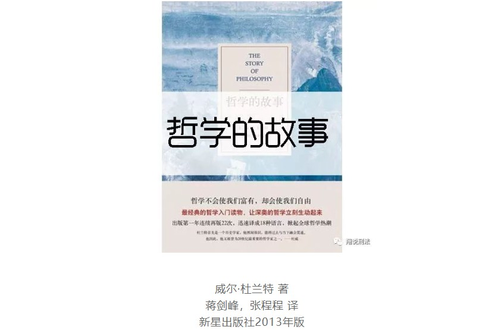
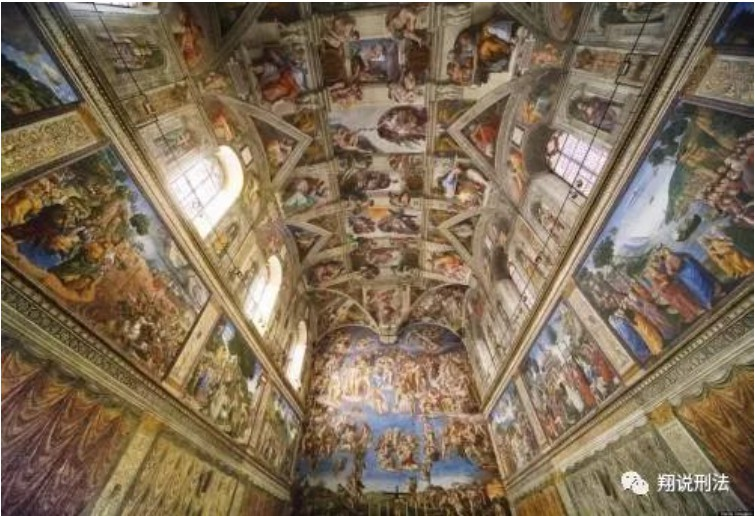
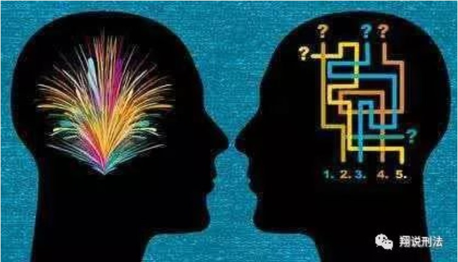

**01**

> 哲学家的“故事”

《哲学的故事》是威尔·杜兰特的成名作，他自谦其书为通俗读物。

然而和一般的哲学史不同，《哲学的故事》不是一部完整的哲学史，而**是关于哲学的“故事”，是杜兰特通过围绕某些主要人物来展示思辨哲学来龙去脉的方式赋予知识以人情味的一种尝试。**

柏拉图、亚里士多德、弗兰西斯·培根、斯宾诺莎、伏尔泰、伊曼纽尔·康德、叔本华、赫伯特·斯宾塞、弗里德里希·尼采、柏格森、克罗齐、伯特兰·罗素……

杜兰特选取了人类历史上影响重大而深远的十多位著名的哲学家，以通俗的文字介绍了他们的时代背景、生平境遇和情感经历，夹叙夹议地阐述了他们的思想，并对每位哲学家进行了中肯的批评。

**02**

> 一部哲学思想史批判

在作者看来，**哲学关心人生，因此，哲学也充满人性的温情**，不仅因为哲学家也是活生生的有各种性格和情感的社会人，更因为每一种哲学理论都根植于解决人生的痛苦、增益人生的幸福之上的。

因此，他对哲学家生活故事、思想观点以及历史评判 **少了些晦涩难懂，而多了些生活气息和人文关怀。**

全书既充满每个哲学家思想中最经典的语句，也不乏作者的精彩解读和评价。

与其说这是一部哲学入门导论，不如说 **是一部哲学思想史批判，让人对各种哲学思想有了清晰和全面的认识。**

**03**

> 哲学与秩序

作者以一则故事导论开篇，谈到哲学对人生的裨益、哲学涵盖的分支、哲学对秩序追求的终极目标。

**在哲学中，认识论是解决人认识世界的秩序安排问题，本体论是解决世界起源的秩序安排问题，逻辑学是揭示世界发展规律秩序的问题。**

**伦理学是解决人类社会道德秩序安排的问题，美学是解决人类个体追求幸福秩序的问题，政治学则是构建人类集体生存秩序的问题。**

作者通过哲学对秩序的思考与安排这个支点，串起了哲学庞大的学科体系，让哲学变得简洁易懂。

随后，作者在苏格拉底、柏拉图、亚里士多德等古希腊哲学家身上花费较多笔墨，目的在于理清哲学的起源，回到**哲学最基本的问题——认识人自己，认识存在的世界。**

作者还分析了柏拉图、亚里士多德庞杂的哲学思想体系，梳理出认识论、政治学、伦理学、美学等学科的发展脉络。

接下来，作者对几位在哲学思想发展史上起到重大转折的人物进行了重点介绍，对西方哲学唯理论、经验论、经院哲学三条发展主线进行了充分说明。

比如，作者对康德的介绍就足见其身后的哲学家素养，对康德生平、时代语境、思想来源、哲学体系等等进行了追踪梳理和条分缕析，全面呈现这个从古代哲学转入现代哲学的关键人物的心灵世界、哲学成就、历史地位。

通过这几位哲学家的思想的阐述和批判，思辨之美便淋漓尽致地得以展现。　　

**04**

> “人”思维与物质的连接点

**哲学不仅关注物质世界，也关注思维世界，更关注二者之间怎样连接起来，这个连接就是人的问题。**

围绕这三个问题构建的哲学世界如此庞杂繁复，甚至陷入探讨思辨的艰深技艺和逻辑思维的游戏当中不可自拔。

哲学本是指导人如何生存、如何与世界和解的思维科学，但哲学家的精致思想与困顿生活间的矛盾却使他们与他人之间产生天然的隔膜。

然而，哲学家也是人，也有自己的爱恨情仇，也有各自可爱、可怜、可悲的一面，这一点在对尼采的介绍上体现得尤其明显。

在书中，作者为别人以为是“疯子”的尼采恢复了一个追求尊严、美、幸福的浪漫青年形象，展现其思想的无穷魅力。

**本书对哲学史的批判以美国实用主义哲学思潮为终点，然而正如作者所指出，西方哲学思想是一个开放的体系，永无发展的终点。**

由于现代社会生产力的极大解放，人类对物质的探索发展到无以复加的程度，对思维的探索也进入到意识、心理学、医学等层次，在多种因素的影响下，哲学的思想潮流更是如雨后春笋般大量兴起。

