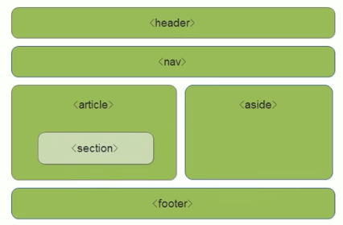

### HTML

**HTML：Hype Text 	Markup	language**

​			   超       文本    标记          语言

- **标签的使用规范**

  - 单标签		<标记    属性=属性值 />
  - 双标签		<标记    属性=属性值>   </标记>

- **标签关系**

  双标签关系可以分为两类：**包含关系** 和 **并列关系**

  ```html
  // 包含关系
  <head>
    <title></title>
  </head>
  
  // 并列关系
  <head></head>
  <body></body>
  ```

- **每个页面都会有一个基本的结构标签 ( 也叫骨架标签 ) 页面内容也是在这些基本标签上书写的。**

  ```html
  <!DOCTYPE html>      文档类型声明，作用就是告诉浏览器使用那种HTML版本来显示网页  (必须写到第一个)
  <html lang="zh">     lang 语言种类 用来定义当前文档显示的语言
  	<head>
      <meta charset='UTF-8'>  字符集是多个字符的集合。以便计算机能够识别和存储各种文字。在<head></head>标签内，可以通过<meta>															标签的 charset 属性来固定 HTML 文档应该使用哪种字符编码。
      												charset 常用的值有：GB2312、BIG5、GBK、和 UTF-8 也被成为万国码，基本包含了全世界所有国家需要用															到的字符。
      <title>头标题</title>
  	</head>
    <body>
  			网页的内容
    </body>
  </html>
  ```


### 常用标签

- ```html
  标题标签 <h1> - <h6>
  段落标签 <p></p>
  换行标签 <br/>
  
  文本格式化标签
  	<b></b>		加粗     <strong></strong>		加粗
    <i></i>		斜体		 <em></em>		倾斜
    <u></u>		下划线   <ins></ins>		下划线
    <s></s>		删除线   <del></del>		删除线
  
  注释标签以 <!-- 开头，以 --> 结尾
    
  特殊字符
  							空格符						&nbsp;
  	<						小于号						&lt;
  	>						大于号						&gt;
  	&						和号						 &amp;
    ￥	         人民币					 &yen;
  	...... 等
  ```

- **div 和 span 盒子标签**

  ```html
  div 和 span 盒子标签
    <div></div>			一个人独占一行
    <span></span>		一行放很多个
  ```

  

#### 图像标签

```html
图像标签

  scr				图片路径			必须属性，用于指定图像文件的路径和文件名
  alt				文本					替换文本，图像不能显示时的文本展示
  title   	文本					提示文本，鼠标放到图像上，显示的文字
  width			像素					设置图像的宽度
  height		像素					设置图像的高度
  border		像素					设置图像的边框粗细
```

#### 超链接标签

```html
超链接标签
<a></a>			
  href			用于指定链接目标的url地址，(必须属性)
  target		用于指定链接页面的打开方式，其中 _self 为默认值，_blank 为在新窗口中打开方式。

  外部链接：<a href="http://www.baidu.com"> </a>
  内部链接：<a href="index.hmtl"> </a>
  空连接：<a href="#"> </a>
  下载链接：如果 href 里面地址是一个文件或者压缩包，会下载这个文件
  网页元素链接：在网页中的各种网页元素，如文本、图像、表格、音频、视频等都可以添加超链接
  锚点链接：点击链接可以快速定位到页面中的某个位置！！
  - 在链接文本的 href 属性中，设置属性值为 #名字 的形式，如 <a href="#two"></a>
  - 找到目标位置标签，里面添加一个 id 属性 = 刚才的名字，如 <h3 id="two"></h3>
```

#### 表格标签

```html
表格标签
	<table>
		<tr> 行
			<th></th>	表头标签 里面的文字会加粗居中显示
			<td> 单元格 </td>
			...
		</tr>
		...
	</table>
	
	table 属性 属性值
		align							left、center、right								表格相对周围元素的对齐方式
		border						1																  表格是否有边框，默认没有边框
		cellpadding				像素值														 单元格内边距
		cellspacing				像素值														 单元格外边距
		width							像素值或百分比											表格宽度
	
	合并单元格方式：
		- 跨行合并：rowspan="合并单元格的个数"               最上侧单元格为目标单元格，写合并代码
		- 跨列合并：colspan="合并单元格的个数"								最左侧单元格为目标单元格，写合并代码
	
表格结构标签
<thead></thead>			 定义表格的头部
<tbody></tbody>			 定义表格的主体
```

#### 列表标签 (用来布局)

```html
列表标签 (用来布局)
无序列表
<ul>
  <li></li>
  <li></li>
  ...
</ul>
有序列表
<ol>
  <li></li>
  <li></li>
  ...
</ol>
自定义列表
<dl>
  <dt>名词</dt>
  <dd>解释1</dd>
  <dd>解释2</dd>
  ...
</dl>
```

#### 表单标签

```html
目的：表单是为了收集用户信息和用户交互的
组成：表单域、表单控件、提示信息

	表单域：是一个包含表单元素的区域，会把它范围内的表单元素信息提交给服务器
    <form action='地址' method="提交方式" name="表单域名称">
      各种表单元素控件
    </form>
    action		url地址			用于指定接收并处理表单数据的服务器程序的url地址
		method		get/post		用于设置表单数据的提交方式，其取值为get或post
		name			名称				用于指定表单的名称，以区分同一个页面中的多个表单域
	
	表单控件
		- input 输入表单元素
			<input type=""/>
        type 属性值
          text			定义单行的输入字段，用户可在其中输入文本，默认宽度为 20 个字符
          password	定义密码字段，该字段中的字符被掩码
          radio			定义单选按钮
          checkbox	定义复选框
					submit		定义提交按钮，提交按钮会把表单数据发送到服务器
          button		定义可点击按钮(多数情况下，用于通过JavaScript启动脚本)
          file			定义输入字段和"浏览"按钮，供文件上传
          hidden		定义隐藏的输入字段
          image			定义图像形式的提交按钮
          reset			定义重置按钮，重置按钮会清除表单中的所有数据

				name				用户自定义			表示表单元素的名称
				value				用户自定义     规定 input 元素的值
				checked			checked				规定此 input 元素首次加载时应当被选中
				maxlength		正整数				  规定输入字段中的字符的最大长度
		
		<lable></lable> 为 input 元素定义标注(标签)
		目的：用于绑定一个表单元素，当点击<labele>标签内的文本时，浏览器就会将焦点(光标)转到或者选择对应的表单元素上，用来增加用		 户体验。
    语法：
      <lable for="sex">男</lable><input type="radio" name="sex" id="sex">
      核心：<lable> 标签的 for 属性应当与相关元素的 id 属性相同。
      
      
		- select 下拉表单元素
      使用场景：有多个选项让用户选择，并且想要节约页面空间时，我们可以使用<select>标签控件定义下拉列表
      <select>
        <option selected="selected">选项1</option>    // selected 当前项为默认选中项
        <option>选项2</option>
        <option>选项3</option>
        ...
      </select>
      
      
		- textarea	文本域元素
      使用场景：当用户输入内容比较多的情况下，我们就不能使用文本框表单了、留言板，评论
      <textarea>文本内容</textarea>
      属性：cols="每行中的字符数"，row="显示的行数"，实际开放中不会使用，都是用 CSS 来改变大小
      
```


### HTML 5 新增

HTML5 的新增特性主要是针对于以前的不足，增加了一些 **新的标签、新的表单和新的表单属性** 等。

这些新特性都有兼容性问题，基本是E9+以上版本的浏览器才支持，如果不考虑兼容性问题，可以大量使用这些新特性。

#### 新增的语义标签

- `<header>`：头部标签

- `<nav>`：导航标签
- `<article>`：内容标签
- `<section>`：定义文档某个区域
- `<aside>`：侧边栏标签
- `<footer>`：尾部标签



**注意：**

- 这种语义化标准主要是针对**搜索引擎**的

- 这些新标签页面中可以使用多次

- 在IE9中，需要把这些元素转换为**块级元素**

- 移动端更喜欢使用这些标签


#### 新增多媒体标签

##### 视频标签

```
<video></video>
# 多种属性可查阅资料
```

##### 音频标签

```
<audio></audio>
# 多种属性可查阅资料
```


#### 新增 input 表单

| 属性值        | 说明                          |
| ------------- | ----------------------------- |
| type="email"  | 限制用户输入类型为 Email 类型 |
| type="url"    | 限制用户输入必须为 URL 类型   |
| type="date"   | 限制用户输入必须为日期类型    |
| type="time"   | 限制用户输入必须为时间类型    |
| type="month"  | 限制用户输入必须为月类型      |
| type="week"   | 限制用户输入必须为周类型      |
| type="number" | 限制用户输入必须为数字类型    |
| type="tel"    | 手机号码                      |
| type="search" | 搜索框                        |
| type="color"  | 生成一个颜色选择表单          |

#### 新增的表单属性

| 属性         | 属性值    | 说明                                                         |
| ------------ | --------- | ------------------------------------------------------------ |
| required     | required  | 表单拥有该属性表示其内容不能为空，必填                       |
| placeholder  | 提示文字  | 表单的提示信息，存在默认值将不显示                           |
| autofocus    | autofocus | 自动聚焦属性，页面加载完成自动聚焦到指定表单                 |
| autocomplete | off / on  | 当用户在字段开始键入时，浏览器基于之前键入过的值，应该显示出在字段中填写的选项。默认已经打开，如 autocomplete="on“，关闭 autocomplete="off" 需要放在表单内，同时加上 name 属性，同时成功提交 |
| multiple     | multiple  | 可以多选文件提交                                             |

