# PC 端

Css 由两部分构成：**选择器** 以及 **一条或者多条声明**


## 一、选择器

### 普通选择器

#### 标签选择器

```css
<p>测试</p>
p { color:red; }
```

#### 类选择器

```css
<p class="test test1">测试</p>		// 多类名

.test { color:red; }
.test1 { font-size:18px;}
```

#### ID选择器

```css
<p id="test">测试</p>   // id 只能有一个
#test { color:red; }
```

#### 通配符选择器

```css
// * 所有标签都使用
* {	属性1: 属性值1; }
```


### 复合选择器

复合选择器是建立在基础选择器之上，对基本选择器进行组合形成。

- 复合选择器可以更准确、更高效的选择目标元素(标签)
- 复合选择器是由两个或多个基础选择器，通过不同的方式结合而成的
- 常用的复合选择器包括：后代选择器、子选择器、并集选择器、伪类选择器等等


#### 后代选择器

后代选择器 又称 包含选择器，可以选择父元素里面子元素。其写法就是把外层标签写在前面，内层标签写在后面，中间用空格分隔。当标签发生嵌套时，内层标签就成为外层标签的后代。

语法：

```css
元素1 元素2 { 样式声明 }

ul li { 样式声明 }  /* 选择 ul 里面所有的 li 标签元素 */
- 元素1 和 元素2 中间用空格隔开
- 元素1 是父级，元素2 是子级，最终选择的是 元素2
- 元素2 可以是儿子，也可以是孙子等，只要是元素1的后代即可
- 元素1 和 元素2 可以是任意基础选择器
```


#### 子选择器

子元素选择器(子选择器) 只能选择作为某元素的最近一级子元素，简单理解就是选亲儿子元素

语法：

```css
元素1 > 元素2 { 样式声明 }

div > p { 样式声明 }	/* 选择 div 里面所有 最近一级的 p 标签元素 */
- 元素1 和 元素2 中间用 大于号 隔开
- 元素1 是父级，元素2 是子级，最终选择的是 元素2
- 元素2 必须是亲儿子，其孙子、重孙之类都不归他管！！！
```


#### 并集选择器

可以选择多组标签，同时为他们定义相同的样式。

并集选择器是各选择器通过英文逗号 (,) 连接而成，**任何形式的选择器** 都可以作为并集选择器的一部分。

语法：

```css
元素1, 元素2 { 样式声明 }

ul, 
div, 
.nva li { 样式声明 }	/* 选择 ul 和 div 标签元素 */
- 元素1 和 元素2 中间用 逗号 隔开
- 逗号可以理解为 和 的意思
- 并集选择器通常用于集体声明
```


#### 伪类选择器

用于向 **某些选择器加特殊的效果**，比如给链接添加特殊效果，或选择第一个，第n个元素。

伪类选择器最大的特点就是用 **冒号(:)表示**

```css
链接伪类
  a:link{ 属性:属性值 }         # 未被选择时的样式
  a:visited{ 属性:属性值 }      # 访问后的样式
  a:hover{ 属性:属性值 }        # 鼠标滑过的样式
  a:active{ 属性:属性值 }       # 鼠标按下的样式
	注意：必须按照 LVHA 的顺序声明。给链接指定样式一定要单独给样式。

:focus 用于选取获得焦点的表单元素
焦点就是光标，一般情况<input>类表单元素才能获取，因此这个选择器也是针对表单元素来说的
input:focus {
	background-color: yellow;
}
```


## 二、CSS 三大特性

### 层叠性

相同选择器给设置相同的样式，此时一个样式会 **覆盖(层叠)** 另一个冲突的样式，层叠性主要解决样式冲突的问题

层叠性原则：

- 样式冲突，遵循的原则是 **就近原则** 哪个样式离结构近，就执行哪个样式
- 样式不冲突，不会层叠


### 继承性

**子标签会继承父标签的某些样式**，如文本颜色和字号。恰当的使用继承可以简化代码，降低CSS样式的复杂性。

子元素可以继承父元素的样式 ( text-, font-, line- 这些元素开头的可以继承，以及color属性 )

- **行高的继承性**

  ```
  body {
  	font: 12px/1.5  'Microsoft YaHei';
  }
  - 行高可以跟单位也可以不跟单位
  - 如果子元素没有设置行高，则会继承父元素的行高为 1.5 
  - 此时子元素的行高是：当前子元素的文字大小 * 1.5
  - body 行高 1.5 这样写法最大的优势就是里面子元素可以根据自己文字大小自动调整行高
  ```


### 优先级

当同一个元素指定多个选择器，就会有优先级的产生

- 选择器相同，则 **执行层叠性**
- 选择器不同，则根据 **选择器权重** 执行

| 选择器                           | 选择器权重 |
| -------------------------------- | ---------- |
| 继承 或者 *                      | 0,0,0,0    |
| 标签选择器、伪元素选择器         | 0,0,0,1    |
| 类选择器、伪类选择器、属性选择器 | 0,0,1,0    |
| ID选择器                         | 0,1,0,0    |
| 行内样式 style=""                | 1,0,0,0    |
| !important 重要的                | 无穷大     |

**注意：**

- 权重是有4组数字组成，但是不会有 **进位**

- **继承的权重是0**，如果该元素没有直接选中，不管父元素权重多高，子元素得到的权重都是0。

- **权重叠加：**如果是复合选择器，则会有权重叠加，需要计算权重

  ```
  div ul li				------>  0,0,0,1 + 0,0,0,1 + 0,0,0,1 = 0,0,0,3
  .nav ul li			------>  0,0,1,0 + 0,0,0,1 + 0,0,0,1 = 0,0,1,2
  a:hover					------>  0,0,0,1 + 0,0,1,0 = 0,0,1,1
  div ul li ul li ul li ul li p				
  ------>  0,0,0,1 + 0,0,0,1 + 0,0,0,1 + 0,0,0,1 + 0,0,0,1 + 0,0,0,1 + 0,0,0,1 + 0,0,0,1 + 0,0,0,1 + 0,0,0,1 = 0,0,0,10
  # 注意：不会进位！！！
  ```


## 三、CSS 样式

### CSS 引入方式

- 行内样式  <p style=""></p>

- 内部样式  <style></style> 写在 <head></head> 标签中的

- 外部样式  <link></link>

  ```css
  1.新建一个后缀名为 .css 的样式文件，把所有 CSS 代码都放入此文件中。
  2.在HTML页面中，使用<link>标签引入这个文件
  <link rel="stylesheet" href="css文件路径"></link>
  ```

- 导入样式  <style> @import url </style>


### CSS 元素显示模式

#### 块元素

- **块元素**：一行只能放一个元素   独占一行可以容纳行内元素和其他元素   可以设置宽高！！！！

  ```html
  常见的块元素 <h1>~<h6> <p> <div> <ul> <ol> <li> 等
  特点：
    - 独占一行
    - 高度、宽度、外边距以及内边距都可以控制
    - 宽度默认是容器(父级宽度)的100%
    - 是一个容器及盒子，里面可以放 行内 或 块级元素
  注意：
    - 文字类的元素内不能使用块级元素
    - <p> 标签主要用于存放文字，因此 <p> 里面不能放块元素，特别是不能放 <div>
    - 同理，<h1>~<h6>等都是文字类块标签，里面不能放其他的块级元素
  ```


#### 行内元素

- **行内元素**：一行内可以放多个元素  行内元素在一行显示 只能容纳文本或者其他行内元素 不能设置宽高！！！！

  ```html
  常见的行内元素 <a> <strong> <b> <em> <i> <del> <s> <ins> <u> <span>
  特点：
    - 相邻行内元素在一行上，一行可以显示多个
    - 高、宽直接设置是无效的
    - 默认宽度就是他本省内容的宽度
    - 行内元素只能容纳文本或其他行内元素
  注意：
    - 链接里面不能再放链接
    - 特殊情况链接 <a> 里面可以放块级元素，但是给 <a> 转换一下块级模式最安全
  ```


#### 行内块元素

- **行内块元素**：既有块元素的特性也有行内元素的特性

  ```
  在行内元素中有几个特殊的标签   <input> <td> 他们同时具有块元素和行内元素的特点。
  特点：
  	- 和相邻行内元素(行内块)元素在一行上，但是他们之间会有空白间隙，一行可以显示多个。
  	- 默认宽度就是他本身内容的宽度
  	- 高度，行高、外边距以及内边距都可以控制。
  ```


### CSS 样式整理

#### 基础样式

```css
font-family: 'Microsoft YaHei', Arial, Helvetica		// 设置字体(可以设置多个)
font-size: 18px;	// 设置字体大小	px 像素
font-weigth: 700;  // 设置字体粗细
font-style: italic;		// 设置字体样式   如：斜体
# 复合属性
格式：font: font-style font-weigth font-size/line-height font-family;
例子：font: italic 700 16px 'Microsoft YaHei'
注意：不能更换顺序，各个属性空格隔开，不需要的属性可以省略但是 必须保留 font-size 和 font-family 属性

# 文本颜色
color: red;
color: #FFFFFF;  // 16进制的颜色
color: rgb(255, 0, 0);	// RGB代码

text-align:center;	// 用于设置元素内文本对齐方式
text-decoration:underline;		// 装饰文本，给文本添加下划线、删除线、上划线
text-indent: 2em;		// 文本首行缩进
line-height: 10px;		// 设置行间距    行间距:上间距、文本高度、下间距
# 设置单行文字垂直居中 line-height = 盒子高度

# 文字阴影
text-shadow: h-shadow v-shadow blur color ;
 - h-shadow				必填					水平阴影的位置，允许负值
 - v-shadow				必填					垂直阴影的位置，允许负值
 - blur						可选					模糊距离
 - color					可选					阴影的颜色


# 元素显示模式转换
display: block 转为块元素
    		 inline          转为行元素
         inline-block    转为行内块元素


# 设置透明度
opacity: 1;


# 设置渐变
背景线性渐变
  background:linear-gradient(起始方向,颜色1,颜色2,...);
  background: -webkit-linear-gradient (left, red , blue);
  background: -webkit-linear-gradient(left htop, red , blue);
  背景渐变必须添加浏览器私有前缀
  起始方向可以是：方位名词或者度数，如果省略默认就是top
```

#### 背景

```css
# 背景  ！做图片一般不要用 img 标签位置太难控制 直接用背景图片操作很简单
background-color: transparent;		// 背景颜色设置透明
background-image: url(地址);	// 背景图片常见用于 loge 或者一些装饰性的小图片、超大的背景图片、精灵图。优点就是非常便于控制位置。
background-repeat: repeat | no-repeat | repeat-x | repeat-y;   // 设置背景图片平铺、不平铺、沿 x 轴平铺、沿 y 轴平铺
注意：页面元素既可以添加背景颜色也可以添加背景图片，只不过背景图片会压住背景颜色。

background-position: x y;
  参数代表的意思是：x 坐标和 y 坐标。可以使用 方位名词 或 精确单位
  position		top | center | bottom | left | center| right 方位名词
		注意：
			- 如果指定的两个值都是方位名词，则两个值前后顺序无关，比如 left top 和 top left 效果一致
      - 如果只指定了一个方位名词，另一个值省略，则第二个值默认居中对齐
	length			百分数 | 由浮点数字和单位标识符组成的长度值
		注意：
			- 如果参数值是精确单位，那么第一个肯定是 x 坐标，第二个一定是 y 坐标
			- 如果只指定一个数值，那该数值一定是 x 坐标，另一个默认垂直居中
	如果参数是精确单位和方位名词混合使用，则第一个值是 x 坐标，第二个值是 y 坐标。

background-attachment: scroll | fixed ; // 设置背景图片是否固定或者随着页面的其余部分滚动。可以制作视差滚动的效果。
background: rgba(0, 0, 0, 0.3);  // 设置背景色半透明
	- 最后一个参数是 alpha 透明度，取值范围在0-1之间
## 复合属性
background: 背景颜色 背景图片地址 背景平铺 背景图像滚动 背景图片位置；
background: tarnsparent url(image.jpg) repeat-y fixed top ;
```

#### 盒子模型

```css
* {
  margin:0 ;
  padding: 0 ;
}
有的组件自带有内外边距的设置刚开始的时候可以直接 清除内外边距 后再布局
注意：行内元素尽量只设置左右内外边距，不要设置上下内外边距，但是转为块级和行内块元素就可以

# 盒子模型：外边距、边框、内边距、内容
## 外边距
margin: 5px 10px 20px 30px;			上、右、下、左  顺时针
	margin:0 auto; 					块级盒子水平居中对齐
	text-align: center;			行内元素、行内块元素水平居中对齐
	
	- 相邻块元素垂直外边距的合并
      当上下相邻的两个块元素（兄弟关系）相遇时，如果上面的元素有下外边距 margin-bottom，下面的元素有上外边距 margin-top，则他们
      之间的垂直间距不是 margin-bottom 与 margin-top 之和。而是取两个值中较大者。
      解决办法：只给一个盒子指定 margin 值即可。
	- 嵌套块元素垂直外边距的塌陷
      对于两个嵌套关系（父子关系）的块元素，父元素有上外边距同时子元素也有上外边距，此时父元素会塌陷较大的外边距值。
      解决办法：
         - 可以为父元素定义上边框
				 - 可以为父元素定义上内边距
				 - 可以为父元素添加 overflow:hidden
	注意：浮动的盒子不会有外边距合并的问题		

## 边框
border: border-width || border-style || border-color;
border-collapse: collapse; 		 控制浏览器回执表格边框的方式，表示相邻边框合并在一起 
注意：设置了边框会影响盒子的大小，盒子的大小 - 边框大小即可

### 边框圆角
border-radius:length;
border-radius: 10px 20px 30px 40px;			顺时针
border-radius: 10px 20px;			对角线
radius 半径(圆的半径)原理：(椭)圆与边框的交集形成圆角效果 
	圆形生成：border-radius 设置为盒子大小的一半 比如：border-radius: 50%;


## 内边距
padding: 5px;										1个值，上下左右都有 5 像素内边距
padding: 5px 10px;							2个值，上下内边距是 5 像素，左右内边距是 10 像素
padding: 5px 10px 20px;					3个值，上内边距是 5 像素，左右内边距是 10 像素，下内边距 20 像素
padding: 5px 10px 20px 30px;		4个值，上 5 像素，右 10 像素，下 20 像素，左 30 像素。顺时针
注意：设置了内边距会影响盒子的大小，盒子的大小 - 内边距大小即可。特殊情况下不会，子元素不设置宽高即可。


## 盒子阴影
box-shadow: h-shadow v-shadow blur spread color inset ;
 - h-shadow				必填					水平阴影的位置，允许负值
 - v-shadow				必填					垂直阴影的位置，允许负值
 - blur						可选					模糊距离
 - spread					可选					阴影的尺寸
 - color					可选					阴影的颜色
 - inset					可选					将外部阴影(outset)改成内部阴影

```


### CSS 页面布局方式

**网页布局的本质：就是用 CSS 来摆放盒子，把盒子摆放到相应的位置。**

传统页面布局的三种方式：


#### 普通流

- **普通流（标准流）**

  就是标签按照规定好默认方式排列

  - 块级元素会独占一行，从上向下顺序排列

    常用元素：div、hr、p、h1~h6、ul、ol、dl、form、table。

  - 行内元素会按照顺序，从左向右顺序排列，碰到父元素边缘则自动换行。

    常用元素：span、a、i、em 等。


#### 浮动

- **浮动**

  **float** 属性用于创建浮动框，将其移动到一边，知道左边缘触及包含块或另一浮动框的边缘

  **01.浮动的特性：**

  - 脱离标准普通流的控制（浮）移动到指定位置（动）俗称 **脱标**

    **浮动的盒子不再保留原先的位置**

  - 如果多个盒子都设置了浮动，则他们会按照属性值 **一行内显示并且顶端对齐排列**

    注意：浮动的元素是相互贴靠在一起的（不会有缝隙），如果父级宽度装不下这些浮动的盒子，多出的盒子会另起一行对齐。

  - 任何元素都可以浮动。不管原先是什么模式的元素，添加浮动之后具有 **行内块元素** 相似的特性

    - 如果块级盒子没有设置宽度，默认宽度和父级一样宽，但是添加浮动后，它的大小根据内容来决定
    - 浮动的盒子中间是没有缝隙的，紧挨着。
    - 行内元素同理

  **02.浮动布局注意点**

  - **浮动和标准流的父盒子搭配**

    先用标准流的父元素排列上下位置，之后内部元素采取浮动排列左右位置

  - **一个元素浮动了，理论上其余兄弟元素也要浮动**

    **浮动的盒子只会影响浮动盒子后面的标准流，不会影响前面的标准流 ！！！！！**

  ```css
  ## 浮动
  float: none | left | right ;    
  
  ## 为什么要清除浮动 ？
  由于父级盒子很多情况下，不方便给高度，但是子盒子浮动又不占有位置，最后父级盒子高度为 0 时，就会影响下面的标准流盒子。
  clear: left | right | both ;
  
  - 额外标签法
  	会在浮动元素末尾添加一个空的标签。例如<div style="clear:both;"></div>，或者其他标签
  	注意：要求这个新的空标签必须是块元素
  
  - 可以给父级添加 overflow 属性，将其属性值设置为 hidden、auto 或 scroll。    /* 溢出隐藏 */
  
  - :after 伪元素方法   /* 在元素的后面插入一个新盒子 */
    .clearfix:after {
  		content:"",
      display: block;
      height:0;
      clear:both;
      visibility: hidden;
    }
    .clearfix {		/* IE6、7 专有 */
      *zoom: 1;
    }
  	
  - 双伪元素清除浮动
    .clearfix:before, .clearfix:after {  /* 在元素的 前面、后面 都插入一个新盒子 */
  		content:"",
      display: table;		/* 转换位块级元素并且在一行显示 */
    }
    .clearfix:after {
      clear:both;
    }
    .clearfix {		/* IE6、7 专有 */
      *zoom: 1;
    }
  ```


#### 定位

- **定位**

  **为什么要用定位？** 

  ​		浮动可以让多个块级盒子一行没有缝隙排列显示，经常用于横向排列盒子。**定位则是可以让盒子自由的在某个盒子内移动位置或者固定屏幕中的某个位置，并且可以压住其他盒子。**

  **定位组成**

  定位：将盒子定在某个位置，所以定位也是在摆放盒子，按照定位的方式移动盒子。

  定位 = 定位模式 + 边偏移

  - 定位模式用于指定一个元素在文档中的定位方式。

    定位模式决定元素的定位方式，用 CSS 的 position 属性来设置

    ```css
    postion: static | relative | absolute | fixed ;
    - static			静态定位（默认）
    
    - relative		相对定位			
    	- 它是相对于自己原来的位置来移动的（移动位置的时候参照点是自己原来的位置）。
    	- 原来在标准流的位置继续占有，后面的盒子任然以标准流的方式对待（不脱标，继续保留原来位置）
    	因此，相对定位并没有脱标，它最典型的应用是给绝对定位当爹的
    - absolute		绝对定位
    	- 如果没有祖先元素或者祖先元素没有定位，则以浏览器为准定位（Document文档）。
    	- 如果祖先元素有定位（相对、绝对、固定定位），则以最近一级的有定位祖先元素为参考点移动位置
    	- 绝对定位不再占有原先的位置（脱标）
    重点：一般都是子绝父相 - 因为父级需要占有位置，因此是相对定位，子盒子不需要占有位置，则是绝对定位
    
    - fixed				固定定位
    	- 以浏览器的可视窗口为参照点移动元素
    	- 跟父元素没有任何关系
    	- 不随滚动条滚动
    	- 不在占有原先的位置
    	- 固定定位也是脱标的，其实固定定位也可以看做一种特殊的绝对定位
    固定定位小技巧：固定在版心右侧位置。
    	- 让固定定位的盒子 left:50% 走到浏览器可视区（也可以看做版心）的一半位置
    	- 让固定定位的盒子 margin-left: 版心宽度的一半距离
    
    - sticky			粘性定位
    	- 以浏览器的可视窗口为参照点移动（固定定位特点）
    	- 粘性定位占有原先的位置（相对定位特点）
    	- 必须添加 top、left、right、bottom 其中一个才有效
    ```

  - 边偏移则决定了该元素的最终位置。

    ```css
    top: 80px; 						顶端偏移量，元素相对于其父元素上边线的距离
    bottom: 80px;					底部偏移量，元素相对于其父元素下边线的距离
    left: 80px;						左侧偏移量，元素相对于其父元素左边线的距离
    right: 80px;					右侧偏移量，元素相对于其父元素右边线的距离
    ```


  **定位的叠放顺序**

  使用定位布局时，可能会出现盒子重叠的情况，此时，可以使用 z-index 来控制盒子的前后次序(z轴)

  ```css
三维：x y z ，z 是屏幕和人眼的距离
z-index: 1;
	- 数值可以是正整数，负整数或0，默认是 auto, 数值越大，盒子越靠上
	- 如果属性值相同，则按照书写顺序，后来居上
	- 数字后面不能加单位
	- 只有定位的盒子才有 z-index 属性
  ```

  **定位的拓展**

  ```css
# 绝对定位的盒子居中
  加了绝对定位的盒子不能通过 margin:0 auto; 水平居中 ！！
  水平居中:
    - left:50%;	让盒子的左侧移动到父级元素的水平中心位置
    - margin-left:-100px;	 让盒子向左移动自身的宽度的一半
  垂直居中:
    - top:50%;	让盒子的上边移动到父级元素的垂直中心位置
    - margin-top:-100px;	 让盒子向上移动自身的高度的一半

# 定位的特殊特性
	绝对定位和固定定位也和浮动类似。
	- 行内元素添加绝对或固定定位，可以直接设置高度和宽度。
	- 块级元素添加绝对或固定定位，可以不给宽度或者高度，默认大小是内容的大小。

# 绝对定位（固定定位）会完全压住盒子
	- 浮动元素不同，只会压住它下面标准流的盒子，但是不会压住下面标准流盒子里面的文字（图片）
	- 绝对定位（固定定位）会压住下面标准流所有的内容
 	原因：浮动之所以不会压住文字，因为浮动产生的目的最初是为了做文字环绕效果的，文字会围绕浮动元素
  ```


### 元素的显示和隐藏

- **display 属性**

  ```css
  display 属性用于设置一个元素应如何显示。
  - display:none;		 隐藏对象
  - display:block;	 除了转化为块级元素之外，同时还有显示元素的意思
  display 隐藏元素后，不在占有原来的位置
  ```

- **visibility 可见性**

  ```css
  visibility 属性用于指定一个元素应可见还是隐藏
   - visibility: visible;		元素可见
   - visibility: hidden;		元素隐藏
  visibility 隐藏元素后，继续占有原来的位置
  ```

- **overflow 溢出**

  ```css
  overflow 属性指定了如果内容溢出一个元素的框（超过其指定高度及宽度）时，会发生什么
  - visible					不剪切内容也不添加滚动条
  - hidden					不显示超过对象尺寸的内容，超出的部分隐藏掉
  - scroll					不管超出内容否，总是显示滚动条
  - auto						超出自动显示滚动条，不超出不显示滚动条
  ```

  


## 四、CSS 高级技巧

### 精灵图

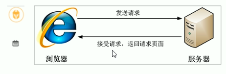

一个网页中往往会应用很多小的背景图像作为修饰，当网页中的图像过多时，服务器就会频繁地接收和发送请求图片，造成服务器请求压力过大，这将大大降低页面的加载速度。

因此，**为了有效地减少服务器接收和发送请求的次数，提高页面的加载速度，出现了CSS精灵技术**（也称CSSSprites、CSS雪碧）。

**核心原理：将网页中的一些小背景图像整合到一张大图中，这样服务器只需要一次请求就可以了**。

**目的：为了有效的减少服务器接收和发送请求的次数，提高页面的加载速度。**

**使用**

- 精灵图主要针对于小的背景图片使用
- 主要借助背景位置来实现      background-position
- 一般情况下精灵图都是负值。（千万注意网页中的坐标：x轴右边走是正值，左边走是负值，y轴下走是正值，上走是负值！！！）

```css
background: 背景颜色 		 背景图片地址 	 背景平铺 	背景图像滚动 背景图片位置；
background: tarnsparent url(image.jpg) repeat-y 	fixed 			top ;
```


### 字体图标

#### 字体图标的产生

字体图标使用场景：主要用于显示页面中通用，常用的一些小图标

精灵图是有诸多优点，但是缺点也很明显。

- 图片文件还是比较大的
- 图片本省放大和缩小会失真
- 一旦图片制作完毕想要更换非常复杂

字体图标 iconfont 可以为前端共和村呢故事提供一种方便高效的图标使用方式，展示的是图标本质属于字体。


#### 字体图标的优点

- 轻量级：一个图标字体要比一系列的图像要小。一旦字体加载了，图标就会马上渲染出来，减少了服务器请求
- 灵活性：本质其实是文字，可以很随意的改变颜色、产生阴影、透明效果、旋转等
- 兼容性：几乎支持所有的浏览器，请放心使用

注意：字体图标不能替代精灵技术，只是对工作中图标部分技术的提升和优化。

总结：如果遇到一些结构和样式比较简单的小图标，就用字体图标。如果遇到一些结构和样式复杂一点的小图片，就用精灵图。

```
# 使用
1、从网上下载下来之后fonts文件夹放到页面的根目录下面
2、css 字体声明
3、找到对应的图标写入
4、给图标设置一个字体 font-family
```


#### 字体图标的追加

如果工作中，原来的字体图标不够用了，我们需要添加新的字体图标到原来的字体文件中。

把压缩包里面的 **selection.json** 从新上传，然后选中自己想要新的图标，从新下载压缩包，并替换原来的文件即可。


### CSS 三角的做法

```html
<div class="box1"></div>

.box1 {
	width:0;
	height:0;
	border: 50px solid transparent;							// 其他边设置成透明色就有了三角形
	border-left-color: red;											
}
```


### CSS 用户界面样式

```html
# 更改用户的鼠标样式
  cursor: pointer;
  设置或检索在对象上移动的鼠标指针采用何种系统预定义的光标形状；
  default							小白
  pointer							小手
  move								移动
  text								文本
  not-allowed					禁止

# 表单轮廓
  outline: none;
  <input type='text' style="outline: none;">			可以去掉默认的蓝色边框
  
# 防止表单域拖拽
	resize: none;
  <textarea style="resize: none;"></textarea>			可以去掉文本域的拖拽
```


### vertical-align 属性

使用场景：**经常用于设置图片或者表单（行内块元素）和文字垂直对齐**。

官方解释：用于设置一个元素的垂直对齐方式，但是它只针对于行内元素或者行内块元素有效。

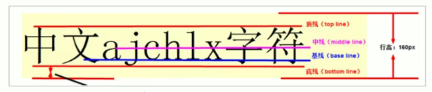

```
vertical-align : baseline | top | middle | bottom
	- baseline				默认。元素放置在父元素的基线上。
	- top							把元素的顶端与行中最高元素的顶端对齐
	- middle					把此元素放置在父元素的中部。
	- bottom					把元素的顶端与行中最低的元素的顶端对齐。
	
# 解决图片底部默认空白缝隙问题
bug: 图片地测会有一个空白缝隙，原因是行内块元素回合文字的基线对齐。
解决：
	- 给图片添加 vertical-align: middle | top | bottom 等。
	- 把图片转换为块级元素	display: block;
```


### 文字溢出省略号显示

#### 单行文本溢出显示省略号

```css
必须满足三个条件
/* 1.先强制一行内显示文本 */
white-space: nowrap;			（默认为 normal 自动换行）
/* 2.超出的部分隐藏 */
overflow: hidden;
/* 3.文字用省略号替代超出的部分 */
text-overflow: ellipsis;
```

#### 多行文本溢出显示省略号

```css
多行文本溢出显示省略号，有较大兼容性问题，适合于webKit浏览器或移动端（移动端大部分是webkit内核）
overflow: hidden;
text-overflow: ellipsis;
/* 弹性伸缩盒子模型显示 */
display: -webkit-box;
/* 限制在一个块元素显示的文本的行数 */
-webkit-line-clamp: 2;
/* 设置或检索伸缩盒对象的子元素的排列方式 */
-webkit-box-orient: vertical;

注意：更推荐让后台人员来做这个效果，因为后台人员可以设置显示多少个字，操作更简单。
```


### 常见布局技巧

#### margin 负值的运用

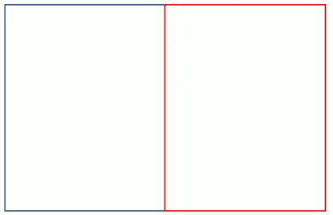

```
1、让每个盒子 margin 往左侧移动 -1 px 整好压住相邻盒子边框
2、鼠标经过某个盒子的时候，提高当前盒子的层级即可（如果没有有定位，则加相对定位（保留位置），如果有定位，则加 z-index)
```


#### 文字围绕浮动元素

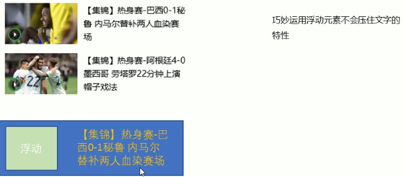


#### 行内块的巧妙运用

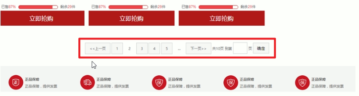

```
无需浮动，只需要转成行内块元素然后设置宽高，使用 text-align:center; 实现水平居中对齐即可
重点：text-align 可以让行内元素、行内块元素水平居中对齐
```


#### CSS 三角强化

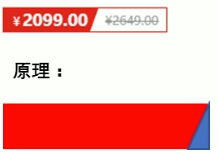

```css
width: 0;
height:0;
/* 只保留右边的边框有颜色 */
border-color: transparent red transparent transparent;
/* 样式都是 solid */
border-style: solid;
/* 上边框宽度要大，右边框宽度稍小 */
border-width: 22px 8px 0 0;
```


### CSS 初始化

不同浏览器对有些标签的默认值是不同的，为了消除不同浏览器对 HTML 文本呈现的差异，照顾浏览器的兼容，我们需要对 CSS 初始化简单理解：CSS 初始化是指重设浏览器的样式。（也称为 CSSreset )

每个网页都必须首先进行CSS初始化。

Unicode 编码字体：

把中文字体的名称用相应的 Unicode 编码来代替，这样就可以有效的避免浏览器解释 CSS 代码时候出现乱码的问题。

比如：黑体\9ED1\4F53		宋体\5B8B\4F53		微软雅黑\5FAE\8F6F\96C5\9ED1


## 五、CSS3 新增特性

### CSS3 新增选择器

#### 属性选择器

属性选择器可以根据**元素特定属性的来选择元素**。这样就可以不用借助于类或者id选择器。

| 选择符        | 简介                                        |
| ------------- | ------------------------------------------- |
| E[att]        | 选择具有 att 属性的 E 元素                  |
| E[att="val"]  | 选择具有 att 属性且属性值等于 val 的 E 元素 |
| E[att^="val"] | 匹配具有 att 属性且值以 val 开头的 E元素    |
| E[att$="val"] | 匹配具有 att 属性且值以 val 结尾的 E 元素   |
| E[att*="val"] | 匹配具有 att 属性且值中含有 val 的 E 元素   |

```html
input[type] {}
input[type=text] {}

# 以开头的
div[class^=icon] {}
	<div class="icon1"><div>
	<div class="icon2"><div>
	<div class="icon3"><div>
	<div><div>
```

注意：类选择器、属性选择器、伪类选择器，权重都是 10。


#### 结构伪类选择器

结构伪类选择器主要根据 **文档结构** 来选择器元素，常用于根据父级选择器里面的子元素

| 选择符           |                               |
| ---------------- | ----------------------------- |
| E:first-child    | 匹配父元素中的第一个子元素 E  |
| E:last-child     | 匹配父元素中最后一个 E 元素   |
| E:nth-child(n)   | 匹配父元素中的第 n 个子元素 E |
| E:first-of-type  | 指定类型 E 的第一个           |
| E:last-of-type   | 指定类型 E 的最后一个         |
| E:nth-of-type(n) | 指定类型 E 的第 n 个          |

```
E:nth-child(n)				选择某个父元素的一个活多个特定的子元素
- n 可以是数字，关键字和公式
- n 如果是数字，就是选择第 n 个元素，里面数字从 1 开始
- n 如果是关键字：even 偶数、odd 奇数
- n 可以是公式：常见的公式如下（如果 n 是公式，则从 0 开始计算，但是第 0 个元素或者超出了元素的个数会被忽略）
	2n			偶数
	2n+1		奇数
	5n			5 10 15
	n+5			从第 5 个开始（包含第五个）到最后
	-n+5		前 5 个（包含第 5 个）
```

**nth-child(n) 和 nth-of-type(n) 的区别**

```css
<section>
	<p>光头像</p>
	<div>熊大</div>
	<div>熊二</div>
</section>

/* nth-child 会把所有的盒子都排列序号 */
/* 执行的时候首先看 :nth-child(1) 之后回去看前面 div */
section div:nth-child(1){				// ❎
  background-color:red;
}
/* nth-of-type 会把指定元素的盒子排列序号 */
/* 执行的时候首先看 div 指定的元素 之后回去看:nth-of-type(1）第几个孩子 */
section div:nth-of-type(1){			// ✅
	background-color:blue;
}
```

**区别：**

1. **nth-child 对父元素里面所有孩子排序选择（序号是固定的）先找到第 n 个孩子，然后看看是否和 E 匹配**
2. **nth-of-type 对父元素里面指定子元素进行排序选择。先去匹配 E，然后再根据 E 找第 n 个孩子**


#### 伪元素选择器

**伪元素选择器可以帮助我们利用 CSS 创建新标签元素，而不需要 HTML 标签，从而简化 HTML 结构。**

| 选择符   | 简介                         |
| -------- | ---------------------------- |
| ::before | 在元素**内部的前面**插入内容 |
| ::after  | 在元素**内部的后面**插入内容 |

注意：

- **before 和 after 创建一个元素，但是属于行内元素**

- **新创建的这个元素在文档树中是找不到的，所以我们称为伪元素**

- 语法：element::before {}

- **before 和 after 必须有 content 属性**

- before 在父元素内容的前面创建元素，after 在父元素内容的后面插入元素

- **伪元素选择器和标签选择器一样，权重为 1**

```css
.tudou:hover::before {
	/* 表示鼠标经过伪元素 */
}
```


### CSS3 盒子模型

CSS3 中可以通过 box-sizing 来指定盒模型，有 2 个值：即可指定为 content-box、border-box 这样我们计算盒子大小的方式就发生了改变。

可以分成两种情况：

- **box-sizing:content-box 盒子大小为 width + padding + border（以前默认的）**

- **box-sizing:border-box 盒子大小为 width**

如果盒子模型我们改为了 box-sizing:border-box 那 padding 和 border 就不会撑大盒子了(前提 padding 和 border 不会超过 width 宽度）

```css
* {
  margin: 0;
  padding: 0;
  box-sizing: border-box;
}
```


### CSS3 其他特性

#### 图片变模糊

CSS3 滤镜 filter

```
filter CSS 属性将模糊或颜色偏移等图形效果应用于元素。
filter: 函数();		
例如：filter: blur(5px);		blur 模糊处理 数值越大越模糊
```

#### 计算盒子宽度 width:calc 函数

CSS3 calc 函数

```
calc() 此函数让你在声明 CSS 属性值时执行一些计算。
例如：width: calc(100% - 80px);
注意：括号里面可以使用 + - * / 来计算
```


### CSS3 过渡

过渡（transition) 是 CSS3 中具有颠覆性的特征之一，我们可以在不使用 Flash 动画或 JavaScript 的情况下，当元素从一种样式变换为另一种样式时为元素添加效果。

过渡动画：**是从一个状态渐渐的过渡到另外一个状态**

可以让我们页面更好看，更动感十足，虽然低版本浏览器不支持（ie9以下版本）但是不会影响页面布局。

我们现在经常和：**hover 一起搭配使用。**

```
transition:要过渡的属性 花费时间	运动曲线	何时开始；
```

- **属性**：想要变化的 css 属性，宽度高度背景颜色内外边距都可以。如果想要所有的属性都变化过渡，写一个 all 就可以。
- **花费时间**：单位是秒（必须写单位）比如 0.5s
- **运动曲线**：默认是 ease（可以省略）
- **何时开始**：单位是秒（必须写单位）可以设置延迟触发时间默认是 0s（可以省略）

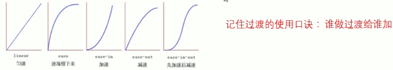

```css
transition: width .5s,  height .5s;
transition: all;
# 谁做过渡给谁加 ！！！！！
```


### CSS3 2D转换

实现元素的位移、旋转、缩放等效果转换（transform）你可以简单理解为变形。

2D 转换是改变标签在二维平面上的位置和形状的一种技术。

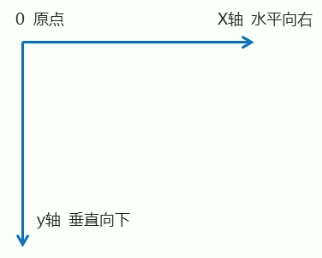


#### 移动：translate

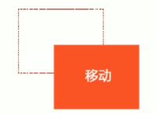

改变元素在页面中的位置，类似于定位

```css
/* x 就是 x 轴上移动位置 y 就是 y 轴上移动位置 中间逗号隔开 */
transform: translate(x, y);				或者分开写
transform: translatex(n);
transform: translateY(n) ;

translate:(50%, 50%);   # 如果里面的参数是 % 移动的距离是 盒子自身的宽度或者高度来对比的
translate:(-50%, -50%);		# 盒子往上走自己高度的一半	（可以配个定位实现垂直居中对齐）	
```

**重点：**

- 定义 2D 转换中的移动，沿着 X 和 Y 轴移动元素

- translate 最大的优点：**不会影响到其他元素的位置**
- **translate 中的百分比单位是相对于自身元素的 translate:(50%,50%);**
- **对行内标签没有效果**


#### 旋转：rotate

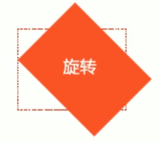

让元素在2维度平面内顺时针旋转或者逆时针旋转。

```css
transform: rotate(度数)

例子：给照片写动画鼠标放上去慢慢旋转360度
</img>
img { 
	border-radius: 50%;
  border: 5px solid pink;
  
  /* 过渡写到本身上，谁做动画给谁加 */
  transition: all 0.5s;
}
img:hover { 
	transform: rotate(360deg);	/* 鼠标划过旋转360度 */
}
```

**重点：**

- **rotate 里面跟度数，单位是 deg 比如 rotate(45deg)**
- **角度为正时，顺时针，负时，为逆时针**
- **默认旋转的中心点是元素的中心点**


#### 设置元素的中心点

```css
transform-origin: x y;
transform-origin: top left;
transform-origin: 100px 20px;
```

**重点：**

- 注意后面的参数 x 和 y 用空格隔开

- x y 默认转换的中心点是元素的中心点（50% 50%）

- 还可以给 x y 设置像素或者方位名词（top bottom left right center)


#### 缩放：scale

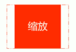

```css
transform: scale(x, y);

- transform:scale(1,1)：			宽和高都放大一倍，相对于没有放大
- transform:scale(2,2)：			宽和高都放大了2倍
- transform:scale(2)：  			只写一个参数，第二个参数则和第一个参数一样，相当于 scale(2,2)
- transform:scale(0.5,0.5)： 缩小
```

**注意：**

- 注意其中的 x 和 y 用**逗号分隔**

- sacle 缩放最大的优势：**可以设置转换中心点缩放，默认以中心点缩放的，而且不影响其他盒子**


#### 2D 综合写法

```css
transform: translate() rotate() scale() ... 等; 
例：transform: translate(100px, 20px) rotate(90deg) scale(2,2);			/* 边移动 边旋转 边缩放 */
```

**注意：其顺序会影转换的效果（先旋转会改变坐标轴方向）当我们同时有位移和其他属性的时候，记得要将位移放到最前**


### CSS3 动画

动画（animation）是 CSS3 中具有颠覆性的特征之一，可通过设置多个节点来精确控制一个或一组动画，常用来实现复杂的动画效果。

**相比较过渡，动画可以实现更多变化，更多控制，连续自动播放等效果。**

**制作动画分为两步：**


#### 01.定义动画

**用 keyframes 定义动画（类似定义类选择器）**

```css
@keyframes 动画名称 {
  0% {
    transform: translate(0, 0);
  }
  25% {
    transform: translate(1000px, 0);
  }
 50% {
    transform: translate(1000px, 500px);
  }
  75% {
    transform: translate(0, 500px);
  }
  100%{
    transform: translate(0, 0);
  }
}
##### 重点
/* 可以做多个状态的变化 keyframe 关键帧	*/
/* 里面的百分比要是整数 */
/* 里面的百分比就是总的时间 (如果是10s) 的划分 25%*10=2.5s */
```

**动画序列：**

- 0% 是动画的**开始**，100% 是动画的**完成**。这样的规则就是动画序列。

- 在 **@keyframes** 中规定某项 CSS 样式，就能创建由当前样式逐渐改为新样式的动画效果。

- 动画是使元素从一种样式逐渐变化为另一种样式的效果。您可以改变任意多的样式任意多的**次数**。

- 请用百分比来规定变化发生的时间，或用关键词 **"from"** 和 **"to"**，等同于 **0%** 和 **100%**。

#### 02.使用动画

```css
div {
	/*		调用动画			*/
	animation-name：动画名称;
	/*		持续时间			*/
	animation-duration：持续时间;
}
```


#### 动画常用属性

| 属性                      | 描述                                                         |
| ------------------------- | ------------------------------------------------------------ |
| @keyframes                | 规定动画。                                                   |
| animation                 | 所有动画属性的简写属性，除了 animation-play-state 属性。     |
| animation-name            | 规定 @keyframes 动画的名称。（必须的）                       |
| animation-duration        | 规定动画完成一个周期所花费的秒或毫秒，默认是 0。（必须的）   |
| animation-timing-function | 规定动画的速度曲线，默认是 “ease”。                          |
| animation-delay           | 规定动画何时开始，默认是 0。                                 |
| animation-iteration-count | 规定动画被播放的次数。默认是 1,  infinite 无限               |
| animation-direction       | 规定动画是否在下一周期逆向播放。默认是 normal,  alternate 逆播放 |
| animation-fill-mode       | 规定动画结束后状态。默认是回到起始状态 backwards,  forwards 保持结束状态 |
| animation-play-state      | 规定动画是否正在运行或暂停。默认是 running,  paused 停止     |


#### 速度曲线细节

animation-timing-function：规定动画的速度曲线，默认是 "ease"

| 值          | 描述                                           |
| ----------- | ---------------------------------------------- |
| linear      | 动画从头到尾的速度是相同的。匀速               |
| ease        | 默认。动画以低速开始，然后加快，在结束前变慢。 |
| ease-in     | 动画以低速开始。                               |
| ease-out    | 动画以低速结束。                               |
| ease-in-out | 动画以低速开始和结束。                         |
| steps()     | 指定了时间函数中的间隔数量（步长）             |

**奔跑的熊例子**

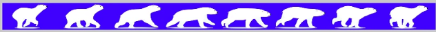

```css
steps(10)			分成10步走完 !!!					例如：打字机效果、奔跑的熊帧动画

<div></div>

@keyframes bear { 
  0%{
    background-position: 0 0;
  }
  100%{
    background-position: -1600px 0;
  }
}
@keyframes move { 
  0%{
    left: 0;
  }
  100%{
    left: 50%;
    transform: translateX(-50%);
  }
}

div {
  pasition:absolute;  # 绝对定位
  width: 200px;
  height: 100px;
  background: url(media/bear.png) no-repeat;
  /* 元素可以添加多个动画  用逗号隔开 */
  animation: bear 1s steps(8) infinite, move 3s forwards;
}
```


#### 动画简写属性

```css
animation：动画名称		持续时间		运动曲线		何时开始		播放次数		是否反方向		动画起始或者结束的状态；
animation: myfirst 5s linear 2s infinite alternate;

- 想要动画走回来，而不是直接跳回来：animation-direction: alternate;
- 盒子动画结束后，停在结束位置：animation-fill-mode: forwards;
```

**注意：**

- **简写属性里面不包含	animation-play-state**

- **暂停动画：animation-play-state:puased; 经常和鼠标经过等其他配合使用**


### CSS3 3D转换

我们生活的环境是 3D 的，照片就是 3D 物体在 2D 平面呈现的例子。近大远小、物体后面遮挡不可见。

#### 三维坐标系

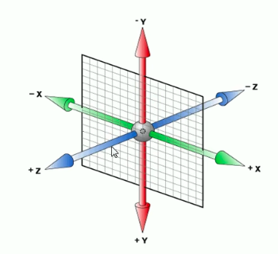

三维坐标系其实就是指立体空间，立体空间是由 3 个轴共同组成的。

- **x 轴：水平向右			注意：x 右边是正值，左边是负值**
- **y 轴：垂直向下            注意：y 下面是正值，上面是负值**
- **z 轴：垂直屏幕	        注意：往外面是正值，往里面是负值**


#### 3D 移动 translate3d

```css
3D移动在2D移动的基础上多加了一个可以移动的方向，就是z轴方向。
translform:translateX(100px)：仅仅是在 x 轴上移动
translform:translateY(100px)：仅仅是在 y 轴上移动
translform:translateZ(100px)：仅仅是在 z 轴上移动
	/* 注意：translateZ 一般用 px 单位 */
translform:translate3d(x,y,z)：其中 x、y、z 分别指要移动的轴的方向的距离
	/* 注意：x,y,z 是不能省略的，如果没有就写 0 */
```


#### 重要：透视 perspective

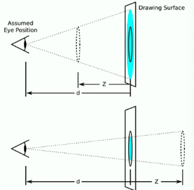

**在 2D 平面产生近大远小视觉立体，但是只是效果二维的**

- **如果想要在网页产生 3D 效果需要透视（理解成 3D 物体投影在 2D 平面内）**。

- 模拟人类的视觉位置，可认为安排一只眼睛去看

- 透视我们也称为视距：**视距就是人的眼睛到屏幕的距离**

- 距离视觉点越近的在电脑平面成像越大，越远成像越小

- **透视的单位是像素**

**注意：透视写在被观察元素的父盒子上面的**

**d：就是视距**，视距就是一个距离人的眼睛到屏幕的距离。			(perspective)

**z：就是 z 轴**，物体距离屏幕的距离，z 轴越大（正值）我们看到的物体就越大。	(z 轴)


#### 3D 旋转 rotate3d

3D旋转指可以让元素在三维平面内沿着x轴，y轴，z轴或者自定义轴进行旋转。

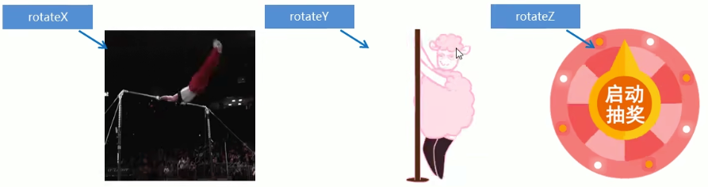

```css
transform:rotateX(45deg)：沿着 x 轴正方向旋转 45 度
transform:rotateY(45deg)：沿着 y 轴正方向旋转 45deg
transform:rotateZ(45deg)：沿着 z 轴正方向旋转 45deg
transform:rotate3d(x,y,z,deg)：沿着自定义轴旋转 deg 为角度（了解即可)
```


##### rotateZ

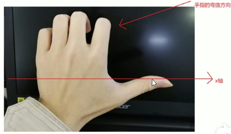

**对于元素旋转的方向的判断我们需要先学习一个左手准则。**

**左手准则**

- 左手的手拇指指向 x 轴的正方向

- 其余手指的弯曲方向就是该元素沿着 x 轴旋转的方向


##### rotateY

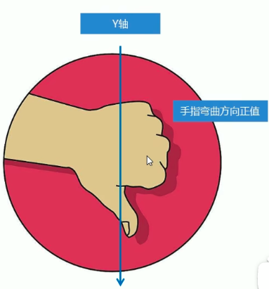

**对于元素旋转的方向的判断我们需要先学习一个左手准则。**

**左手准则**

- 左手的手拇指指向 y 轴的正方向

- 其余手指的弯曲方向就是该元素沿着 y 轴旋转的方向（正值）


##### rotateZ

```css
transform:rotate3d(x,y,z,deg)：沿着自定义轴旋转 deg 为角度
x y z 是表示旋转轴的矢量，是标示你是否希望沿着该轴旋转，最后一个标示旋转的角度。
- transform:rotate3d(1, 0, 0, 45deg)		就是沿着 × 轴旋转 45deg
- transform:rotate3d(1, 1, 0, 45deg)就是沿着对角线旋转	45deg
```


#### 3D 呈现 transfrom-style

**作用：控制子元素是否开启三维立体环境**

```css
transform-style: flat;  				子元素不开启 3d 立体空间默认的
transform-style: preserve-3d;		子元素开启立体空间
注意：代码写给父级，但是影响的是子盒子 ！！！！
```


## 小方法

### Emmet 语法

#### 快速生成 HTML 结构语法

```
1、<div></div>				生成标签直接输入标签名按 tab 键
2、div*3         		生成多个相同的标签加上 * 
3、ul>li							生成父子级关系的标签
4、div+p							生成兄弟关系的标签
5、.nav #banner	p.one p#one	 生成带有类名或者id名字的
6、.demo$*5					生成的div类名是有顺序的可以使用自增符号 $
7、{}								在生成的标签内部写内容
```

#### 快速生成 CSS 样式语法

```
w200 按 tab 可以生成 width:200px;
lh26 按 tab 可以生成 line-height:26px;
```


### 网站 TDK 三大标签 SEO 优化

**SEO（Search Engine Optimization) 汉译为搜索引擎优化**，是一种利用搜索引擎的规则提高网站在有关搜索引擎内自然排名的方式。
SEO的目的是**对网站进行深度的优化**，从而帮助网站获取免费的流量，进而在搜索引擎上提升网站的排名，提高网站的知名度。
页面必须有三个标签用来符合SEO优化。

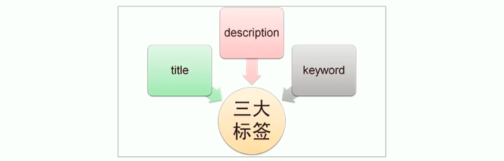

#### title 网站标题

title 具有不可替代性，是我们内页的第一个重要标签，是搜索引擎了解网页的入口和对网页主题归属的最佳判断点。

**建议：网站名（产品名）- 网站的介绍**（尽量不要超过30个汉字）

例如：

- 京东（JD.COM）-综合网购首选-正品低价、品质保障、配送及时、轻松购物！
- 小米商城-小米5s、红米Note4、小米MIX、小米笔记本官方网站


#### description 网站说明

**简要说明我们网站主要是做什么的。**

提倡：description 作为网站的总体业务和主题概括，多采用“我们是…”、“我们提供…”、“xxx网作为...”、“电话：010...”之类语句。

例如：

```html
<meta name="description"  content="京东JD.COM-专业的综合网上购物商城，销售家电、数码通讯、电脑、家居百货、，服装服饰、母婴、图书、食品等数万个品牌优质商品.便捷、诚信的服务，为您提供愉悦的网上购物体验！" />
```


#### keywords 关键字

**keywords 是页面关键词，是搜索引擎的关注点之一。**

keywords 最好限制为 6～8 个关键词，关键词之间用英文逗号隔开，采用关键词1,关键词 2 的形式。

例如：

```html
<meta name="keywords"  content="网上购物,网上商城手机,笔记本,电脑,MP3,CD,VCD,DV,相机,数码,配件,手表,存储卡,京东" />
```


### LOGO SEC 优化

- logo 里面首先放一个 **h1** 标签，目的是为了提权，告诉搜索引擎，这个地方很重要。

- h1 里面再放一个**链接**，可以返回首页的，把 logo 的背景图片给链接即可。

- 为了搜索引擎收录我们，我们链接里面要放**文字（网站名称）**，但是文字不要显示出来。

  - 方法1: **text-indent** 移到盒子外面（**text-indent:-9999px**)，然后 **overflow:hidden**，淘宝的做法。

  - 方法2：直接给 **font-size:0;** 就看不到文字了，京东的做法。

- 最后给链接一个 **title** 属性，这样鼠标放到 logo 上就可以看到提示文字了。


### 浏览器私有前缀

浏览器私有前缀是为了兼容老版本的写法，比较新版本的浏览器无须添加。

私有前缀

- -moz-：代表 firefox 浏览器私有属性

- -ms-：代表 ie 浏览器私有属性

- -webkit-：代表 safari、chrome 私有属性

- -o-：代表 Opera 私有属性

提倡的写法

```
-moz-border-radius: 10px;
-webkit-border-radius: 10px;
-o-border-radius: 10px;
border-radius: 10px;
```


## 页面布局整体思路

为了提高网页制作的效率，布局时通常有以下的整体思路：

1.必须确定页面的版心（可视区），我们测量可得知。

2.分析页面中的行模块，以及每个行模块中的列模块。其实页面布局第一准则.

3.一行中的列模块经常浮动布局，先确定每个列的大小，之后确定列的位置.页面布局第二准则

4.**制作 HTML 结构。我们还是遵循，先有结构，后有样式的原则。结构永远最重要  ！！！！**

5.所以，先理清楚布局结构，再写代码尤为重要.这需要我们多写多积累.


# 移动端开发

## 视口

**视口 ( viewport ) 就是浏览器显示页面内容的屏幕区域。视口可以分为布局视口、视觉视口和理想视口。**

### 布局视口 layout viewport

一般移动设备的浏览器都默认设置了一个布局视口，用于解决早期的PC端页面在手机上显示的问题。iOS, Android 基本都将这个视口分辨率设置为 980px，所以 PC 上的网页大多都能在手机上呈现，只不过元素看上去很小，一般默认可以通过手动缩放网页。

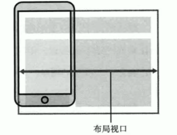


### 视觉视口 visual viewport

字面意思，它是用户正在看到的网站的区域。注意：是网站的区域。

通过缩放去操作视觉视口，但不会影响布局视口，布局视口仍保持原来的宽度。

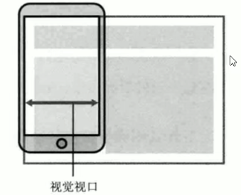


### 理想视口 ideal viewport

- 为了使网站在移动端有最理想的浏览和阅读宽度而设定，理想视口，对设备来讲，是最理想的视口尺寸

- 需要手动添写 meta 视口标签通知浏览器操作

- meta 视口标签的主要目的：布局视口的宽度应该与理想视口的宽度一致，简单理解就是设备有多宽，我们布局的视口就多宽


### meta 视口标签

```html
<meta name="viewport" content="width=device-width, user-scalable=no, 
initial-scale=1.0, maximum-scale=1.0, minimum-scale=1.0">
```

| 属性          | 解释说明                                                 |
| ------------- | -------------------------------------------------------- |
| width         | 宽度设置的是 viewport 宽度，可以设置 device-width 特殊值 |
| initial-scale | 初始缩放比，大于 0 的数字                                |
| maximum-scale | 最大缩放比，大于 0 的数字                                |
| minimum-scale | 最小缩放比，大于 0 的数字                                |
| user-scalable | 用户是否可以缩放，yes 或 no（1或0）                      |


## 二倍图

### 物理像素&物理像素比

- 物理像素点指的是屏幕显示的最小颗粒，是物理真实存在的。这是厂商在出厂时就设置好了，比如苹果 6\7\8 是 750*1334

- 我们开发时候的 1px 不是一定等于1个物理像素的

- PC 端页面，1个 px 等于1个物理像素的，但是移动端就不尽相同

- 一个 px 的能显示的物理像素点的个数，称为物理像素比或屏幕像素比

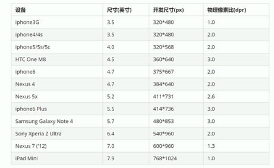

**PC 端和早前的手机屏幕/普通手机屏幕：1CSS像素=1物理像素的**

**Retina (视网膜屏幕）是一种显示技术，可以将把更多的物理像素点压缩至一块屏幕里，从而达到更高的分辨率，并提高屏幕显示的细腻程度。**

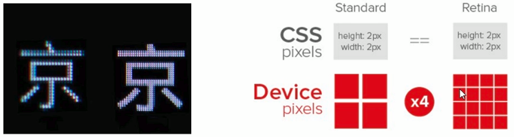


### 多倍图

对于一张 50px*50px 的图片，在手机 Retina 屏中打开，按照刚才的物理像素比会放大倍数，这样会造成图片模糊。在标准的viewport设置中，使用倍图来提高图片质量，解决在高清设备中的模糊问题，通常使用二倍图，还存在3倍图4倍图的情况，这个看实际开发公司需求。

```css
/* 在 iphone8 下面 */
img {
	/* 原始图片 100*100px */
  width: 50px;
  height: 50px;
}

.box { 
	/* 原始图片 100*100px */
	background-size: 50px 50px;
}
```


### 背景缩放

**background-size 属性规定背景图像的尺寸**

```
background-size: 图片的宽度 图片的高度
  - 只写一个参数 肯定是宽度 高度省略了 会等比例缩放
  - 里面的单位可以跟 % 相对于父盒子来说的
```

- 单位：长度 | 百分比 | cover | contain

- cover 把背景图像扩展至足够大，以使背景图像完全覆盖背景区域。

  **注意：要完全覆盖 div 盒子，可能有部分背景图片显示不全**

- contain 把图像图像扩展至最大尺寸，以使其宽度和高度完全适应内容区域。

  **注意：当宽度或者高度 铺满 div 盒子就不再进行拉伸了，可能有部分空白区域**


### 二倍精灵图做法

- **在 firework 里面把精灵图等比例缩放为原来的一半**
- **之后根据大小测量坐标**

**注意：代码里面 background-size 也要写：精灵图原来宽度的一半**


## 移动端主流方案

#### 单独制作移动端页面（主流）

通常情况下，网址域名前面加 m(mobile) 可以打开移动端。通过判断设备，如果是移动设备打开，则跳到移动端页面。


##### 布局方式

- **流式布局（百分比布局）**
- **flex 弹性布局（强烈推荐）**
- **less + rem + 媒体查询布局**
- **混合布局**


#### 响应式页面兼容移动端（其次）

三星电子官网：www.samsung.com/cn/，通过判断屏幕宽度来改变样式，以适应不同终端。

**缺点：制作麻烦，需要花很大精力去调兼容性问题**

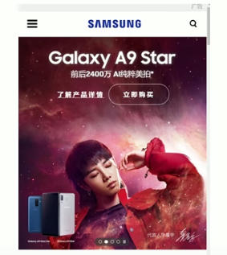

##### 布局方式

- **媒体查询**
- **bootstarp**


## 移动端技术解决方案

### 移动端浏览器

移动端浏览器基本以 webkit 内核为主，因此我们就考虑 webkit 兼容性问题。

我们可以放心使用 H5 标签和 CSS3 样式。

同时我们浏览器的私有前缀我们只需要考虑添加 webkit 即可

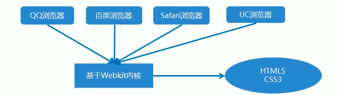


### CSS 初始化 normalize.css

移动端 CSS 初始化推荐使用 normalize.css

- Normalize.css：保护了有价值的默认值

- Normalize.css：修复了浏览器的bug

- Normalize.css：是模块化的

- Normalize.css：拥有详细的文档

官网地址：http://necolas.github.io/normalize.css/


### CSS3 盒子模型 box-sizing

CSS3 中可以通过 box-sizing 来指定盒模型，有 2 个值：即可指定为 content-box、border-box 这样我们计算盒子大小的方式就发生了改变。

可以分成两种情况：

- **box-sizing:content-box 盒子大小为 width + padding + border（以前默认的）**

- **box-sizing:border-box 盒子大小为 width**

如果盒子模型我们改为了 box-sizing:border-box 那 padding 和 border 就不会撑大盒子了(前提 padding 和 border 不会超过 width 宽度）

```css
* {
  margin: 0;
  padding: 0;
  box-sizing: border-box;
}
```


### 特殊样式

```css
/*CSS3盒子模型*/
box-sizing: border-box;
-webkit-box-sizing: border-box;
/*点击高亮我们需要清除清除设置为transparent 完成透明*/
-webkit-tap-highlight-color: transparent;
/*在移动端浏览器默认的外观在ios上加上这个属性才能给按钮和输入框自定义样式*/
-webkit-appearance: none;
/*禁用长按页面时的弹出菜单*/
img,a { -webkit-touch-callout: none; }
```


## 布局

- **单独制作移动端页面**
  - **流式布局（百分比布局）**
  - **flex 弹性布局（强烈推荐）**
  - **less + rem + 媒体查询布局**
  - **混合布局**
- **响应式页面兼容移动端**
  - **媒体查询**
  - **bootstarp**


### 01.流式布局（百分比布局）

- 流式布局，就是百分比布局，**也称非固定像素布局**。

- **通过盒子的宽度设置成百分比来根据屏幕的宽度来进行伸缩，不受固定像素的限制，内容向两侧填充**。

- 流式布局方式是移动 web 开发使用的比较常见的布局方式。

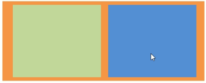

```
max-width			最大宽度			max-height		最大高度
min-width			最小宽度			min-height		最小高度
注意：流式布局只管宽度就可以了
```


### 02.Flex  弹性布局

#### 布局体验

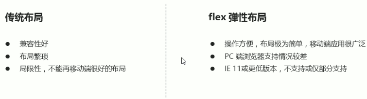

**建议：**

- **如果是PC端页面布局，我们还是传统布局。**

- **如果是移动端或者不考虑兼容性问题的 PC 端页面布局，我们还是使用 flex 弹性布局**


#### Flex 布局原理

Flex 是 Flexible box 的缩写，意思为**弹性布局**，**用来为盒装模型提供最大的灵活度，任何一个容器都可以指定为 flex 布局。不区分行内元素和块元素！**

- **当我们为父盒子设为 Flex 布局以后，子元素的 float、clear 和 vertical-align 属性将失效。**
- **采用 Flex 布局的元素，称为 Flex 容器( Flex container)，简称 "容器"。它的所有子元素自动成为容器成员，称为 Flex 项目(flex item)， 简称 "项目"。**

**总结：通过给父盒子添加 Flex 属性，来控制子盒子的位置和排列方式 ！！！**


#### 父项常见属性

##### 主轴和侧轴

在 Flex 布局中，是分为主轴和侧轴两个方向，同样的叫法有：行和列、x 轴和 y 轴

- 默认主轴方向就是 x 轴方向，水平向右
- 默认侧轴方向就是 y 轴方向，水平向下

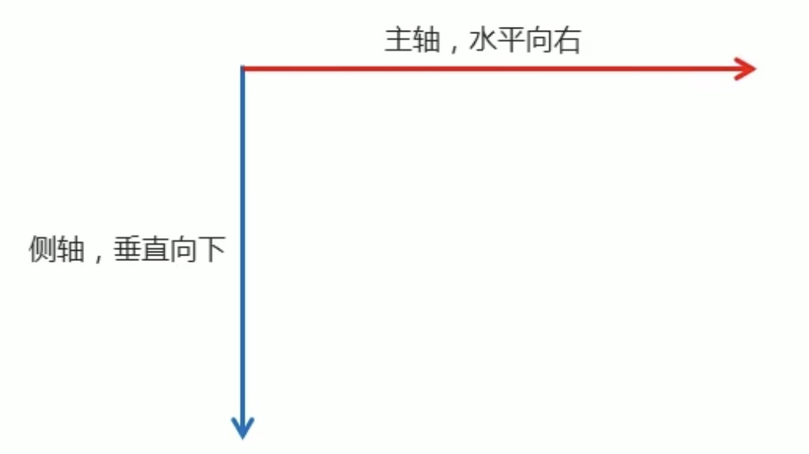

##### flex-direction

**属性决定主轴的方向（即项目的排列方向）**

注意：主轴和侧轴是会变化的，就看 flex-direction 设置谁为主轴，剩下的就是侧轴。而我们的子元素是跟着主轴来排列的。

```css
flex-direction:	
	属性值：
    - row						 默认值从左到右
    - row-reverse					从右到左
    - column							从上到下
    - column-reverse			从下到上
```

##### flex-wrap

**设置子元素是否换行**

注意：默认情况下，项目都排在一条线上 (又称为轴线) 上。flex-wrap 属性定义，flex 布局中默认是不换行的，如果装不开，会缩小子元素的宽度，放到父元素里面。

```css
flex-wrap:  
	属性值：
		- nowrap		默认值，不换行
		- wrap			换行
```

##### flex-flow

**复合属性，相当于同时设置了 flex-direction 和 flex-wrap**

```css
flex-flow: row, nowrap;
```

##### justify-content

**设置主轴上元素排列方式，该属性定义了项目再主轴上的对齐方式**

```css
justify-content:  
	注意：使用这个属性之前一定要确定好主轴是哪个
	属性值：
		- flex-start		 默认值 从头部开始 如果主轴是 x 轴，则从左到右
		- flex-end							从尾部开始排列
		- center								在主轴居中对齐，如果主轴是 x 轴则水平居中
		- space-around					平分剩余空间
		- space-between   			先两边贴边 再平分剩余空间（重要）
```

##### align-items

**设置侧轴上子元素排列方式（单行）**

注意：该属性是控制子项在侧轴上的排列方式，在子项为单项的时候使用

```css
align-items:
	属性值：
		- flex-start			默认值 从上到下
		- flex-end				从下到上
		- center					挤在一起居中 (垂直居中)
		- stretch					拉伸  (但是子盒子不能设置高度)
```

##### align-content

**设置侧轴上的子元素的排列方式（多行）**

注意：设置子项在侧轴上的排列方式 并且只能用于子项出现换行的情况 (多行)，在单行下是没有效果的。

```css
align-content:
	属性值：
		- flex-start			默认值 在侧轴的头部开始排列
		- flex-end				在侧轴的尾部开始排列
		- center					在侧轴中间显示
		- space-around		子项在侧轴平分剩余空间
		- space-between		子项在侧轴先分布在两头，再平分剩余空间
		- stretch					设置子项元素高度平分父元素高度
```


#### 子项常见属性

##### flex

flex 属性定义子项目 **分配剩余空间**，用 flex 来表示占多少份数。

```css
flex: <number>;  // dafault 0
flex: 20%;  // flex 可以写百分比的
```

##### align-self

**align-self 控制子项自己在侧轴上的排列方式**

```css
align-self 属性允许单个项目有与其他项目不一样的对齐方式，可覆盖 align-items 属性。
默认值为 auto, 表示继承父元素的 align-items 属性，如果没有父元素，则等同于 stretch。

- flex-start			默认值 从上到下
- flex-end				从下到上
- center					挤在一起居中 (垂直居中)
- stretch					拉伸  (但是子盒子不能设置高度)
```

##### order

**order 属性定义项目的排列顺序**

```css
数值越小，排列越靠前，默认为 0
```


### 03.rem 适配布局

**产生原因：**

- 页面布局文字能否随着屏幕大小变化而变化？

- 流式布局和flex布局主要针对于宽度布局，那高度如何设置?

- 怎么样让屏幕发生变化的时候元素高度和宽度等比例缩放？

#### rem 单位

- rem(root em) 是一个相对单位，类似于 em，em 是**父元素字体大小。**

- 不同的是 rem 的基准是相对于 html 元素的字体大小。

- 比如，根元素（html) 设置 font-size=12px; 非根元素设置 width:2rem; 则换成 px 表示就是 24px。

```css
html {
  font-size=12px;
}

p { 
  /* 1.em 相对于父元素的字体大小来说的 */
	width: 10em;
  height: 10em;
  /* 2.rem 相对于 html 的字体大小来说的 */
  width: 10rem;
  height: 10rem;
  /* 注：rem 的优点就是可以通过修改 html 里面的文字大小来改变页面中元素的大小可以整体控制 */
}
```


#### 媒体查询

媒体查询（Media Query）是 CSS3 新语法。

- 使用 @media 查询，可以针对不同的媒体类型定义不同的样式

- **@media 可以针对不同的屏幕尺寸设置不同的样式**

- 当你重置浏览器大小的过程中，页面也会根据浏览器的宽度和高度重新渲染页面

- 目前针对很多苹果手机、Android 手机，平板等设备都用得到多媒体查询

```css
# 语法
@media mediatype and | not | only (media feature) {
	CSS-Code;
}

- 用 @media 开头注意 @ 符号
- mediatype 媒体类型
- 关键字 and  not  only
- media feature	媒体特性必须有小括号包含
  
例子：
@media scree and (min-width: 600px) and (max-width: 800px) {
	background-color: red;
}
```


##### mediatype 媒体类型

讲不同的终端设备划分成不同的类型，称为媒体类型

| 值    | 解释说明                           |
| ----- | ---------------------------------- |
| all   | 用于所有设备                       |
| print | 用于打印机和打印预览               |
| scree | 用于电脑屏幕，平板电脑，智能手机等 |


##### 关键字

**关键字将媒体类型或多个媒体特性连接到一起做为媒体查询的条件。**

- and：可以将多个媒体特性连接到一起，相当于“且”的意思。
- not：排除某个媒体类型，相当于“非”的意思，可以省略。
- only：指定某个特定的媒体类型，可以省略。


##### 媒体特性

每种媒体类型都具体各自不同的特性，根据不同媒体类型的媒体特性设置不同的展示风格。暂且了解三个。

| 值        | 解释说明                           |
| --------- | ---------------------------------- |
| width     | 定义输出设备中页面可见区域的宽度   |
| min-width | 定义输出设备中页面最小可见区域宽度 |
| max-width | 定义输出设备中页面最大可见区域宽度 |

**注意：为了防止混乱，媒体查询我们要按照从小到大或者从大到小的顺序来写，但是我们最喜欢的还是从小到大来写，这样代码更简洁**

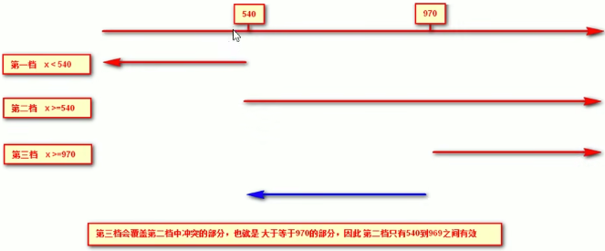


#### 媒体查询 + rem

**媒体查询 + rem 就可以实现不同设备宽度，实现页面元素大小的动态变化**

```css
<p>购物车<p>

@media screen and (min-width: 320px) {
  html {
    font-size: 50px;
  }
}
@media screen and (min-width: 640px) {
  html {
    font-size: 100px;
  }
}

p { 
	height: 1rem;
  font-size: .5rem;
  line-height: 1rem;
  text-aligin: center;
}
```


#### 引入资源

当样式比较繁多的时候，我们可以针对不同的媒体使用不同 stylesheets(样式表）。原理，就是直接在 link 中判断设备的尺寸，然后引用不同的 css 文件。

```css
# 注：引入资源就是针对不同的屏幕尺寸调用不同的 css 文件
<link rel="stylesheet" media="mediatype and|not|only (media feature)" href="mystylesheet.css">
```


#### rem 适配方案

##### rem 适配方案技术使用

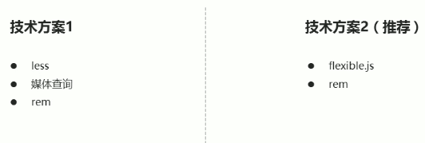


##### 01.媒体查询 + rem + less 技术

**动态设置 html 标签 font-size 大小**

```
① 假设设计稿是 750px
② 假设我们把整个屏幕划分为 15 等份（划分标准不一可以是 20 份也可以是 10 等份）
③ 每一份作为 html 字体大小，这里就是 50px
④ 那么在 320px 设备的时候，字体大小为 320/15 就是 21.33px
⑤ 用我们页面元素的大小除以不同的 html 字体大小会发现他们比例还是相同的
⑥ 比如我们以 750 为标准设计稿
⑦ 一个 100*100 像素的页面元素在 750 屏幕下，就是 100/50 转换为 rem 是 2rem*2rem 比例是 1 比 1
⑧ 320 屏幕下，html 字体大小为 21.33 则 2rem=42.66px 此时宽和高都是 42.66 但是宽和高的比例还是 1 比 1
⑨ 但是已经能实现不同屏幕下页面元素盒子等比例缩放的效果
```

**元素大小取值方法**

```
最后的公式：
- 页面元素的 rem 值 = 页面元素值（px）/（屏幕宽度/划分的份数）
屏幕宽度/划分的份数就是 html font-size 的大小		或者：页面元素的rem值 = 页面元素值（px）/ html font-size字体大小
```


##### 02.flexible.js + rem

```
手机淘宝团队出的简洁高效移动端适配库
我们再也不需要在写不同屏幕的媒体查询，因为里面 js 做了处理
它的原理是把当前设备划分为 10 等份，但是不同设备下，比例还是一致的。
我们要做的，就是确定好我们当前设备的 html 文字大小就可以了
比如当前设计稿是 750px，那么我们只需要把 html 文字大小设置为 75px（750px/10）就可以
里面页面元素 rem 值：页面元素的 px值/75
剩余的，让 flexible.js 来去算

github地址 : https://github.com/amfe/lib-flexible
```


### 04.vw 和 vh

**vw/vh 是一个相对单位 (类似 em 和 rem 相对单位)**

- **vw 是：viewport width 视口宽度单位**

- **vh 是：viewport height 视口高度单位**

**相对视口的尺寸计算结果**

- **1vw = 1/100 视口宽度**

- **1vh = 1/100 视口高度**

**注意事项：**

- **和百分比有区别的，百分比是相对于父元素来说的，而 vw 和 vh 总是针对于当前视口来说的。**
- **我们本质是根据视口宽度来等比例缩放页面元素高度和宽度的，所以开发中使用 vw 就基本够用了，vh 很少使用。**

```javascript
例子：前提：我们设计稿按照iphone678来设计，有个盒子是 50 * 50 像素的如何使用 vw 呢？
分析：
	参照 iphone678，所以视口宽度是 375 像素
	那么 1vm = 375px / 100 = 3.75px
	那么 50px = 50 / 3.75 = 13.33333vw
```


## 响应式开发

### 响应式开发原理

就是使用媒体查询针对不同宽度的设备进行布局和样式的设置，从而适配不同设备的目的。

| 设备划分                 | 尺寸区间            |
| ------------------------ | ------------------- |
| 超小屏幕（手机)          | < 768px             |
| 小屏设备（平板）         | \>= 768px ~ <992px  |
| 中等屏幕（桌面显示器）   | \>= 992px ~ <1200px |
| 宽屏设备（大桌面显示器） | \>= 1200px          |


### 响应式布局容器

响应式需要一个父级做为布局容器，来配合子级元素来实现变化效果。

原理就是在不同屏幕下，通过媒体查询来改变这个布局容器的大小，再改变里面子元素的排列方式和大小，从而实现不同屏幕下，看到不同的页面布局和样式变化。

**平时我们的响应式尺寸划分**

- 超小屏幕（手机，小于768px）：设置宽度为100%

- 小屏幕（平板，大于等于768px）：设置宽度为750px

- 中等屏幕（桌面显示器，大于等于992px）：宽度设置为970px

- 大屏幕（大桌面显示器，大于等于1200px）：宽度设置为1170px

```css
<div class="container"></div>

@media screen and (max-width: 767px){
  .container{
    width: 100%;
  }
}
@media screen and (min-width: 768px){
  .container{
    width: 750px;
  }
}
@media screen and (min-width: 992px){
  .container{
    width: 970px;
  }
}
@media screen and (min-width: 1200px){
  .container{
    width: 1170px;
  }
}
```


## 小知识

### 图片格式

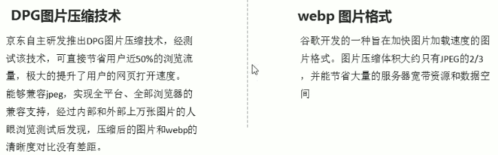


# 前端开发框架

## Bootstrap

3.x.x：目前使用最多，稳定，但是放弃了IE6-IE7。对IE8支持但是界面效果不好，**偏向用于开发响应式布局、移动设备优先的WEB项目。**


# CSS 扩展语言

## 维护 CSS 的弊端

- CSS 是一门非程序式语言，没有变量、函数、SCOPE（作用域）等概念。

- CSS 需要书写大量看似没有逻辑的代码，CSS 冗余度是比较高的。

- 不方便维护及扩展，不利于复用。

- CSS 没有很好的计算能力

非前端开发工程师来讲，往往会因为缺少 CSS 编写经验而很难写出组织良好且易于维护的 CSS 代码项目。

## Less

### Less 介绍

Less 中文网址：https://less.bootcss.com/

Less（Leaner Style Sheets的缩写）是一门 CSS 扩展语言，也成为 CSS 预处理器。

做为 CSS 的一种形式的扩展，它并没有减少 CSS 的功能，而是在现有的 CSS 语法上，为 CSS 加入程序式语言的特性。

它在 CSS 的语法基础之上，引入了变量，Mixin（混入），运算以及函数等功能，大大简化了 CSS 的编写，并且降低了 CSS 的维护成本，就像它的名称所说的那样，Less 可以让我们用更少的代码做更多的事情。

常见的 CSS 预处理器：Sass、Less、Stylus


## Sass

Sass 中文网址：https://www.sass.hk/

