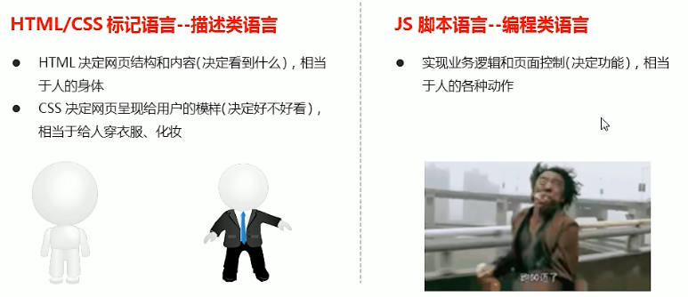
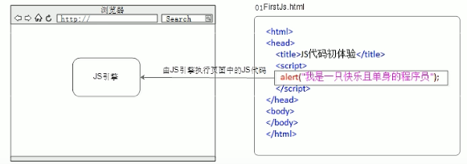
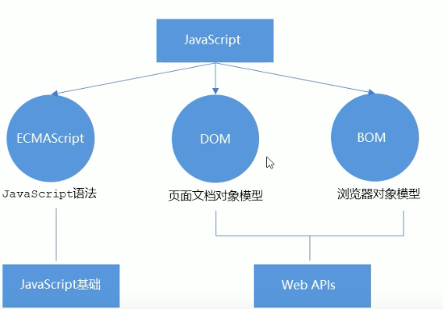
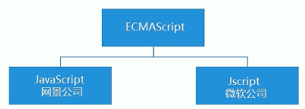
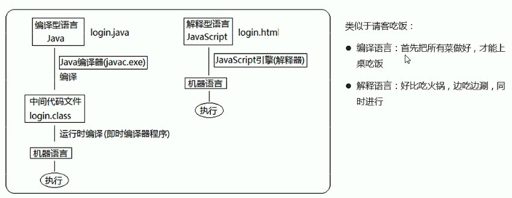

**是什么？**
- JavaScript 是世界上最流行的语言之一，是一种运行在客户端的脚本语言（ Script 是脚本的意思）
- 脚本语言：不需要编译，运行过程中由js解释器（ js 引擎）逐行来进行解释并执行
- 现在也可以基于 Node.js 技术进行服务器端编程

**作用**
- 表单动态校验 密码强度检测  **JS 产生最初的目的**
- 网页特效
- 服务端开发（ Node.js )
- 桌面程序（ Electron ）
- App（ Cordova ）
- 控制硬件-物联网（ Ruff ）
- 游戏开发（ cocos2d-js ）

**HTML、CSS、JS 的区别**



**浏览器执行 JS**

**浏览器分成两部分：渲染引擎和 JS 引擎**

- **渲染引擎**：用来解析 HTML 与 CSS，俗称内核，比如 chrome 浏览器的 blink，老版本的 webkit
- **JS 引擎**：也称为 JS 解释器。用来读取网页中的 JavaScript 代码，对其处理后运行，比如 chrome 浏览器的 V8

浏览器本身并不会执行 JS 代码，而是通过内置 JavaScript引擎（解释器) 来执行 JS 代码。 JS 引擎执行代码时逐行解释每一句源码（转换为机器语言），然后由计算机去执行，所以 JavaScript 语言归为脚本语言，会逐行解释执行。




## JS 的组成



### ECMAScript
**ECMASeript** 是由 ECMA 国际（原欧洲计算机制造商协会）进行标准化的一门编程语言，这种语言在万维网上应用广泛，它往往被称为JavaScript 或 JScript，但实际上后两者是 ECMAScript 语言的实现和扩展。


**ECMAScript：ECMAScript 规定了 JS 的编程语法和基础核心知识，是所有浏览器厂商共同遵守的一套 JS 语法工业标准。**

更多参看MDN:https://developer.mozilla.org/zh-CN/docs/Web/JavaScript/JavaScript technologies overview


### DOM - 文档对象模型
**文档对象模型**（Document Object Model，简称 DOM），是 W3C 组织推荐的处理可扩展标记语言的**标准编程接口**。
**通过DOM提供的接口可以对页面上的各种元素进行操作（大小、位置、颜色等）。**


### BOM - 浏览器对象模型
BOM（Browser Object Model，简称BOM) 是指浏览器对象模型，**它提供了独立于内容的、可以与浏览器窗口进行互动的对象结构。通过BOM可以操作浏览器窗口，比如弹出框、控制浏览器跳转、获取分辨率等。**


## JS 3 种书写方式
### 行内式

```html
<input type="button" value="点我试试" onclick="alert('Hello World')" />
```

- 可以将单行或少量 JS 代码写在 HTML 标签的事件属性中（**以 on 开头的属性**），如：onclick
- 注意单双引号的使用：**在HTML中我们推荐使用双引号，JS 中我们推荐使用单引号**

**缺点：**
- 可读性差，在 html 中编写 JS 大量代码时，不方便阅读;
- 引号易错，引号多层嵌套匹配时，非常容易弄混;
- 特殊情况下使用


### 内嵌式

```html
<script>
	alert('Hello World~ !'); 
</script>
```

- 可以将多行代码写到 `<script>` 标签中
- 内嵌 JS 是学习时常用的方式


### 外部式

```html
<script src="my.js"></script>
```

- 利于 HTML 页面代码结构化，把大段 JS 代码独立到 HTML 页面之外，既美观，也方便文件级别的复用
- 引用外部 JS 文件的 script 标签中间不可以写代码
- 适合于 JS 代码量比较大的情况


## 解释型语言和编译型语言




## 标识符、关键字、保留字

- **标识(zhi)符**：就是指开发人员为变量、属性、函数、参数取的名字。**标识符不能是关键字或保留字**。

  ```
  - 变量的名称一般用名词  ❗️
  - 函数的名称一般用动词  ❗️
  ```

- **关键字：是指 JS 本身已经使用了的字，不能再用它们充当变量名、方法名。**

  包括：break、case、catch、continue、default、delete、do、else、finally、for、function、if、in、
  instanceof、new、return、switch、this、throw、try、typeof、var、void、while、with 等。

- **保留字：实际上就是预留的“关键字”，意思是现在虽然还不是关键字，但是未来可能会成为关键字，同样不能使用它们当变量名或方法名。**

  包括：boolean、byte、char、class、const、debugger、double、enum、export、extends、fimal、 float、goto、 implements、 import、int、 interface、 long、 mative、package、private、protected、 public、 short、 static、 super、 synchronized、 throws、 transient、volatile 等。

