# ECMAScript

```javascript
// 单行注释
/*
	 多行注释
*/

//   01.输入输出语句
prompt(info)						浏览器弹出输入框，用户可以输入	 // 取过来的值是 字符型
alert(msg)							浏览器弹出警示框
console.log(msg)				浏览器控制台打印输出信息
```


## 变量

**本质：变量是程序在内存中申请的一块用来存放数据的空间。**


### 变量使用

```javascript
变量在使用时分为两步：	1.声明变量   2.赋值
- 声明变量
	var age;  // 声明一个名称为 age 的变量
    var 是一个 JS 关键字，用来声明变量( variable 变量的意思)。使用该关键字声明变量后，计算机会自动为变量分配内存空间。
    age 是程序员定义的变量名，我们要通过变量名来访问内存中分配的空间
- 赋值
	age = 10; // 给 age 这个变量赋值为 10

// 声明一个变量并赋值，称为变量的初始化
var age = 18; 

# 例子
var myname = prompt('请输入你的名字');
alert(myname);


# 变量拓展
// 1.更新变量
var age = 18;
age = 81;  // 最后的结果是 81 因为 18 被覆盖掉了
// 2.声明多个变量
var age=18, myname='xiaoming';
var sex, address;
console.log(sex)  // 输出 undefined 未定义的
console.log(tel)  // 不声明 不赋值 直接使用报错
qq = 110;
console.log(qq);	// 可以使用  不推荐 ！！！


# 变量命令规范
- 由字母(A-Za-z）、数字（0-9）、下划线（_）、美元符号（$）组成，如：usrAge,num01,_name
- 严格区分大小写。var app; 和 var App; 是两个变量
- 不能以数字开头。18age 是错误的
- 不能是关键字、保留字。例如：var、for、while
- 变量名必须有意义。MMD BBD nl → age
- 遵守驼峰命名法。首字母小写，后面单词的首字母需要大写。myFirstName
```


## 数据类型

```javascript
数据类型								 说明																									 默认值
Number									数字型，包含整型值和浮点型值，如 21、0.21								0
String									字符串类型，如"张三"注意 js 里面，字符串都带引号          ""
Boolean									布尔值类型，如 true、false, 等价于 1 和 0								false
Undefined								var a; 声明了变量 a 但是没有给值，此时 a=undefined			 undefined
Null										var a=null;声明了变量 a 为空值												 null
```


### 为什么需要数据类型 ? 有什么特点？

在计算机中，不同的数据所需占用的存储空间是不同的，**为了便于把数据分成所需内存大小不同的数据，充分利用存储空间**，于是定义了不同的数据类型。

变量是用来存储值的所在处，它们有名字和数据类型。变量的数据类型决定了如何将代表这些值的位存储到计算机的内存中。JavaScript是一种 **弱类型或者说动态语言**。这意味着不用提前声明变量的类型，在程序运行过程中，类型会被自动确定。

```javascript
var age = 10; 			// 这是一个数字型
var areYouok='是的'; // 这是一个字符串
```

在代码运行时，变量的数据类型是由JS引擎根据=右边变量值的数据类型来判断的，运行完毕之后，变量就确定了数据类型。

JavaScript 拥有动态类型，同时也意味着相同的变量可用作不同的类型：

```javascript
var x = 6;				//  x 为数字
var x = "Bill";			// x 为字符串
x = 9
```


### 判断变量类型

```javascript
// typeof  判断变量类型
var num = 10;
console.log(typeof num); // number
var str= 'pink';
console.log(typeof str); // string
var flag = true;
console.log(typeof flag); // boolean
var vari = undefined;
console.log(typeof vari); // undefined
var timer = null;
console.log(typeof timer); // object
```


### 数据类型转换

```javascript
# 数据类型转换
## 转为字符串
  var num = 1;
  console.log( num.toString() );      	// 变量.toString()
  console.log( String(num) );						// String(变量)				函数   强制转换
  console.log( num + "我是字符串" );			// 隐式转换 ！！！ 

## 转成数字型
	var age = '18';
	console.log( parselnt(age) );					// parselnt(变量) 	函数
	console.log( parselnt('3.14') );			// 3 取整不会四舍五入进位
	console.log( parselnt('120px') );			// 120 !!! 会去掉 px 单位

	console.log( parseFloat(age) );				 // parseFloat(变量)  函数
	console.log( parseFloat('3.14') );		 // 3.14
	console.log( parseFloat('120px') );		 // 120

	console.log( Number(age) );						 // 强制转换
	
	console.log( '12' - 0 );							// 12      隐式转换 ！！！（ - * /)
	console.log( '12' - '11' );						// 1
	console.log( '12' * 1 );						  // 12  
	console.log( '12' / 1 );						  // 12  

## 转成布尔型
- 代表 空、否定的值 会被转换为false，如 ''、0、NaN、null、undefined
- 其余值都会被转换为 true

  console.log( Boolean('') ); 			 // false
  console.log( Boolean(0) ); 				 // false
  console.log( Boolean(NaN) ); 			 // false
  console.log( Boolean(null) ); 		 // false
  console.log( Boolean(undefined) ); // false

  console.log( Boolean('小白') );		  //true
  console.log( Boolean(12) ); 			  // true
```


### Number

```javascript
# 注意：在 JS 中八进制前面加 0 ，十六进制前面加 0x

# 数字型范围
Number.MAX_VALUE			
Number.MIN_VALUE

# 特殊值
Infinity		// 无穷大，大于任何数值
-Infinity		// 无穷小，小于任何数值
NaN					// Not a number 代表一个非数值

isNaN()   // 这个方法用来的判断非数字，如果是数字返回 false，如果不是数据返回 true
```


### String

#### 字符串的不可变

**指的是里面的值不可变，虽然看上去可以改变内容，但其实是地址变了，内存中新开辟了一个内存空间。**

```javascript
var str = 'abc';
str = 'hello';
// 当重新给 str 赋值的时候，常量 'abc' 不会被修改，依然在内存中
// 重新给字符串赋值，会重新在内存中开辟空间，这个特点就是字符串的不可变
// 由于字符串的不可变，在大量拼接字符串的时候会有效率问题
var str = "";
for (var i =0; i < 100000; i++){
	str += i;
}
console.log(str);// 这个结果需要花费大量时间来显示，因为需要不断的开辟新的空间
```

#### 字符串的使用

```javascript
字符串型可以是引号中的任意文本，其语法为双引号 "" 和单引号 ''。推荐单引号
var a = '我是"高富帅"的程序员';   // ✅
var b = "我是'高富帅'的程序员";   // ✅
var c = "我是"高富帅"的程序员";	 // ❌
var d = '我是'高富帅'的程序员';	 // ❌

# 转义字符
\n				换行符，n 是 newline 的意思
\\				斜杠 \
\'				' 单引号
\"				" 双引号
\t				tab 缩进
\b				空格，b 是 blank 的意思


# 字符串长度
var  a = "my name is andy";
a.length  // 字符串长度 15


# 字符串拼接  ( 只要有字符串和其他类型相拼接，最终的结果是字符串类型 )
var a = 'abc';
a + 'def' 		// 'abcdef'
a + 18    		// 'abc19'
a + true  		// 'abctrue'
'12' + 12   	// '1212'   数值相加，字符相连
var a = 18;
console.log('飞飞' + 18 + '岁')		// 飞飞18岁   
console.log('飞飞' + a + '岁')     // 飞飞18岁  引引加加
```


### Boolean、Undefined、Null

```javascript
# Boolean
布尔类型有两个值：true 和 false，其中 true 表示真（对），而 false 表示假（错）。
注意：布尔类型和数字型相加的时候，true 的值是 1，false 的值是 0。
console.log(true + 1);				// 结果 2
console.log(false + 1);				// 结果 1


# Undefined
// 如果一个变量声明未赋值就是 undefined 未定义数据类型
var str;
console.log(str);			// undefined
var variable = undefined;
console.log(variable + 'pink'); 		// undefinedpink
console.log(variable + 1);					// NaN undefined和数字相加最后的结果是 NaN


# Null
var space = null;
console.log(space + 'pink'); 	 // nullpink
console.log(space + 1); 			// 1
```


### Array

数组是指**一组数据的集合**，**其中的每个数据被称作元素，在数组中可以存放任意类型的元素**。数组是一种将一组数据存储在单个变量名下的优雅方式。

```javascript
# 数组创建两种方式
	- 利用 new 创建数组
		var 数组名 = new Array();
		var arr = new Array(); // 创建一个新的空数组
	- 利用数组字面量创建数组
		var 数组名 = [];
		var arr = []; // 创建一个新的空数组

# 获取数组元素
  索引（下标）：用来访问数组元素的序号（数组下标从 0 开始）。 ‼️
  var arr = ['a', 'b', 'c'];
  console.log( arr[0] ); // a
  console.log( arr[3] ); // undefined

# 遍历数组	
	遍历：就是把数组中的每个元素从头到尾都访问一次（类似我们每天早上学生的点名）。 ‼️
	数组长度：数组名.length 可以访问数组元素的数量（数组长度）。 ‼️
  var arr = ['a', 'b', 'c'];
  for (var i = 0, i < arr.length, i++) { 
    console.log( arr[i] );
  }
	// 数组名.length 有妙用，在累加的时候可以 数组名[数组名.length] = 值  ‼️
	

# 数组中增加元素
	- 通过修改 length 长度新增数组元素，length 属性是可读写的。 ‼️
  	var arr = ['res', 'green', 'pink'];
		arr.length = 5;
		console.log( arr ); // 'res', 'green', 'pink', 空属性 × 2
		console.log( arr[3] ); // undefined
	- 修改索引号追加数组元素。‼️
		var arr = ['res', 'green', 'pink'];
		arr[3] = 'yellow';
```

#### 冒泡排序

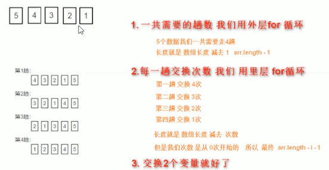

**冒泡排序是一种简单的排序算法。它重复地走访过要排序的数列，一次比较两个元素，如果他们的顺序错误就招他们交换过来。走访数列的工作是重复地进行直到没有再需要交换，也就是说该数列已经排序完成。这个算法的名字由来是因为越小的元素会经由交换慢慢 "浮" 到数列的顶端。**

```javascript
// 冒泡排序
var arr = [5, 4, 3, 2, 1];
for (var i = 0; i <= arr.length - 1; i++) { // 外层循环管趟数
	for (var j = 0; j <= arr.length - i - 1; j++) { // 里面的循环管每一趟的交换次数
    // 内部交换2个变量的值前一个和后面一个数组元素相比较
    if(arr[j] > arr[j + 1]) {
      var temp = arr[j];
      arr[j] = arr[j + 1];
      arr[j + 1] = temp;
    }
  }
}
```

#### 新增方法

```js
const arr = ['red', 'pink', 'green']
arr.forEach((item, index) => {
  console.log(item) // 数组元素
  console.log(index) // 索引号
})
```


### 对象

**在 JavaScript 中，对象是一组无序的相关属性和方法的集合，所有的事物都是对象，例如字符串、数值、数组、函数等。**

**对象是由属性和方法组成的。**

- **属性：事物的特征，在对象中用属性来表示（常用名词）**
- **方法：事物的行为，在对象中用方法来表示（常用动词）**


#### 创建对象

##### 字面量创建对象

**对象字面量：就是花括号 {} 里面包含了表达这个具体事物（对象）的属性和方法。**

```javascript
var obj = {
  uname: "张三丰",
  age: 18,
  sex: '男',
  sayHi: function() {
    console.log('hi ~ ')
  }
}

# 使用对象
1.调用对象的属性：（ 对象名.属性名   或者   对象名['属性名'] ）   ‼️
2.调用对象的方法： 对象名.方法名()   ‼️
```

##### new Object 创建对象

```javascript
var obj  = new Object();  // 创建一个空的对象
obj.uname = '张三分';
obj.age = 18;
obj.sex = '男';
obj.sayHi = function() {
  console.log('hi ~ ')
}
```

##### 构造函数创建对象

**构造函数：是一种特殊的函数，主要用来初始化对象，即为对象成员变量赋初始值，它总与 new 运算符一起使用。我们可以把对象中一些公共的属性和方法抽取出来，然后封装到这个函数里面。**

```javascript
# 声明
function 构造函数名() {   // 构造函数名字首字母要大写
  this.属性 = 值
  this.方法 = function() {}
}
# 调用
new 构造函数名();
注意：构造函数不需要 return 就可以返回结果。


/*
	new 在执行时会做四件事情：
  - 在内存中创建一个新的空对象。
  - 让 this 指向这个新的对象。
  - 执行构造函数里面的代码，给这个新对象添加属性和方法。
  - 返回这个新对象（所以构造函数里面不需要 return）。
*/

// 例子
function Star(uname, age, sex) { 
	this.uname = uname;
  this.age = age;
  this.sex = sex;
  this.sing = function (sang) {
    console.log(sang);
  }
}

var ldh = new Star('刘德华', 18, '男');  // 调用函数返回的是一个对象
console.log(ldh.uname);
console.log(ldh.age);
ldh.sing('冰雨');
var zxy = new Star('张学友', 20, '男');  // 调用函数返回的是一个对象
console.log(zxy.uname);
console.log(zxy.age);
zxy.sing('李香兰');
```

#### new 关键字

**new 在执行时会做四件事情：**

- **在内存中创建一个新的空对象。**
- **让 this 指向这个新的对象。**
- **执行构造函数里面的代码，给这个新对象添加属性和方法。**
- **返回这个新对象（所以构造函数里面不需要 return）。**


#### 遍历对象

**for..in 语句用于对数组或者对象的属性进行循环操作。**

```javascript
/*
	for (var 变量名 in  对象名) {
	}
*/
for (var k in obj) {
  console.log(k);  // k 变量输出的是属性名
  console.log(obj[k]);	// obj[k] 得到的是属性值
}
```


### 基本包装类型

**为了方便操作基本数据类型，JavaScript 还提供了三个特殊的引用类型：String、Number 和 Boolean。** ‼️

**基本包装类型：把简单数据类型包装成为复杂数据类型，这样基本数据类型就有了属性和方法。** ‼️

```javascript
下面代码有什么问题 ？？？  ‼️
var str ='andy';
console.log(str.length);

按道理基本数据类型是没有属性和方法的，而对象才有属性和方法，但上面代码却可以执行，这是因为 js 会把基本数据类型包装为复杂数据类型，其执行过程如下：
// 1.生成临时变量，把简单类型包装为复杂数据类型
var temp = new String('andy');
// 2.赋值给我们声明的字符变量
str = temp;
// 3.销毁临时变量
temp = null;
```


### 内置对象

**内置对象就是指 JS 语言自带的一些对象，这些对象供开发者使用，并提供了一些常用的或是最基本而必要的功能（属性和方法）。**

#### Math

Math 对象不是构造函数，它具有数学常数和函数的属性和方法。跟数学相关的运算（求绝对值，取整、最大值等）可以使用 Math 中的成员。

```javascript
Math.PI  // 圆周率
Math.max() 		  // 最大值
Math.min()      // 最小值
Math.floor()		// 向下取整
Math.ceil()			// 向上取整
Math.round()		// 四舍五入版就近取整  注意-3.5 结果是 -3  其他数字都是四舍五入但是 .5 特殊，它往大的取
Math.abs()			// 绝对值

Math.random()   // 生成一个随机浮点数 范围是 0-1 之间
```


#### Date

Date 是个构造函数，需要实例化后才能使用。Date 实例用来处理日期和时间。

```javascript
var now = new Date();
console.log(now);

# 例子 - 倒计时
function countDown(time){
  var nowTime = +new Date();	// 返回的是当前时间总的毫秒数
  var inputTime = +new Date(time);	// 返回的是用户输入时间总的毫秒数
  var times = (inputTime - nowTime) / 1000;	// times 是剩余时间总的秒数
  
  var d = parseInt(times / 60 / 60 / 24);	// 天
  d = d < 10? '0' + d: d;
  var h = parseInt(times / 60 / 60 % 24); // 时
  h = h < 10? '0' + h: h;
  var m = parseInt(times / 60 % 60); // 分
  m = m < 10? '0' + m: m;
  var s = parseInt(times % 60); // 秒
  s = s < 10? '0' + s: s;
	return d + '天' + h + '时' + m + '分' + s + '秒';
}
console.log(countDown('2023-3-2 18:00:00'));
var date = new Date();
console.log(date);
```

##### 日期格式化

| 方法名        | 说明                           | 代码               |
| ------------- | ------------------------------ | ------------------ |
| getFullYear() | 获取当年                       | dObj.getFullYear() |
| getMonth()    | 获取当月（0-11）               | dObj.getMonth()    |
| getDate()     | 获取当天日期                   | dObj.getDate()     |
| getDay()      | 获取星期几 ( 周日 0 到周六 6 ) | dObj.getDay()      |
| getHours()    | 获取当前小时                   | dObj.getHours()    |
| getMinutes()  | 获取当前分钟                   | dObj.getMinutes()  |
| getSeconds()  | 获取当前秒钟                   | dObj.getSeconds()  |

##### 获取日期的总毫秒形式 ( 时间戳 )

```javascript
//获得Date总的毫秒数（时间戳）不是当前时间的毫秒数而是距离1970年1月1号过了多少毫秒数
// 1.通过 valueof（） getTime(）
var date = new Date();
console.1og(date.valueof());// 就是我们现在时间距离 1970.1.1 总的毫秒数
console.log(date.getTime());
// 2.简单的写法（最常用的写法）
vardate1 = +new Date();// +new Date()返回的就是总的毫秒数
console.log(date1);
// 3.H5 新增的获得总的毫秒数
console.log(Date.now());
```


#### 数组对象

| 方法名   | 说明                                    | 返回值                                      |
| -------- | --------------------------------------- | ------------------------------------------- |
| concat() | 连接两个或多个数组                      | 返回一个新的数组，不影响原数组              |
| slice()  | 数组截取 slice(begin, end)              | 返回被截取项目的新数组                      |
| splice() | 数组删除 splice(第几个开始,要删除个数） | 返回被删除项目的新数组 注意这个会影响原数组 |

##### 检测是否为数组

```javascript
var arr = [];
var obj = {};
1. instanceof 运算符
console.log(arr instanceof Array);  // true
console.log(obj instanceof Array);  // false
2. Array.isArray(参数);  H5 新增的方法
console.log(Array.isArray(arr));  // true
console.log(Array.isArray(obj));  // false
```

##### 添加删除元素

| 方法名            | 说明                                                        | 返回值               |
| ----------------- | ----------------------------------------------------------- | -------------------- |
| push(参数1...)    | 末尾添加一个或多个元素，**注意修改原数组**                  | 并返回新的长度       |
| pop()             | 删除数组最后一个元素，把数组长度减 1 无参数、**修改原数组** | 返回它删除的元素的值 |
| unshift(参数1...) | 开头添加一个或多个元素，**注意修改原数组**                  | 并返回新的长度       |
| shift()           | 删除数组的第一个元素，把数组长度减 1 无参数、**修改原数组** | 并返回第一个元素的值 |

##### 数组排序

| 方法名    | 说明                         | 是否修改原数组               |
| --------- | ---------------------------- | ---------------------------- |
| reverse() | 颠倒数组中元素的顺序。无参数 | 会改变原来的数组，返回新数组 |
| sort()    | 对数组的元素进行排序         | 会改变原来的数组，返回新数组 |

```javascript
var arr = [12, 3, 77, 1, 7];
arr.sort(function(a, b) {
  // return a - b; // 升序的顺序排列
  return b - a; // 降序的顺序排列
})
console.log(arr);
```

##### 数组索引方法

| 方法名        | 说明                                   | 返回值                                    |
| ------------- | -------------------------------------- | ----------------------------------------- |
| indexOf()     | 数组中查找给定元素的**第一个的索引**   | 如果存在返回索引号如果不存在，则返回 -1。 |
| lastlndexOf() | 数组中查找给定元素的**最后一个的索引** | 如果存在返回索引号如果不存在，则返回 -1。 |

```javascript
# 案例 - 数组去重
目标：把旧数组里面不重复的元素选取出来放到新数组中，重复的元素只保留一个，放到新数组中去重。
核心算法：我们遍历旧数组，然后拿着旧数组元素去查询新数组，如果该元素在新数组里面没有出现过，我们就添加，否则不添加。  ‼️
旧数组 ['c'，'a', 'z'，'a', 'x', 'a', 'x', 'c', 'b']
新数组 []
function unique(arr) {
  var newArr = [];
  for (var i = 0; i < arr.length; i++){
  	if(newArr.indexOf(arr[i]) === -1){
      newArr.push(arr[i]);
    }
  }
  return newArr;
}

var demo = unique(['c'，'a', 'z'，'a', 'x', 'a', 'x', 'c', 'b'])
```

##### 数组转成字符串

| 方法名          | 说明                                         | 返回值         |
| --------------- | -------------------------------------------- | -------------- |
| toString()      | 把数组转换成字符串，逗号分隔每一项           | 返回一个字符串 |
| join('分隔符'） | 方法用于把数组中的所有元素转换为一个字符串。 | 返回一个字符串 |

```javascript
//数组转换为字符串
// 1.tostring() 将我们的数组转换为字符串
var arr = [1, 2, 3];
console.log(arr.tostring()); // 1,2,3
// 2.join('分隔符')
var arr1 = ['green','blue','pink'];
console.log(arr1.join()); // green,blue,pink
console.log(arr1.join('-')); // green-blue-pink
```


#### 字符串对象

**字符串所有的方法，都不会修改字符串本身（字符串是不可变的），操作完成会返回一个新的字符串。**

| 方法名                              | 说明                                                         |
| ----------------------------------- | ------------------------------------------------------------ |
| indexOf('要查找的字符', [起始位置]) | 返回指定内容在元字符串中的位置，如果找不到就返回-1，开始的位置是 index 索引号 |
| lastlndexOf()                       | 从后往前找，只找第一个四配的                                 |

```javascript
# 案例 -  查找字符串 "abcoefoxyozzopp" 中所有 o 出现的位置以及次数
① 核心算法：先查找第一个 o 出现的位置
② 然后只要 indexOf 返回的结果不是 -1 就继续往后查找
③ 因为 indexOf 只能查找到第一个，所以后面的查找，利用第二个参数，当前索引加 1，从而继续查找
var str = "oabcoefoxyozzopp";
var index = str.indexOf('o');
var num = 0;
while (index !== -1){
  console.log(index);
  num++;
  index = str.indexOf('o', index + 1);
}
console.log('o 出现的次数是：' + num);

注意：数组的做法是一样的一样的函数 ！！！！ ❗️
```

| 方法名            | 说明                                          | 使用                             |
| ----------------- | --------------------------------------------- | -------------------------------- |
| charAt(index)     | 返回指定位置的字符 (index 字符串的索引号）    | str.charAt(0)                    |
| charCodeAt(index) | 获取指定位置处字符的 ASCIl 码 (index 索引号） | str.charCodeAt(0)                |
| str[index]        | 获取指定位置处字符                            | HTML5，IE8+ 支持和 charAt() 等效 |

```javascript
注意： charCodeAt(index) 此方法一般用做判断用于按下了哪个键 ❗️❗️
```

| 方法名                                | 说明                                                         |
| ------------------------------------- | ------------------------------------------------------------ |
| concat(str1, str2, str3...)           | concat() 方法用于连接两个或多个字符串。拼接字符串，等效于 +，+ 更常用 |
| substr(start, length)                 | 从 start 位置开始（索引号），length 取的个数      重点    ❗️  |
| slice(start, end)                     | 从 start 位置开始，截取到 end 位置，end 取不到（他们俩都是索引号） |
| substring(start, end)                 | 从 start 位置开始，截取到 end 位置，end 取不到    基本和 slice 相同  但是不接受负值 |
| replace('被替换的字符', '替换的字符') | 替换字符，只会替换第一个匹配到的字符   ❗️                     |
| split('分隔符')                       | 将字符串转换成数组，join 把数组转成字符串   ❗️                |


## 简单数据类型和复杂数据类型

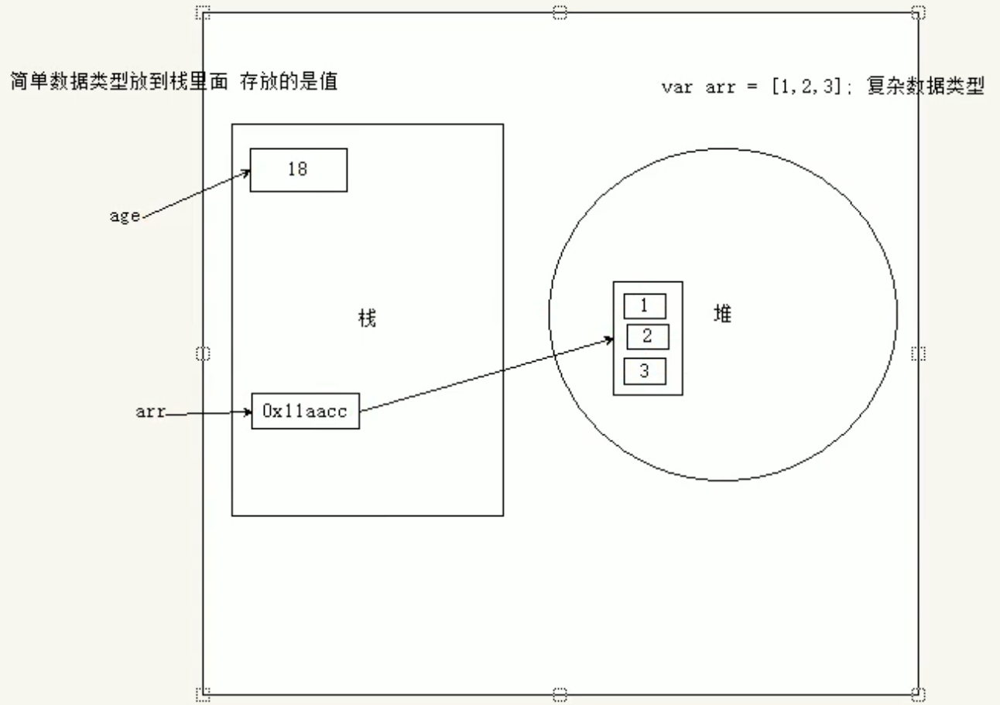


**简单类型又叫做基本数据类型或者值类型，复杂类型又叫做引用类型。**

- **值类型：简单数据类型/基本数据类型，在存储时变量中存储的是值本身，因此叫做值类型**

  **string , number , boolean , undefined , null**

- **引用类型：复杂数据类型，在存储时变量中存储的仅仅是地址（引用），因此叫做引用数据类型**

  **通过 new 关键字创建的对象（系统对象、自定义对象），如 Object、Array、Date 等**


### 堆和栈

**堆栈空间分配区别：**

**1、栈（操作系统）：由操作系统自动分配释放存放函数的参数值、局部变量的值等。其操作方式类似于数据结构中的栈。简单数据类型存放到栈里面**

**2、堆（操作系统）：存储复杂类型（对象），一般由程序员分配释放，若程序员不释放，由垃圾回收机制回收。复杂数据类型存放到堆里面**

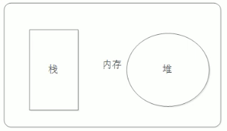

**注意：JavaScript 中没有堆栈的概念，通过堆栈的方式，可以更容易理解代码的一些执行方式，便于将来学习其他语言。**


### 简单类型的内存分配

- 值类型（简单数据类型）：string,number,boolean,undefined,null

- 值类型变量的数据直接存放在变量（栈空间）中

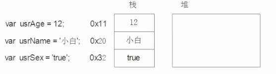

### 复杂类型的内存分配

- 引用类型（复杂数据类型）：通过 new 关键字创建的对象（系统对象、自定义对象），如 Object、Array、Date 等

- 引用类型变量（栈空间）里存放的是地址，真正的对象实例存放在堆空间中

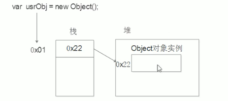


### 简单类型传参

**函数的形参也可以看做是一个变量，当我们把一个值类型变量作为参数传给函数的形参时，其实是把变量在栈空间里的值复制了一份给形参，那么在方法内部对形参做任何修改，都不会影响到的外部变量。** ‼️

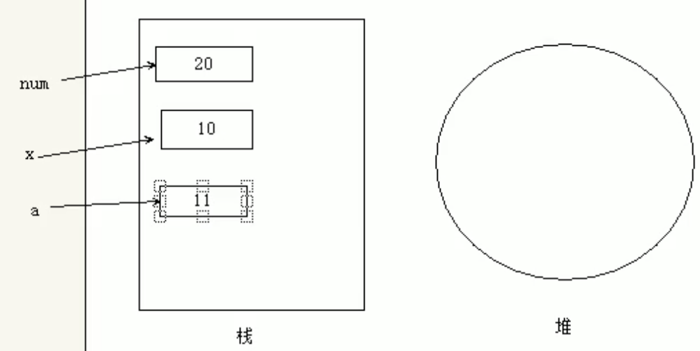

```javascript
function fn(a) {
	a++;
	console.log(a);   // 11
}
var x = 10;
fn(x); 
console.log(x);  // 10 ‼️
```

### 复杂类型传参

**函数的形参也可以看做是一个变量，当我们把引用类型变量传给形参时，其实是把变量在栈空间里保存的堆地址复制给了形参，形参和实参其实保存的是同一个堆地址，所以操作的是同一个对象。**  ‼️

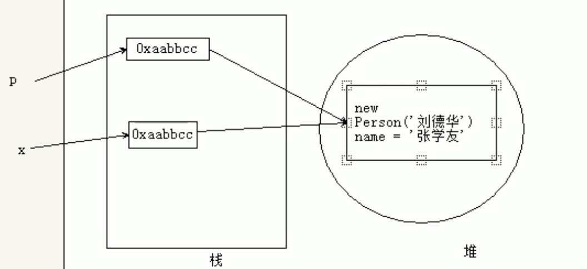

```javascript
function Person(name) {
	this.name = name;
}

function f1(x){ // x = p
  console.log(x.name);	// 2.这个输出什么?  刘德华
  x.name =" 张学友";
  console.log(x.name);	// 3.这个输出什么?  张学友
}

var p＝new Person("刘德华");
console.log (p.name);		// 1.这个输出什么?   刘德华
f1(p);
console.log(p.name);		// 4.这个输出什么?   张学友  ‼️
```


## 运算符

运算符（operator）也被称为**操作符**，**是用于实现赋值、比较和执行算数运算等功能的符号。**

JavaScript 中常用的运算符有：

- **算数运算符**
- **递增和递减运算符**
- **比较运算符**
- **逻辑运算符**
- **赋值运算符**


### 表达式和返回值

**表达式：是由数字、运算符、变量等以能求得数值的有意义排列方法所得的组合**

简单理解：是由数字、运算符、变量等组成的式子

```javascript
// 是由数字、运算符、变量等组成的式子我们称为表达式  1 + 1
console.log(1 + 1); 			// 2 就是返回值
// 在我们程序里面  2 = 1 + 1 把我们的右边表达式计算完毕把返回值给左边
var num = 1 + 1;
```


### 算数运算符

```javascript
/*

+			加
-		  减
*			乘
/			除
%			取余数（取模）

*/


10 + 20 = 30
10 - 20 = -10
10 * 20 = 200
10 / 20 = 0.5
返回除法的余数 9 % 2 = 1


# 浮点数精度问题
浮点数值的最高精度是 17 位小数，但在进行算术计算时其精确度远远不如整数。
var result = 0.1 + 0.2;          // 结果不是 0.3，而是：0.30000000000000004
console.log(0.07 * 100);        // 结果不是 7，而是：7.000000000000001
注意：不要直接判断两个浮点数是否相等 ！！！


// 小知识
1.它的余数是 0 就说明这个数能被整除，这就是 % 取余运算符的主要用途
2.注意算术运算符优先级的，先乘除，后加减，有小括号先算小括号里面的
```


### 递增和递减运算符

如果需要反复给数字变量添加或减去 1，可以使用**递增（++）**和**递减（--)** 运算符来完成。

在 JavaScript 中，递增（++）和递减（--）既可以放在变量前面，也可以放在变量后面。**放在变量前面时，我们可以称为前置递增（递减）运算符，放在变量后面时，我们可以称为后置递增（递减）运算符。**

**注意：递增和递减运算符必须和变量配合使用。**

```javascript
/*
	注意：前置自增和后置自增如果单独使用效果是一样的
	区别：
		- 前置递增口诀：先加1  后返回值
		- 后置递增口诀：先返回原值 后加1
*/

# 前置递增
  // 前置递增口诀：先加1  后返回值
  var p = 10;
  console.log(++p + 10);  // 21

# 后置递增
  // 后置递增口诀：先 返回原值 后自加1
  var age = 10;
  console.log(age++ + 10);		// 20   10 + 10
  console.log(age);			// 11


// 练习
var a = 10;
++a; 							// ++a 11  		a = 11
var b = ++a + 2; // a = 12  		++a = 12
console.log(b);  // 14

var c = 10;
c++; 								// c++ 11   		c = 11
var d = c++ + 2;    // c++ = 11			c = 12
console.log(d); 		// 13

var e = 10;
var f = e++ + ++e; // 1.e++ = 10   e= 11 		 2.e = 12   ++e = 12
console.log(f);   // 22
```


### 比较运算符

**概念：比较运算符（关系运算符）是两个数据进行比较时所使用的运算符，比较运算后，会返回一个布尔值（true /false）作为比较运算的结果。**

```javascript
/*
  运算符名称					说明
  <									小于
  <=								小于等于
  >									大于
  >=								大于等于
  ==                判等号（会转型）
  !=								不等
  ===								全等 要求值和数据类型都一致
*/

console.log( 12 == '12' );   // true
console.log( 12 === '12' );   // false

=       赋值				把右边给左边
== 			判断				判断两边值是否相等（注意此时有隐式转换）
=== 	  全等	      判断两边的值和数据类型是否完全相同
```


### 逻辑运算符

**概念：逻辑运算符是用来进行布尔值运算的运算符，其返回值也是布尔值。后面开发中经常用于多个条件的判断**

```javascript
/* 
	&&		  逻辑与  and				全真才真，一假就假
	||			逻辑或	 or					一真就真，全假才假
	！			 逻辑非	not				 取反
*/

// 1.逻辑与 && and 两侧都为 true 结果才是 true 只要有一侧为 false 结果就为 false
console.log(3 > 5 && 3 > 2); // false
console.log(3 < 5 && 3 > 2); // true
// 2.逻辑或 ll or 两侧都为 false 结果才是假 false 只要有一侧为 true 结果就是 true
console.log(3 > 5 || 3 > 2); // true
console.log(3 > 5 || 3 < 2); // false
// 3.逻辑非 not ！
console.log(!true);  // false 
```

#### 短路运算（逻辑中断）

```javascript
/*
  逻辑与
  语法：表达式1 && 表达式2
  - 如果第一个表达式1的值为真，则返回表达式2
  - 如果第一个表达式1的值为假，则返回表达式1
*/
// 逻辑与短路运算：如果表达式1结果为真，则返回表达式2。如果表达式1为假，返回表达式1
console.log(123 && 456); 			// 456
console.log(0 && 456); 				// 0
console.log(0 && 1 + 2 && 456 * 56789);		// 0


/*
	逻辑或
  语法：表达式1 || 表达式2
  - 如果第一个表达式1的值为真，则返回表达式1
  - 如果第一个表达式1的值为假，则返回表达式2
*/
// 逻辑或短路运算：如果表达式1结果为真，则返回的是表达式1。如果表达式1结果为假，返回表达2
console.log(123 || 456);   // 123
console.log(123 || 456 || 456 + 123);  // 123
console.log(0 || 456 || 456 + 123);  // 456
var num = 0;
console.log(123 || num++);  // 123
console.log(num); // 0
```


### 赋值运算符

```javascript
/*
	= 									直接赋值
	+=、-=							 加、减 一个数后再赋值
	*=、/=、%=					乘、除、取模后再赋值
*/

var age = 10;
age += 5;				//相当于 age = age + 5;
age -= 5;				//相当于 age = age - 5;
age *= 10;			//相当于 age = age * 10;
```


### 展开运算符

```js
// 说明：不会修改原数组

const arr = [1, 2, 3, 4]
console.log(...arr) // 1 2 3 4

// 将一个数组进行展开      案例：求数组最大值（最小值）合并数组
const arr = [1, 4, 5, 7, 8]
console.log(Math.max(...arr))

const arr1 = [1,2,3]
const arr2 = [4,5,6]
const arr = [...arr1, ...arr2]
console.log(arr) // [1,2,3,4,5,6]
```


### 运算符优先级

| 优先级 | 运算符     | 顺序                 |
| ------ | ---------- | -------------------- |
| 1      | 小括号     | ()                   |
| 2      | 一元运算符 | ++、--、!            |
| 3      | 算数运算符 | **先 * /  % 后 + -** |
| 4      | 关系运算符 | >、>=、<=、<         |
| 5      | 相等运算符 | ==、!=、===、!==     |
| 6      | 逻辑运算符 | **先 && 后 \|\|**    |
| 7      | 赋值运算符 | =                    |
| 8      | 逗号运算符 | ,                    |

- 一元运算符里面的**逻辑非优先级很高**
- **逻辑与 比 逻辑或优先级高**


## 流程控制 - 分支结构

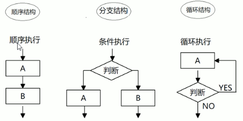


### if

```javascript
if (条件表达式1) {
  // 如果 条件表达式1 为 true 则执行这里，执行完毕后退出整个 if 分支语句
}
else if(条件表达式2) {
  // 如果 条件表达式2 为 true 则执行这里
}
else {
  // 如果 表达式1和表达式2 都是 false 则执行这里
}

// 条件表达式为 true 执行大括号里面的代码


三元表达式     ❗️
# 注意：++num 是一元表达式，1+1 是二元表达式   
// 三元表达式语法：条件表达式 ? 表达式1 : 表达式2  
// 执行思路：如果条件表达式结果为真，则返回表达式1的值，如果是假则返回表达式2的值 ！！！
```


### switch

**switch 语句也是多分支语句，它用于基于不同的条件来执行不同的代码。当要针对变量设置一系列的特定值的选项时，就可以使用 switch。**

```javascript
# 语法结构
//  switch转换、开关     case 小例子或者选项的意思
switch(表达式) {
  case value1: 执行语句1;
  break;
  case value2: 执行语句2;
  break;
  ...
  default: 执行最后的语句;
}

执行思路：利用我们的表达式的值和 case 后面的选项值相匹配，如果匹配上就执行该 case 面的语句，如果都没有匹配上，那么执行 default 里面的语句。 ❗️

注意：
- 表达式 的值和 case 里面的值相匹配的时候是 全等 必须是值和数据类型一致才可以。 表达式===value才行 ❗️
- 重要：如果当前的 case 里面没有 break 则不会退出 switch 是继续执行下一个 case ❗️
```


### switch 语句和 if 语句的区别

- 一般情况下，它们两个语句可以相互替换。
- **switch...case 语句通常处理 case 为比较确定值的情况，而 if...else... 语句更加灵活，常用于范围判断（大于、等于某个范围）。** ❗️
- **switch 语句进行条件判断后直接执行到程序的条件语句，效率更高。而 if...else 语句有几种条件，就得判断多少次。** ❗️
- **当分支比较少时，if...else 语句的执行效率比 switch 语句高。**❗️
- **当分支比较多时，switch 语句的执行效率比较高，而且结构更清晰。**❗️


## 流程控制 - 循环结构

**循环目的：在实际问题中，有许多具有规律性的重复操作，因此在程序中要完成这类操作就需要重复执行某些语句。**


### 断点调试

断点调试是指自己在程序的某一行设置一个断点，调试时，程序运行到这一行就会停住，然后你可以一步一步往下调试，调试过程中可以看各个变量当前的值，出错的话，调试到出错的代码行显示错误，停下。

断点调试可以帮我们观察程序的运行过程

```
浏览器中按 F12  --> sources --> 找到需要调试的文件 --> 在程序的某一行设置断点
Watch：监视，通过 watch 可以监视变量的值的变化，非常的常用。
F11：程序单步执行，让程序一行一行的执行，这个时候，观察 watch 中变量的值的变化。
```


### for 

在程序中，一组被重复执行的语句被称之为循环体，能否继续重复执行，取决于循环的终止条件。由循环体及循环的终止条件组成的语句，被称之为循环语句。

```javascript
for (初始化变量; 条件表达式; 操作表达式) {
  // 循环体
}

# 参数解释
- 初始化变量：用 var 声明的一个普通变量，通常用于作为计数器使用 ❗️
- 条件表达式：用来决定每一次循环是否继续执行就是终止的条件❗️
- 操作表达式：每次循环最后执行的代码 经常用于我们计数器变量进行更新（递增或者递减）❗️


循环嵌套：是指在一个循环语句中再定义一个循环语句的语法结构，例如在for循环语句中，可以再嵌套一个 for 循环，这样的 for 循环语句我们称之为双重 for 循环。
# 语法结构
for(外层的初始化变量;外层的条件表达式;外层的操作表达式){   // 外层循环控制行数
  for(里层的初始化变量;里层的条件表达式;里层的操作表达式){  // 里层循环控制每行的个数
  	//执行语句;
  }
}
//  我们可以把里面的循环看做是外层循环的语句
//  外层循环循环一次，里面的循环执行全部


// 案例
# 打印倒三角形
var str = '';
for(var i = 1; i <= 10; i++) { 
	for (var j = i; j <= 10; j++) {
		str = str + '☆';
	}
	str += '\n';
}
console.log(str);

# 打印 九九乘法表
var str = '';
for(var i = 1; i <= 9; i++) { 
	for (var j = 1; j <= i; j++) {
		str += j + 'x' + i + '=' + i * j + '\t';
	}
	str += '\n';
}
console.log(str);
```

### while

```javascript
while(条件表达式) {
  循环体;
}
执行思路：当条件表达式结果为 true 则执行循环体，否则退出循环。 ❗️
注：while 和 do...while 可以做更复杂的判断条件，比 for 循环灵活一些。
```

### do while

```javascript
do {
	循环体;
}	while (条件表达式)
执行思路：先执行一次循环体再判断条件，如果条件表达式结果为真，则继续执行循环体，否则退出循环。 ❗️
```

### continue、break

**continue 关键字** 用于 **立即跳出本次循环**，继续下一次循环（本次循环体中 continue 之后的代码就会少执行一次）。

**break 关键字** 用于 **立即跳出整个循环**（循环结束）。


## 函数

**函数：就是封装了一段可被重复调用执行的代码块。通过此代码块可以实现大量代码的重复使用。**

```javascript
# 声明函数
function 函数名 (形参1, 形参2) { // 形参可以看做是不用声明的变量 如果没有实参对应则是 undefined
  // 函数体
  return 需要返回的结果
}
# 调用函数
a = 函数名(实参1， 实参2);

return : 可以终止函数。返回一个值给调用者。只能返回一个值，如果是多个值那就是最后一个值。没有 return 函数返回的是 undefined ❗️
注意：声明函数本身并不会执行代码，只有调用函数时才会执行函数体代码。
注意：函数可以调用另一个函数，函数可以互相调用。


# 函数定义方式
	- 利用函数关键字自定义函数（命名函数）
    function fn(){}
    fn();
	- 函数表达式（匿名函数）
    var fun = function(arr){};   // fun 是 变量名 不是 函数名
    fun(111);
```


### 动态参数 - arguments

**当我们不确定有多少个参数传递的时候，可以用 arguments 来获取。在 JavaScript 中，arguments 实际上它是当前函数的一个内置对象。所有函数都内置了一个 arguments 对象，arguments 对象中存储了传递的所有实参。**

arguments 展示形式是一个**伪数组**，**因此可以进行遍历**。伪数组特点：‼️

- **具有 length 属性**    ‼️
- **按索引方式储存数据**    ‼️
- **不具有数组的 push、pop 等方法**    ‼️

```javascript
function fn() {
  console.log(arguments);// 里面存储了所有传递过来的实参
  console.log(arguments.length);
  console.log(arguments[2]);
}

fn(1, 2, 3);
```


### 剩余参数

- ... 是语法符号，置于最末函数形参之前，用于获取**多余的实参**
- 借助... 获取的剩余实参，是个**真数组**

```js
function fn(a, b, ...arr) {
  console.log(arr); // [3, 4]
}
fn(1, 2, 3, 4);
```


### 箭头函数

**目的：引入箭头函数的目的是更简短的函数写法并且不绑定 this，箭头函数的语法比函数表达式更简洁**

**使用场景：箭头函数更适用于那些本来需要匿名函数的地方**

```js
// -------------------------------- 简单使用 ----------------------------------
const fn = () => {};
const fn = (x) => {};
const fn = x => {};		// 只有一个形参的时候能省略 ()
const fn = x => console.log(x);		// 只有一行代码的时候能省略大括号

const fn = x => {
  return x + x
}
const fn = x => x + x; // 只有一行代码可以省略 return

const fn = (uname) => ({uname})  // 直接返回一个对象


// -------------------------------- 参数 ----------------------------------
- 普通函数有 arguments 动态参数
- 箭头函数没有 atguments 动态参数，但是有剩余函数 ...args


// -------------------------------- this ----------------------------------
/*
	在箭头函数出现之前，每个新函数根据他是如何调用的来定义这个函数的 this 值
  console.log(this) // 此处是 window
  const sayHi = function () {
    console.log(this)  // 普通函数指向调用者 此处是 window
  }
  btn.addEventListener('click', function () {
    console.log(this)  // 当前 this 指向 btn 
  })
*/
箭头函数不会创建自己的 this，会从自己的作用域链的上一层沿用 this。
const obj = {
  name: '',
  sayHi: () => {
    console.log(this)  // window
  }
}
obj.sayHi();
```


### 内置构造函数

```js
// ------------------------ Object ------------------
const a = {'name': '张三', age:18}
Object.keys(a)	// 静态方法：获得所有的属性名    ['name', 'age']
Object.values(a)	// 静态方法：获得所有的属性值    ['张三', 18]

Object.assign(a, {gender: '女'})
console.log(a) // 静态方法：拷贝     {'name': '张三', age:18, gender: '女'}   使用场景：给对象添加属性


// ------------------------ Array ------------------
方法     										作用														说明	
forEach										遍历数组													不返回数组，经常用于查找遍历数组元素
filter										过滤数组													返回新数组，返回的是筛选满足条件的数组元素
map												迭代数组													返回新数组，返回的是处理之后的数组元素，想要使用返回的新数组
reduce                    累计器														 返回累计处理的结果，经常用于求和等

// reduce
const arr = [1, 1, 1]
const total = arr.reduce(frunction(prev, current) { return prev + current })   // 不传初始值 3
const total = arr.reduce((prev, current) => prev + current, 10) // 传初始值 13
reduce 执行过程：
- 如果没有起始值，则上一次值以数组的第一个数组元素的值
- 如果有起始值，则起始值做为上一次值
- 每一次循环，把返回值给做为下一次循环的上一次值

实例方法 join 数组元素拼接为字符串，返回字符串（重点）
实例方法 find 查找元素，返回符合测试条件的第一个数组元素值，如果没有符合条件的则返回 undefined（重点)
实例方法 every 检测数组所有元素是否都符合指定条件，如果所有元素都通过检测返回 true,否则返回 false（重点）
实例方法 some 检测数组中的元素是否满足指定条件如果数组中有元素满足条件返回 true，否则返回 false
实例方法 concat 合并两个数组，返回生成新数组
实例方法 sort 对原数组单元值排序
实例方法 splice 删除或替换原数组单元反转数组
实例方法 reverse
实例方法 findIndex 查找元素的索引值


// ------------------------ String ------------------
实例属性 length 用来获取字符串的度长（重点）
实例方法 split('分隔符'）用来将字符串拆分成数组（重点）
实例方法 substring（需要截取的第一个字符的索引 [，结束的索引号]）用于字符串截取（重点）
实例方法 startswith（检测字符串[，检测位置索引号]）检测是否以某字符开头（重点）
实例方法 includes（搜索的字符串[，检测位置索引号]）判断一个字符串是否包含在另一个字符串中，根据情况返回 true 或 false(重点)
实例方法 toUpperCase 用于将字母转换成大写
实例方法 toLowerCase 用于将就转换成小写
实例方法 indexof 检测是否包含某字符
实例方法 endsWith 检测是否以某字符结尾
实例方法 replace 用于替换字符串，支持正则匹配
实例方法 match 用于查找字符串，支持正则匹配
```


## 作用域

**通常来说，一段程序代码中所用到的名字并不总是有效和可用的，而限定这个名字的可用性的代码范围就是这个名字的作用域。作用域的使用提高了程序逻辑的局部性，增强了程序的可靠性，减少了名字冲突。**

**ES6 之前**

- **全局作用域：整个 script 标签或者是一个单独的 js 文件**
- **局部作用域：在函数内部就是局部作用域，只在函数内部起作用**

```javascript
# 全部变量：在全局作用域下的变量，在全局下都可以使用
	注意：如果在函数内部没有声明的变量也属于全局变量 ❗️
# 局部变量：在局部作用域下的变量，在函数内部的变量就是局部变量
	注意：函数的形参也可以看做是局部变量

  
从执行效率来看全局变量和局部变量
- 全局变量只有浏览器关闭的时候才会销毁，比较占内存资源	‼️
- 局部变量当代码块执行完比就会被销毁，比较节约内存咨源  ‼️

注意：es6之前是没有块级作用域的 {} // 块级作用域：{ }


# 作用域链
内部函数访问外部函数的变量，采取的是链式查找的方式来决定取哪个值   ‼️   就近原则
  var num = 10;
  function fn() {
    var num = 20;

    function func() {
      console.log( num );
    }
  }
```


## 预解析

**引擎运行 js 分为两步：预解析、代码执行。**‼️

- **预解析 js 引擎会把 js 里面所有的 var 还有 function 提升到当前作用域的最前面。**‼️

  **预解析分为变量预解析（变量提升）和函数预解析（函数提升）**。‼️

  - **变量提升：就是把所有的变量声明提升到当前的作用域最前面，不提升赋值操作。**‼️
  - **函数提升：就是把所有的函数声明提升到当前作用域的最前面，不调用函数。**‼️

- **代码执行按照代码书写的顺序从上往下执行。** ‼️

```javascript
# 坑 1 
console.log(num);  // undefined
var num = 10;
// 相当于执行了一下代码
var num;
console.log(num);
num = 10;


# 坑2
fun(); // 报错
var fun = function() {};
// 相当于执行了一下代码
var fun;
fun();
fun = function() {};


# 面试题案例
f1();
console.log(c);
console.log(b);
console.log(a);
function f1(){
  var a = b = c = 9;
  console.log(a);
  console.log(b);
  console.log(c);
}
// 相当于以下代码
function f1(){
  var a = b = c = 9;
  // 相当于 var a = 9; b = 9; c = 9;  b 和 c 直接赋值没有 var 声明，当全局变量看 ‼️ ‼️
  // 集体声明是这样：var a=9, b=9, c=9;   是用逗号 ‼️ ‼️
  console.log(a);  // 9
  console.log(b);  // 9
  console.log(c);  // 9
}
f1();
console.log(c);  // 9
console.log(b);  // 9
console.log(a);  // 报错
```


## 本地存储

随着互联网的快速发展，基于网页的应用越来越普遍，同时也变的越来越复杂，为了满足各种各样的需求，会经

常性在本地存储大量的数据，HTML5 规范提出了相关解决方案。

本地存储特性

1、数据存储在用户浏览器中

2、设置、读取方便、甚至页面刷新不丢失数据

3、容量较大，sessionStorage 约 5M、localStorage 约 20M

4、只能存储字符串，可以将对象 JSON.stringify() 编码后存储


### window.sessionStorage

- **生命周期为关闭浏览器窗口**
- **在同一个窗口（页面）下数据可以共享**
- 以键值对的形式存储使用

```javascript
存储数据：
sessionStorage.setltem(key, value)
获取数据：
sessionStorage.getltem(key)
删除数据：
sessionStorage.removeltem(key)
删除所有数据：
sessionStorage.clear()
```

### window.localStorage

- **声明周期永久生效，除非手动删除否则关闭页面也会存在**
- **可以多窗口（页面）共享（同一浏览器可以共享）**
- 以键值对的形式存储使用

```javascript
存储数据：
localStorage.setltem(key, value)
获取数据：
localStorage.getltem(key)
删除数据：
localStorage.removeltem(key)
删除所有数据：
localStorage.clear()
```


## 解构赋值

### 数组解构

```js
数组解构是将数组的单元值快速批量赋值给一系列变量的简洁语法。
基本语法：
1.赋值运算符 = 左侧的 [] 用于批量声明变量，右侧数组的单元值将被赋值给左侧的变量
2.变量的顺序对应数组单元值的位置依次进行赋值操作

const [max, min, avg] = [1, 2, 3]

let a = 1
let b = 2 ; // 必须加分号的两种情况：立即执行函数、使用数组开头的写法
[b, a] = [a, b]

const [a, b, ...c] = [1, 2, 3, 4]
console.log(c) // [3, 4] 真数组

const [a, b, , d] = [1, 2, 3, 4]
console.log(d) // 4

let [a, [[b], c]] = [1, [[2], 3]];  // 可嵌套
```


### 对象解构

```js
对象解构是将对象属性和方法快速批量赋值给一系列变量的简洁语法
基本语法：
1.赋值运算符 = 左侧的用于批量声明变量，右侧对象的属性值将被赋值给左侧的变量
2.对象属性的值将被赋值给与属性名相同的变量
3.注意解构的变量名不要和外面的变量名冲突否则报错
4.对象中找不到与变量名一致的属性时变量值为 undefined

const { uname, age } = { uname:"zs", age:10 };
const { uname: username, age } = { uname:"zs", age:10 };  // 改名  旧:新
const pig = [
  {
    name: "佩奇",
    family: {
      monther: '猪妈妈',
      father: '猪爸爸',
      sister: '乔治'
    },
    age: 6
  }
]
const [{ name, family: { mother, father, sister }}] = pig ;  // 嵌套
```


## 原型对象

构造函数用来封装、原型用来继承。

注意：构造函数里面如果一些公共的方法写到构造函数里会导致浪费内存的问题，所以就要用到原型对象！！！！

- 构造函数通过原型分配的函数是所有对象所**共享**的。

- JavaScript 规定，每一个构造函数都有一个 prototype 属性，指向另一个对象，所以我们也称为原型对象

- 这个对象可以挂载函数，对象实例化不会多次创建原型上函数，节约内存

- **我们可以把那些不变的方法，直接定义在 prototype 对象上，这样所有对象的实例就可以共享这些方法**

- **构造函数和原型对象中的 this 都指向实例化的对象**

```js
function Star(name, age){
  this.name = name;
  this.age = age;
}
// Star.prototype 原型对象
Star.prototype.sing = function(){
	console.log('唱歌')
}
const ldh = new Star('刘德华', 10);
const zxy = new Star('张学友', 20);
console.log(ldh.sing === zxy.sing) // true


/*
!!! 构造函数和原型对象中的 this 都指向实例化的对象
*/
案例：给数组添加扩展方法
const arr = [1, 2, 3]; 
// const arr = new Array(1, 2, 3);
Array.prototype.max = function(){
  return Math.max(...this)  // 原型函数里面的 this 指向实例对象
}
console.log(arr.max())
```


### constructor 属性

在哪里？每个原型对象里面都有个 constructor 属性（ constructor 构造函数）

作用：**该属性指向该原型对象的构造函数** ，简单理解，就是指向我的爸爸，我是有爸爸的孩子

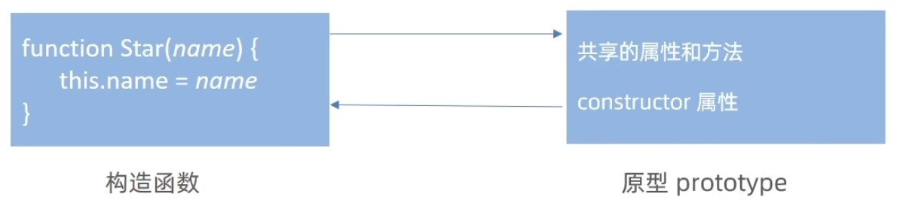

```js
function Star(name){
  this.name = name
}
Star.prototype = {
  constructor: Star, // 重新指回创造这个原型对象的构造函数
  sing: function(){ console.log('唱歌') },
  dance: function(){ console.log('跳舞') },
}
console.log(Star.prototype.constructor) // 指向 Star
```


### 对象原型

**对象都会有一个属性 \_\_proto\_\_  指向构造函数的 prototype 原型对象，之所以我们对象可以使用构造函数 prototype 原型对象的属性和方法，就是因为对象有\_\_proto\_\_ 原型的存在。**

注意：

- _\_proto__ 是 JS 非标准属性
- [[prototype]] 和 \_\_proto__ 意义相同
- 用来表明当前实例对象指向哪个原型对象 prototype
- \_\_proto__ 对象原型里面也有一个 constructor 属性，指向创建该实例对象的构造函数

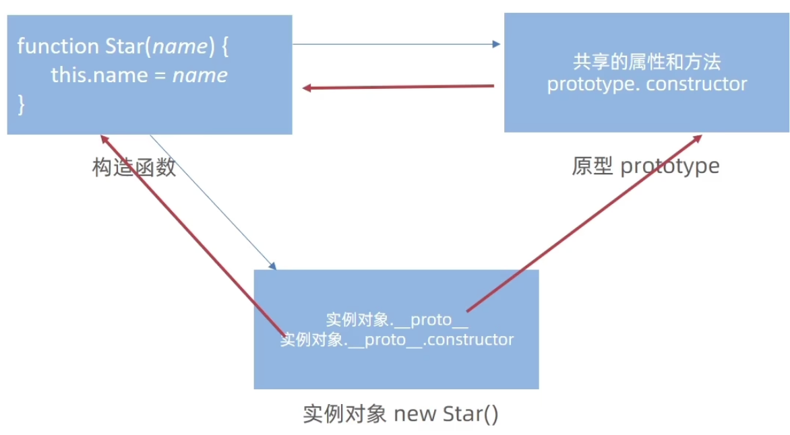


### 原型继承

继承有很多种方式，原型继承是最常用的继承方式。

```js
function Person(){
  this.eyes = 2;
  this.head = 1;
}

function Woman(){ }
Woman.prototype = new Person();  // 通过原型对象来继承 Person        子类的原型 = new 父类
Woman.prototype.constructor = Woman;	// 指回原来的构造函数
Woman.prototype.baby = function(){  // 只有 Woman 的实例对象可以调用
  console.log('宝宝');
}
xiaohong = new Woman();

function Man(){  }
Man.prototype = new Person();
Man.prototype.constructor = Man;
xiaoming = new Man();
```


 ### 原型链

基于原型对象的继承使得不同构造函数的原型对象关联在一起，并且这种关联的关系是一种链状的结构，我们将原型对象的链状结构关系称为原型链。

**原型链就是查找规则**

**① 当访问一个对象的属性（包括方法）时，首先查找这个对象自身有没有该属性。**

**② 如果没有就查找它的原型(也就是 __proto\_\_ 指向的 prototype 原型对象)**

**③ 如果还没有就查找原型对象的原型（Object 的原型对象)**

**④ 依此类推一直找到 object 为止（null)**

**⑤ \_\_proto\_\_ 对象原型的意义就在于为对象成员查找机制提供一个方向，或者说一条路线**

**⑥ 可以使用 instanceof 运算符用于检测构造函数的 prototype 属性是否出现在某个实例对象的原型链上**

**注意：**

**所有的对象里面都有 \_\_proto\_\_ 对象原型 指向 原型对象**

**所有的原型对象里面都有 constructor 指向 创造该原型对象的构造函数**

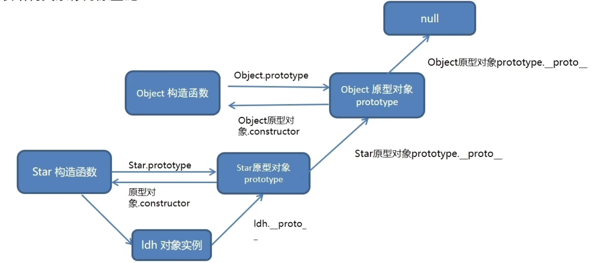


## 深浅拷贝

### 浅拷贝

  

### 深拷贝

首先浅拷贝和深拷贝只针对引用类型

深拷贝：拷贝的是对象，不是地址


#### 通过递归实现深拷贝

**函数递归：如果一个函数在内部可以调用其本身，那么这个函数就是递归函数**

- 简单理解：函数内部自己调用自己，这个函数就是递归函数
- 递归函数的作用和循环效果类似
- 由于递归很容易发生"栈溢出”错误（stack overflow），所以必须要加退出条件 return

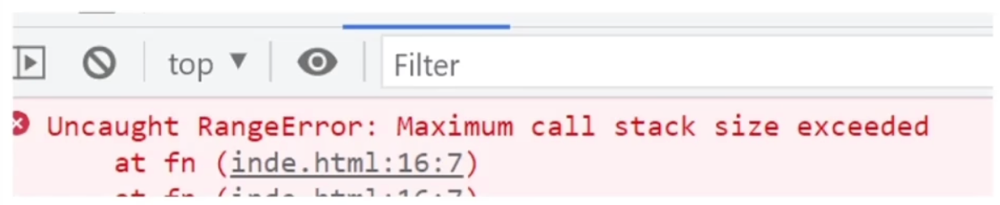


#### lodash/cloneDeep


#### 通过 JSON.stringify() 实现


# 数据可视化

## ECharts

### ECharts 使用五部曲

步骤1：下载并引入echarts.js文件																											图表依赖这个 js 库

步骤2：准备一个具备大小的DOM容器																									生成的图表会放入这个容器内

步骤3：初始化echarts实例对象																												实例化 echarts 对象

步骤4：指定配置项和数据(option)																											根据具体需求修改配置选项

步骤5：将配置项设置给echarts实例对象																								让 echarts 对象根据修改好的配置生效


### ECharts 相关配置

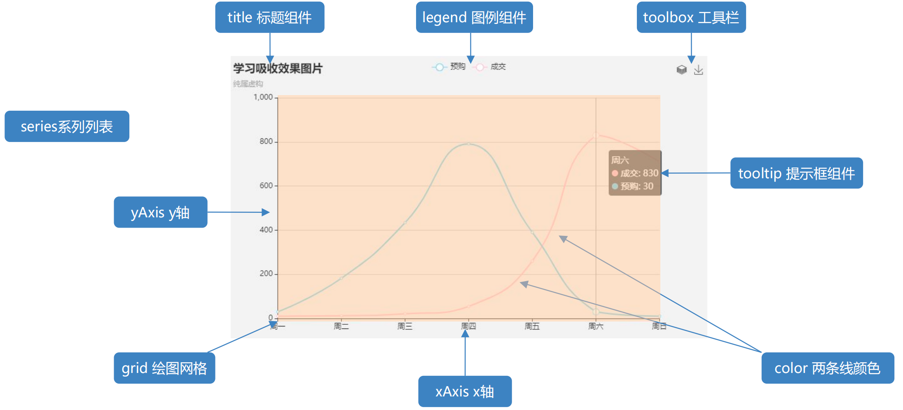

- **title: 标题组件**
- **tooltip: 提示框组件**
- **legend: 图例组件**
- **toolbox: 工具栏**
- **grid: 直角坐标系内绘图网格**
- **xAxis: 直角坐标系 grid 中的 x 轴**
- **yAxis: 直角坐标系 grid 中的 y 轴**
- **series: 系列列表。**
- **color: 调色盘颜色列表**

**先了解以上 9 个配置的作用，其余配置还有具体细节我们查阅文档：文档菜单一配置项手册**

**学 echarts 关键在于学会查阅文档，根据需求修改配置**


### 饼图

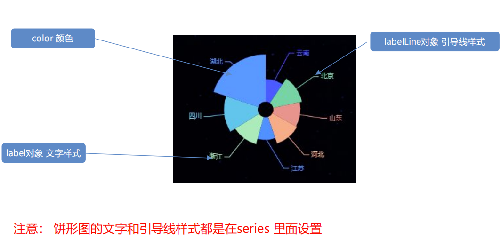


### 柱状图

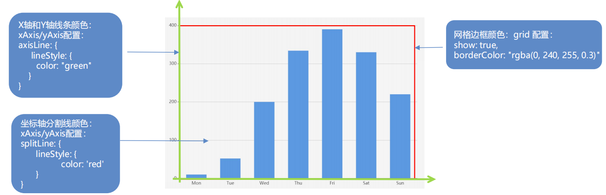


**柱形图-单独修改其中某个柱形样式**

**核心原理：series 对象里面的 data 数组，里面的每一个数据影响每一个柱形。**

**重要的是，data 数组里面除了直接写数字，还可以是对象。**

**直接把 data 里面对应的数据修改为需求配置的对象即可。**


### 雷达图

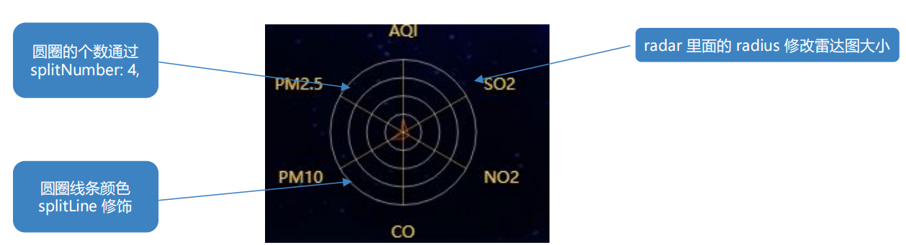

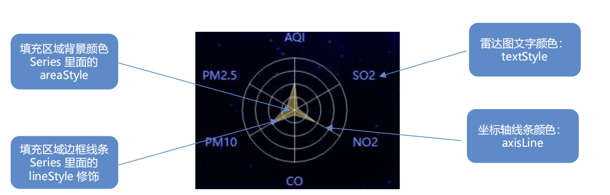


# ES6

### ES6 模板字符

```javascript
ES6 模板字符可以极大的提高我们的开发效率
语法规范：`${表达式}`		// 模板字符串使用反钩号 `` 而且允许自由换行
```

