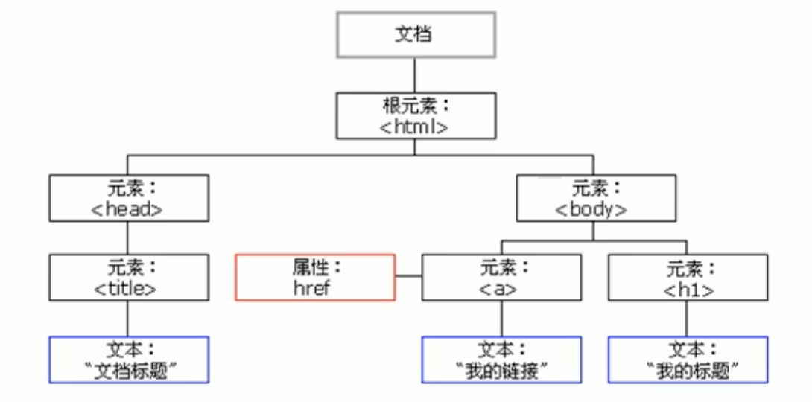
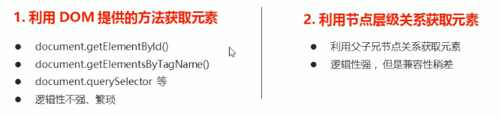
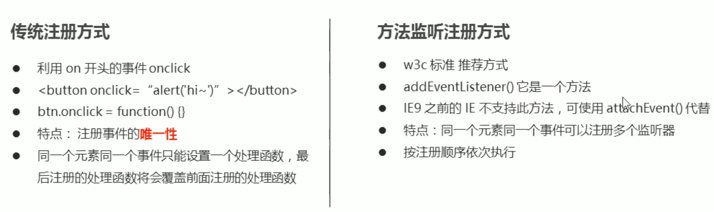
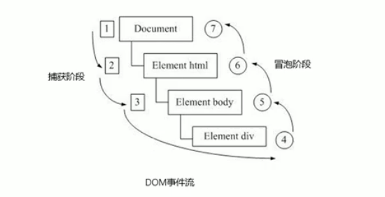
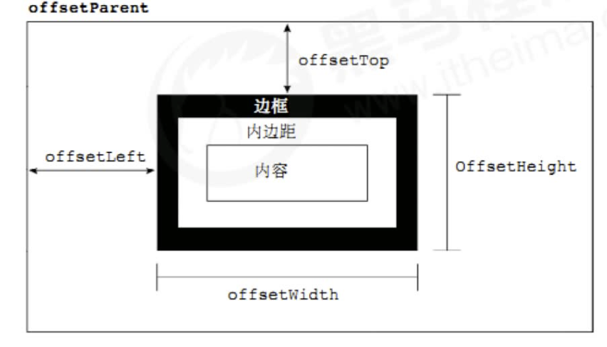
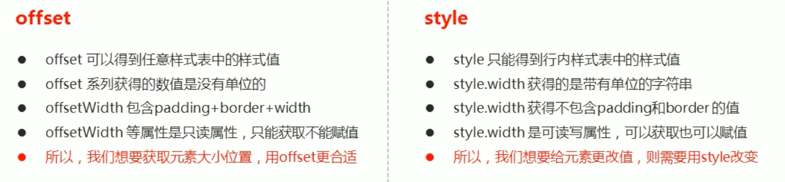
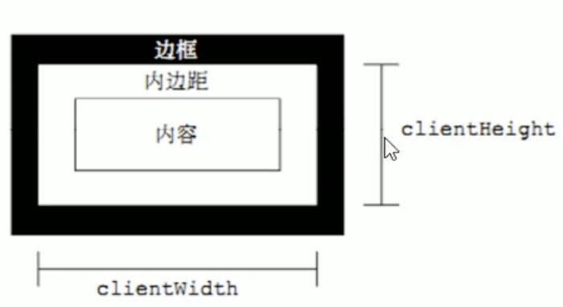
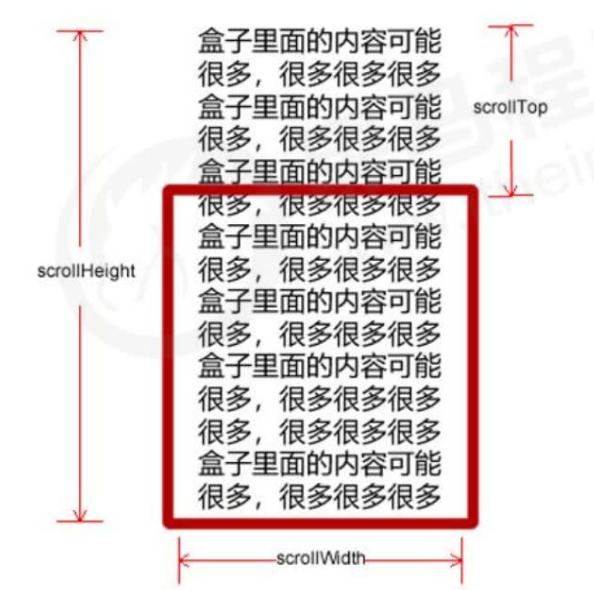
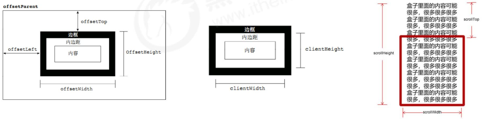

# WebAPI - DOM

## DOM 简介

### 什么是 DOM

文档对象模型（Document Object Model，简称 DOM），是 W3C 组织推荐的**处理可扩展标记语言（HTML 或者 XML）的标准编程接口**。

W3C 已经定义了一系列的 **DOM 接口**，**通过这些 DOM 接口可以改变网页的内容、结构和样式。**


### DOM 树



- **文档：一个页面就是一个文档，DOM 中使用 document 表示** ‼️

- **元素：页面中的所有标签都是元素，DOM 中使用 element 表示** ‼️

- **节点：网页中的所有内容都是节点（标签、属性、文本、注释等），DOM 中使用 node 表示** ‼️

**DOM 把以上内容都看做是对象 ！！！** ‼️


## 获取元素

### 根据 ID 获取

**使用 getElementByld() 方法可以获取带有 ID 的元素对象。**  ‼️

```html
/*
		语法：document.getElementById('ID名字');
*/

<div id = 'time'> 2023-03-02 </div>
<script>
  // 因为我们文档页面从上往下加载，所以先得有标签所以我们 script 写到标签的下面
  
  // 1.get 获得 element 元素 by 通过    驼峰命名法
  // 2.参数 id 是大小写敏感的字符串
  // 3.返回的是一个元素对象    ‼️
  var timer = document.getElementById('time');
  console.log(timer);
  console.log(typeof timer);
  // 4.console.dir 打印我们返回的元素对象更好的查看里面的属性和方法   ‼️
  console.dir(timer);
</script>
```


### 根据标签名获取

**使用 getElementsByTagName() 方法可以返回带有指定标签名的对象的集合。** ‼️

```html
/*
		语法：document.getElementsByTagName('标签名');
		注意：
			- 因为得到的是一个对象的集合，所以我们想要操作里面的元索就需要遍历。 ‼️
			- 得到元素对象是动态的。 ‼️
			
		还可以获取某个元素（父元素）内部所有指定标签名的子元素。 ‼️
		语法：element.getElementsByTagName('标签名'); ‼️
    注意：父元素必须是单个对象（必须指明是哪一个元素对象），获取的时候不包括父元素自己。 ‼️
*/

<ul>
  <li>知否知否 1</li>  
  <li>知否知否 2</li>  
  <li>知否知否 3</li>  
  <li>知否知否 4</li>  
</ul>
<ol id='ol'>
	<li>怎么只获取这个呢？</li> 
  <li>怎么只获取这个呢？</li>
  <li>怎么只获取这个呢？</li>
</ol>
<script>
	    // 1.返回的是获取过来元素对象的集合以伪数组的形式存储的
      var lis = document.getElementsByTagName('li');
      console.log(lis);
      console.log(lis[0]);
      // 2.我们想要依次打印里面的元素对象我们可以采取遍历的方式
      for (var i = 0; i < lis.length; i++) {
      	console.log(lis[i]);
      }
      // 3.如果页面中只有一个 1i 返回的还是伪数组的形式
			// 4.如果页面中没有这个元素返回的空的伪数组的形式
			

			// var ol = document.getElementsByTagName('ol'); // [ol]
      // console.log(ol[0].getElementsByTagName('li'));
      var ol = document.getElementById('ol');
      console.log(ol.getElementsByTagName('li')); // 正常做法  ‼️
</script>
```


### 通过 HTML5 新增的方法获取

```javascript
document.getElementsByClassName('类名');		// 根据 类名 返回元素对象集合 - 伪数组
document.querySelector('选择器');			// 根据 指定选择器 返回第一个元素对象
document.querySelectorAll('选择器');		// 根据 指定选择器 返回元素对象集合
```

### 获取特殊元素 body、html

```javascript
// 1.获取 body 元素
var bodyEle = document.body;
console.log(bodyEle);
console.dir(bodyEle);
// 2.获取 html 元素
var htmlEle = document.documentElement;
console.log(htmlEle);
```


## 操作元素

**JavaScript 的 DOM 操作可以改变网页内容、结构和样式，我们可以利用 DOM 操作元素来改变元素里面的内容、属性等。注意以下都是属性**


### 修改元素内容

- **element.innerText		从起始位置到终止位置的内容，但它去除html标签，同时空格和换行也会去掉**
- **element.innerHTML      起始位置到终止位置的全部内容，包括html标签，同时保留空格和换行。可以用做创建元素！！！**

```html
<body>
  <div></div>
  <p>
  		我是文字
  		<span> 123</span>
  </p>
  <script>
    // innerText 和 innerHTML 的区别
    // 1.innerText 不识别 html 标签		非标准 		去除空格和换行   ‼️
    var div = document.querySelector('div');
    div.innerText='<strong>今天是：</strong>2019';  // 不能正常加粗展示
    // 2.innerHTML 识别 html 标签			 W3C标准		保留空格和换行的 ‼️
    div.innerHTML='<strong>今天是：</strong>2019';
    
    // 这两个属性是可读写的可以获取元素里面的内容
    var p = document.querySelector('p');
    console.log(p.innerText);
    console.log(p.innerHTML);
  </script>
</body>
```


### 修改元素属性

```html
直接拿 element.属性名 改变属性值 ！！！
例：scr、href、id、alt、title

<body>
 	<button id="ldh">刘德华</button>
  <button id="zxy">张学友</button><br>
  

  <script>
    // 修改元素属性 scr
    // 1.获取元素
    var ldh = document.getElementById('ldh');
    var zxy = document.getElementById('zxy');
    var img = document.querySelector('img');
    // 2.注册事件 处理程序
    zxy.onclick = function(){
      img.src = 'images/zxy.jpg';
      img.title = '张学友';
    }
    ldh.onclick =function(){
      img.src = 'images/ldh.jpg';
      img.title = '刘德华';
    }
  </script>
</body>
```


### 修改表单属性

```html
type、value、checked、selected、disabled

<body>
  <button>按钮</button>
  <input type="text" value="输入内容">
  <script>
    // 1.获取元素
    var btn = document.querySelector('button');
    var input = document.querySelector('input');
    // 2.注册事件 处理程序
    btn.onclick = function() {
      // input.innerHTML='点击了';  这个是普通盒子比如 div 标签里面的内容
      // 表单里面的值文字内容是通过 value 来修改的
      input.value = '被点击了';
      // 如果想要某个表单被禁用不能再点击    disabled 属性
      this.disabled = true;  // btn.disabled = true; 两种写法都可以
      // 注意：this 指向的是事件函数的调用者 btn  ‼️ ‼️ ‼️
    }
  </script>
</body>
```


### 修改元素样式属性

**我们可以通过  JS 修改元素的大小、颜色、位置等样式。**

- **element.style    行内样式操作（样式比较少 或者 功能简单的情况下使用）**

  ```html
  <body>
    <div></div>
    <script>
      // 1.获取元素
      var div = document.querySelector('div');
      // 2.注册事件处理程序
      div.onclick = function() {
        // div.style 里面的属性采取驼峰命名法
        this.style.backgroundColor = 'purple';
        this.style.width = '250px';
      }
    </script>
  </body>
  ```

  **注意：**

  - **Js 里面的样式采取驼峰命名法。比如 fontSize、backgroundColor**
  - **Js 修改 style 样式操作，产生的是行内样式，css 权重比较高。**

  

- **element.className   类名样式操作**

  ```html
  <head>
    <style>
      .first {
      	color: green;
      }
      .change { 
      	font-size: 18px;
        color: red;
        margin-top: 10px;
      }
    </style>
  </head>
  <body>
    <div class='first'></div>
    <script>
      var div = document.querySelector('div');
      div.onclick = function() {
      	this.className = 'change';   // 会直接更改元素的类名，会覆盖原先的类名  ‼️
        this.className = 'first change';  // 如果想追加类名 可以使用多类名选择器写法  ‼️
      }
    </script>
  </body>
  ```

  **注意：**

  - **如果样式修改较多，可以采取操作类名方式更改元素样式。**
  - class 因为是个保留字，因此使用 className 来操作元素类名属性
  - **className 会直接更改元素的类名，会覆盖原先的类名。**


### 自定义属性

**自定义属性目的：是为了保存并使用数据。有些数据可以保存到页面中而不用保存到数据库中。 ‼️**

```html
获取属性值
- element.属性			获取属性值。
- element.getAttribute('属性');
区别：
- element.属性												 获取内置属性值									元素本身自带的属性
- element.getAttribute('属性');        主要获得自定义的属性（标准） 		程序员自定义的属性


设置属性值
- element.属性 = '值' 	设置内置属性值。
- element.setAttribute('属性'，'值');
区别：
- element.属性 = '值' 										 设置内置属性值
- element.setAttribute('属性', '值');	  主要设置自定义的属性（标准）


移除自定义属性
- element.removeAttribute('属性');
```

**H5 规定自定义属性 data- 开头做为属性名并且赋值。**

```html
H5 新增 element.dataset.index 或者 element.dataset['index'] 					ie 11 才开始支持   ‼️

<body>
  <div getTime="20" data-index="2" data-list-name="andy"></div>
  <script>
    var div = document.querySelector('div');
    console.log(div.getAttribute('getTime'));
    div.setAttribute('data-time', 20);
    console.log(div.getAttribute('data-index'));
    console.log(div.getAttribute('data-list-name'));
    
    // h5 新增的获取自定义属性的方法
    // dataset 是一个集合里面存放了所有以 data 开头的自定义属性
    console.log(div.dataset);
    console.log(div.dataset.index);
    console.log(div.dataset['index']);
    // 如果自定义属性里面有多个 - 链接的单词，我们获取的时候采取驼峰命名法 ‼️
    console.log(div.dataset.listName);
    console.log(div.dataset['listName']);
  </script>
</body>
```


## 节点操作

**获取元素通常使用两种方式：**




### 节点概述

**网页中的所有内容都是节点（标签、属性、文本、注释等），在 DOM 中，节点使用 node 来表示。**

**HTML DOM 树中的所有节点均可通过 JavaScript 进行访问，所有 HTML 元素（节点）均可被修改，也可以创建或删除。**

**一般地，节点至少拥有 		nodeType(节点类型)、nodeName(节点名称)、nodeValue(节点值) 			这三个基本属性。**

- **元素节点 nodeType 为 1**
- **属性节点 nodeType 为 2**
- **文本节点 nodeType 为 3（文本节点包含文字、空格、换行等）**

**我们在实际开发中，节点操作主要操作的是元素节点。**


### 节点层次

**利用 DOM 树可以把节点划分为不同的层级关系，常见的是父子兄层级关系。**

#### 父子节点

```javascript
# 父节点
node.parentNode
注意：
	- 得到的是离元素最近的父级节点（亲爸爸）
	- 如果找不到父节点就返回为 null


# 子节点
01.parentNode.childNodes（标准）
parentNode.childNodes 返回包含指定节点的子节点的集合，该集合为即时更新的集合。
注意：
	- 返回值里面包含了所有的子节点，包括元素节点，文本节点等。 ❗️
	- 如果只想要获得里面的元素节点，则需要专门处理。所以一般不提倡使用childNodes

var ul = document. querySelector('ul');
for(var i = 0; i < ul.childNodes.length; i++) {
  if (ul.childNodes[i].nodeType == 1) {
    // ul.childNodes[i] 是元素节点
    console.log(ul.childNodes[i]);
	}
}

02.parentNode.children（非标准）
parentNode.children 是一个只读属性，返回所有的子元素节点。它只返回子元素节点，其余节点不返回（重点）。❗️❗️❗️
var ul = document. querySelector('ul');
console.log(ul.children);  // 只获取子元素节点
console.log(ul.children[0]);  // 只获取第一个子元素节点


03. parentNode.firstChild
firstChild 返回第一个子节点，找不到则返回 null。同样，也是包含所有的节点。
04. parentNode.lastChild
lastChild 返回最后一个子节点，找不到则返回 null。同样，也是包含所有的节点。

05. parentNode.firstElementChild
firstElementchild 返回第一个子元素节点，找不到则返回 null。
06. parentNode.lastElementChild
lastElementchild返回最后一个子元素节点，找不到则返回 null。
注意：这两个方法有兼容性问题，IE9 以上才支持。
```

#### 兄弟节点

```javascript
# 兄弟节点
01.node.nextSibling
nextsibling 返回当前元素的下一个兄弟节点，找不到则返回 null。同样，也是包含所有的节点。
02.node.previousSibling
previoussibling 返回当前元素上一个兄弟节点，找不到则返回 null。同样，也是包含所有的节点。

03.node.nextElementSibling
nextElementsibling返回当前元素下一个兄弟元素节点，找不到则返回 null。
04.node.previousElementSibling
previousElementsibling返回当前元素上一个兄弟节点，找不到则返回 null。
注意：这两个方法有兼容性问题，IE9 以上才支持。
```


### 创建、添加、删除 节点

```javascript
// 注意：页面添加一个新的元素：1.创建元素 2.添加元素
# 一、创建节点
document.createElement() 方法创建由 tagName 指定的 HTML 元素。因为这些元素原先不存在，是根据我们的需求动态生成的，所以我们也称为动态创建元素节点。
document.createElement('tagName')

# 二、添加节点
01.node.appendChild(child)
node.appendChild() 方法将一个节点添加到指定父节点的子节点 列表末尾。类似于 css 里面的 after 伪元素。
02.node.insertBefore(child, 指定元素)
node.insertBefore() 方法将一个节点添加到父节点的指定子节点 前面。类似于css 里面的 before 伪元素。

// 删除节点
node.removeChild(child)
node.removeChild() 方法从 DOM 中删除一个子节点，返回删除的节点。

// 小知识：阻止链接跳转需要添加 javascriptvoid(o); 或者 javascript:;   <a href="javascript:;"></a>


###################  三种动态创建元素区别
- document.write()						注意：document.write 是直接将内容写入页面的内容流，但是文档流执行完毕，则它会导致页面全部重绘
- element.innerHTML						注意：创建多个元素效率更高（不要拼接字符串，采取数组形式拼接），结构稍微复杂
	// 字符串      ❌
	var inner = document.querySelector('.inner');
  for (var i = 0; i <= 100; i++) {
  	inner.innerHTML+='<a href="#">百度</a>'
  }
	// 数组形式拼接	 ✅
	var arr = [];
  for (var i = 0; i <= 100; i++){
    arr.push('<a href="#">百度</a>');
    inner.innerHTML = arr.join('');
  }
- document.createElement()		注意：创建多个元素效率稍低一点点，但是结构更清晰
```

### 复制节点、克隆节点

```javascript
node.cloneNode()
node.cloneNode() 方法返回调用该方法的节点的一个副本。也称为克隆节点/拷贝节点

注意：
	如果括号参数为空或者为 false，则是浅拷贝，即只克隆复制节点本身，不克隆里面的子节点。
// node.cloneNode(false) 浅拷贝      node.cloneNode(true) 深拷贝
```


## 事件

### 事件三要素

```html
<body>
  <button id="btn">唐伯虎</button>
  <script>
    // 点击一个按钮，弹出对话框

    // 事件是有三部分组成：事件源、事件类型、事件处理程序
    // 1.事件源		事件被触发的对象
    var btn = document.getElementById('btn');
    // 2.事件类型		如何触发? 什么事件			比如：鼠标点击(onclick)还是鼠标经过还是键盘按下
    // 3.事件处理程序				通过一个函数赋值的方式完成
    btn.onclick = function(){
    	alert（'点秋香'）;
    }
    
    // 注意可以手动调用事件 btn.click(); ❗️❗️
  </script>
</body>
```

- **事件源：事件被触发的对象。**
- **事件类型：如何触发，什么事件**
- **事件处理程序：通过一个函数赋值的方式**


### 注册事件（绑定事件）

**给元素添加事件，称为注册事件或者绑定事件。**

注册事件有两种方式：**传统方式** 和 **方法监听注册方式**



#### addEventListener 事件监听方式

```javascript
eventTarget.addEventListener(type, listener [, useCapture])
eventTarget.addEventListener()	方法将指定的监听器注册到eventTarget(目标对象)上,当该对象触发指定的事件时，就会执行事件处理函数。
该方法接收三个参数：
	- type：事件类型字符串，比如 'click'、'mouseover' 注意这里不要带 on
	- listener：事件处理函数，事件发生时，会调用该监听函数
	- useCapture：可选参数，是一个布尔值，默认是 false。
  		参数如果是 true, 表示在事件捕获阶段调用事件处理程序；
			如果是 false（不写默认就是 false），表示在事件冒泡阶段调用事件处理程序。
```

#### attachEvent 事件监听方式

```javascript
eventTarget.attachEvent (eventNameWithOn, callback)  老方法，不用
eventTarget.attachEvent()	方法将指定的监听器注册到 eventTarget（目标对象）上，当该对象触发指定的事件时，指定的回调函数就会被执行。
该方法接收两个参数：
- eventNameWithOn：事件类型字符串，比如 'onclick'、'onmouseover'，这里要带 on
- callback：事件处理函数，当目标触发事件时回调函数被调用
```


### 删除事件（解绑事件）

```javascript
删除事件的方式
- 传统注册方式
// eventTarget.onclick = null;

- 方法监听注册方式
① eventTarget.removeEventListener(type, listener [, useCapture]);
② eventTarget.detachEvent(eventNameWithOn, callback);
```


### DOM 事件流

**事件流描述的是从页面中接收事件的顺序。**

**事件发生时会在元素节点之间按照特定的顺序传播，这个传播过程即 DOM 事件流。**



比如我们给一个 div 注册了点击事件：

DOM 事件流分为 3 个阶段：

**1.捕获阶段**

**2.当前目标阶段**

**3.冒泡阶段**

- 事件冒泡：IE 最早提出，事件开始时由最具体的元素接收，然后逐级向上传播到到 DOM 最顶层节点的过程。
- 事件捕获：网景最早提出，由 DOM 最顶层节点开始，然后逐级向下传播到到最具体的元素接收的过程。


### 事件对象

```javascript
eventTarget.onclick = function(event) {}
eventTarget.addEventListener('click', Tunction(event) {})
// 这个 event 就是事件对象，我们还喜欢的写成 e 或者 evt
```

**官方解释：event 对象代表事件的状态，比如键盘按键的状态、鼠标的位置、鼠标按钮的状态。**

**简单理解：事件发生后，跟事件相关的一系列信息数据的集合都放到这个对象里面，这个对象就是事件对象 event，它有很多属性和方法。**


#### 事件对象的常见属性和方法

| 事件对象属性方法    | 说明                                                         |
| ------------------- | ------------------------------------------------------------ |
| e.target            | 返回触发事件的对象           标准                            |
| e.srcElement        | 返回触发事件的对象           非标准 ie6-8 使用               |
| e.type              | 返回事件的类型 比如 click、mouseover 不带 on                 |
| e.cancelBubble      | 该属性阻止冒泡               非标准 ie6-8 使用               |
| e.returnValue       | 该属性阻止默认事件（默认行为）非标准 ie6-8 使用    比如不让链接跳转 |
| e.preventDefault()  | 该方法阻止默认事件（默认行为）标准    比如不让链接跳转       |
| e.stopPropagation() | 阻止冒泡         标准                                        |

**e.target 和 this 区别**

```javascript
// 重点：e.target 返回的是触发事件的对象（元素） this 返回的是绑定事件的对象（元素）
var ul = document.querySelector('ul');
ul.addEventListener('click', function(e){
  console.log(this);  // <ul></ul>
  console.log(e.currentTarget);  // <ul></ul>
  console.log(e.target);   // <li></li>
}）
```


### 阻止冒泡

事件冒泡：开始时由最具体的元素接收，然后逐级向上传播到到DOM最顶层节点。

事件冒泡本身的特性，会带来的坏处，也会带来的好处，需要我们灵活掌握。

```javascript
阻止事件冒泡
// 标准写法：利用事件对象里面的 stopPropagation() 方法
e.stopPropagation() // stop 停止 Propagation 传递
// 非标准写法：IE6-8 利用事件对象 cancelBubble 属性
e.cancelBubble = true // cancel 取消 bubble 泡泡

# 兼容性写法
if(e && e.stopPropagation){
	e.stopPropagation();
}else{
	window.event.cancelBubble = true;
}
```


### 事件委托（代理、委派）

事件冒泡本身的特性，会带来的坏处，也会**带来的好处**，需要我们灵活掌握。生活中有如下场景：

咱们班有100个学生，快递员有100个快递，如果一个个的送花费时间较长。同时每个学生领取的时候，也需

要排队领取，也花费时间较长，何如？

**解决方案：**快递员把100个快递，委托给班主任，班主任把这些快递放到办公室，同学们下课自行领取即可。

**优势：**快递员省事，委托给班主任就可以走了。同学们领取也方便，因为相信班主任。

程序中也有如此场景：

```html
<ul>
  <li>知否知否，应该有弹框在手</li>
  <li>知否知否，应该有弹框在手</li>
  <li>知否知否，应该有弹框在手</li>
  <li>知否知否，应该有弹框在手</li>
  <li>知否知否，应该有弹框在手</li>
</ul>
```

**点击每个 li 都会弹出对话框，以前需要给每个 li 注册事件，是非常辛苦的，而且访问 DOM 的次数越多，这就会延长整个页面的交互就绪时间。**

**解决方案：**

事件委托也称为事件代理，在 jQuery 里面称为事件委派。

**事件委托的原理：不是每个子节点单独设置事件监听器，而是事件监听器设置在其父节点上，然后利用冒泡原理影响设置每个子节点。**

以上案例：给 ul 注册点击事件，然后利用事件对象的 target 来找到当前点击的 li，因为点击 li，事件会冒泡到 ul 上，ul 有注册事件，就会触发事件监听器。

事件委托的作用：**我们只操作了一次 DOM，提高了程序的性能。**

```html
<ul>
  <li>知否知否，点我应有弹框在手！</li>
  <1i>知否知否，点我应有弹框在手！</1i>
  <li>知否知否，点我应有弹框在手！</1i>
  <li>知否知否，点我应有弹框在手！</1i>
  <1i>知否知否，点我应有弹框在手！</1i>
</ul>
<script>
// 事件委托的核心原理。给父节点添加侦听器，利用事件冒泡影响每一个子节点
var ul = document.querySelector('ul');
ul.addEventListener('click', function(e){
  // alert（'知否知否，点我应有弹框在手！'）;
  //e.target 这个可以得到我们点击的对象
  e.target.style.backgroundcolor = 'pink';
}）
</script>
```


### 常用事件

#### 常用鼠标事件

| 鼠标事件     | 触发条件         |
| ------------ | ---------------- |
| onclick      | 鼠标点击左键触发 |
| onmouseover  | 鼠标经过触发     |
| onmouseenter | 鼠标经过触发     |
| onmouseout   | 鼠标离开触发     |
| onfocus      | 获得鼠标焦点触发 |
| onblur       | 失去鼠标焦点触发 |
| onmousemove  | 鼠标移动触发     |
| onmouseup    | 鼠标弹起触发     |
| onmousedown  | 鼠标按下触发     |

```javascript
// 1.禁止鼠标右键菜单
contextmenu主要控制应该何时显示上下文菜单，主要用于程序员取消默认的上下文菜单
document.addEventListener('contextmenu', function(e) {
  e.preventDefault();
})
// 2.禁止鼠标选中(selectstart 开始选中）
document.addEventListener('selectstart', function (e) {
  e.preventDefault ();
})

// mouseenter 和 mouseover的区别
mouseenter 当鼠标移动到元素上时就会触发 mouseenter 事件类似 mouseover。
它们两者之间的差别是：mouseover 鼠标经过自身盒子会触发，经过子盒子还会触发。
										mouseenter 只会经过自身盒子触发
之所以这样，就是因为 mouseenter 不会冒泡
```

#### 鼠标事件对象

event 对象代表事件的状态，跟事件相关的一系列信息的集合。MouseEvent 和键盘事件对象 KeyboardEvent。

| 鼠标事件对象 | 说明                                               |
| ------------ | -------------------------------------------------- |
| e.clientX    | 返回鼠标相对于**浏览器窗囗可视区**的 X 坐标        |
| e.clientY    | 返回鼠标相对于**浏览器窗口可视区**的 Y 坐标        |
| e.pageX      | 返回鼠标相对于**文档页面**的 X 坐标       IE9+支持 |
| e.pageY      | 返回鼠标相对于**文档页面**的 Y 坐标       IE9+支持 |
| e.screenX    | 返回鼠标相对于**电脑屏幕**的 X 坐标                |
| e.screenY    | 返回鼠标相对于**电脑屏幕**的 Y 坐标                |


#### 常用键盘事件

| 键盘事件   | 触发条件                                                     |
| ---------- | ------------------------------------------------------------ |
| onkeyup    | 某个键盘按键被松开时触发                                     |
| onkeydown  | 某个键盘按键被按下时触发                                     |
| onkeypress | 某个键盘按键被按下时触发 但是它不识别功能键比如 ctrl shift 箭头等 |

**注意：**

- **如果使用 addEventListener 不需要加 on**
- **onkeypress 和前面 2 个的区别是，它不识别功能键，比如左右箭头，shift等。**
- **三个事件的执行顺序是：keydown -- keypress --- keyup**

#### 键盘事件对象

| 键盘事件对象属性 | 说明              |
| ---------------- | ----------------- |
| keyCode          | 返回该键的ASCII值 |

**注意：**

- **onkeydown 和 onkeyup 不区分字母大小写，onkeypress 区分字母大小写。**

- **在我们实际开发中，我们更多的使用 keydown 和 keyup，它能识别所有的键（包括功能键）**

- **keypress 不识别功能键，但是 keyCode 属性能区分大小写，返回不同的 ASCII 值**


## 网页特效

### 元素偏移量 offset 系列

**offset 翻译过来就是偏移量，我们使用offset系列相关属性可以动态的得到该元素的位置（偏移）、大小等。**

- **获得元素距离带有定位父元素的位置**

- **获得元素自身的大小（宽度高度）**
- **注意：返回的数值都不带单位**



**offset 系列常用属性：**

| offset 系列属性      | 作用                                                         |
| -------------------- | ------------------------------------------------------------ |
| element.offsetParent | 返回作为该元素带有定位的父级元素如果父级都没有定位则返回 body |
| element.offsetTop    | 返回元素相对带有定位父元素上方的偏移                         |
| element.offsetLeft   | 返回元素相对带有定位父元素左边框的偏移                       |
| element.offsetWidth  | 返回自身包括 padding、边框、内容区的宽度，返回数值不带单位   |
| element.offsetHeight | 返回自身包括 padding、边框、内容区的高度，返回数值不带单位   |

**offset 与 style 区别**




### 元素可视区 client 系列

client 翻译过来就是客户端，我们使用 client 系列的相关属性来获取元素可视区的相关信息。通过 client 系列的相关属性可以动态的得到该元素的边框大小、元素大小等。



| client 系列属性      | 作用                                                         |
| -------------------- | ------------------------------------------------------------ |
| element.clientTop    | 返回元素上边框的大小                                         |
| element.clientLeft   | 返回元素左边框的大小                                         |
| element.clientWidth  | 返回自身包括 padding、内容区的宽度，不含边框，返回数值不带单位 |
| element.clientHeight | 返回自身包括 padding、内容区的高度，不含边框，返回数值不带单位 |


### 元素滚动 scroll 系列

**scroll 翻译过来就是滚动的，我们使用 scroll 系列的相关属性可以动态的得到该元素的大小、滚动距离等。**



| scroll 系列属性      | 作用                                           |
| -------------------- | ---------------------------------------------- |
| element.scrollTop    | 返回被卷去的上侧距离，返回数值不带单位         |
| element.scrollLeft   | 返回被卷去的左侧距离，返回数值不带单位         |
| element.scrollWidth  | 返回自身实际的宽度，不含边框，返回数值不带单位 |
| element.scrollHeight | 返回自身实际的高度，不含边框，返回数值不带单位 |

**页面被卷去的头部**

如果浏览器的高（或宽）度不足以显示整个页面时，会自动出现滚动条。当滚动条向下滚动时，页面上面被隐藏掉的高度，我们就称为页面被卷去的头部。滚动条在滚动时会触发 onscroll 事件。

```html
<div>
	我是内容 我是内容我是内容我是内容我是内容我是内容 我是内容我是内容我是内容我是内容
</div>
<script>
// scroll 系列
var div = document.querySelector('div');
console.log(div.scrollHeight);
console.log(div.clientHeight);
// scroll 滚动事件当我们滚动条发生变化会触发的事件
div.addEventListener('scrol1', function() {
	console.log(div.scrollTop);
}）
</script>


注意，元素被卷去的头部是 element.scrollTop，如果是页面被卷去的头部则是 window.pageYOffset
	页面被卷去的头部：可以通过 window.pageYOffset 获得 如果是被卷去的左侧 window.pageXOffset

<--! 注意： -->
需要注意的是，页面被卷去的头部，有兼容性问题，因此被卷去的头部通常有如下几种写法：
1.声明了 DTD,使用document.documentElement.scrollTop
2.未声明 DTD,使用document.body.scrol1Top
3.新方法 window.pageYOffset 和 window.pageXOffset,IE9开始支持
function getScroll() {
  return {
    left: window.pagexOffset || document.documentElement.scrollLeft || document.body.scrollLeft || 0,
    top: window.pageYOffset || document.documentElement.scrollTop || document.body.scrollTop || 0
  };
}
使用的时候 getScroll().left
```


### 三大系列总结

| 三大系列大小对比    | 作用                                                         |
| ------------------- | ------------------------------------------------------------ |
| element.offsetWidth | 返回自身包括 padding、边框、内容区的宽度，返回数值不带单位   |
| element.clientWidth | 返回自身包括 padding、内容区的宽度，不含边框，返回数值不带单位 |
| element.scrollWidth | 返回自身实际的宽度，不含边框，返回数值不带单位               |



**注意：**

- **offset 系列经常用于获得元素位置 offsetLeft offsetTop**
- **client 经常用于获取元素大小 clientWidth clientHeight**
- **scroll 经常用于获取滚动距离scrollTop scrollLeft**

**注意页面滚动的距离通过 window.pagexoffset 获得**


### 立即执行函数

```javascript
// 立即执行函数，不需要调用，立马能够执行的函数
- (function(a, b) {})(1, 2);
- (function(a){} (1));
主要作用：创建一个独立的作用域。避免了命名冲突问题。
```


### 动画函数封装

**动画实现核心原理：通过定时器 setlnterval() 不断移动盒子位置。**

**实现步骤：**

**1.获得盒子当前位置**

**2.让盒子在当前位置加上1个移动距离**

**3.利用定时器不断重复这个操作**

**4.加一个结束定时器的条件**

**5.注意此元素需要添加定位，才能使用 element.style.left**

```html
<head>
  <style>
    div, span {
      position: absolute;
      left: 0;
      width: 100px;
      height: 100px;
      background-color: pink;
    }
  </style>
</head>
<body>
  <div></div>
  <span></span>
  <script>
    // 简单动画函数封装obj目标对象target目标位置
    // 给不同的元素指定了不同的定时器
    function animate(obj, target) {
      // 当我们不断的点击按钮，这个元素的速度会越来越快，因为开启了太多。
      // 解决方案就是让我们元素只有一个定时器执行，先清除以前的定时器，只保留当前的一个定时器执行。
      clearInterval(obj.timer);
      obj.timer = setInterval(function() {
        if (obj.offsetLeft >= target){
          clearInterval(obj.timer); // 停止动画本质是停止定时器
        }
        obj.style.left = obj.offsetleft + 1 + 'px';
      }, 30); 
    }
    var div = document.querySelector('div');
    var span = document.querySelector('span');
  </script>
</body>
```


### 缓动动画

**缓动动画原理：就是让元素运动速度有所变化，最常见的是让速度慢慢停下来**

**思路：**

**1.让盒子每次移动的距离慢慢变小，速度就会慢慢落下来。**

**2.核心算法：（目标值-现在的位置）/10 做为每次移动的距离步长**

**3.停止的条件是：让当前盒子位置等于目标位置就停止定时器**

**4.注意步长值需要取整**

****

**动画函数多个目标值之间移动可以让动画函数从 800 移动到 500。**

**当我们点击按钮时候，判断步长是正值还是负值**

**1.如果是正值，则步长往大了取整**

**2.如果是负值，则步长向小了取整**

****

**动画函数添加回调函数**

**回调函数原理：函数可以作为一个参数。将这个函数作为参数传到另一个函数里面，当那个函数执行完之后，再执行传进去的这个函数，这个过程就叫做回调。**

**回调函数写的位置：定时器结束的位置。**

```html
<head>
  <style>
    div, span {
      position: absolute;
      left: 0;
      width: 100px;
      height: 100px;
      background-color: pink;
    }
  </style>
</head>
<body>
  <div></div>
  <span></span>
  <script>
    // 可以专门封装一个 js 文件 如果想用动画函数直接引入一下就可以
    function animate(obj, target, callback) {
      clearInterval(obj.timer);
      obj.timer = setInterval(function() {
        
        var step = (target - obj.offsetLeft) / 10; // （目标值-现在的位置）/ 10 做为每次移动的距离步长
        step = step > 0? Math.ceil(step) :Math.floor(step); // 判断步长是正值还是负值, 正值，则步长往大了取整
        
        if (obj.offsetLeft >= target){
          clearInterval(obj.timer); // 停止动画本质是停止定时器
          if(callback){ callback(); } // 停止动画后执行回调函数
        }
        obj.style.left = obj.offsetleft + step + 'px';
      }, 30); 
    }
    var div = document.querySelector('div');
    var span = document.querySelector('span');
    span.addEventListener('click', function() {
    		enimate(span, 800, function() {
        	span.style.color = 'red';
        });
    })
                          
   // 滚动窗口至文档中的特定位置				window.scroll(x,y) 				注意：里面的 x 和 y 不跟单位，直接写数字
  </script>
</body>
```


### 节流阀

**防止轮播图按钮连续点击造成播放过快。**

**节流阀目的：当上一个函数动画内容执行完毕，再去执行下一个函数动画，让事件无法连续触发。**

**核心实现思路：利用回调函数，添加一个变量来控制，锁住函数和解锁函数。**

**开始设置一个变量 var flag=true；**

**If(flag) {flag = false; do something}		关闭水龙头**

**利用回调函数动画执行完毕，flag = true 			打开水龙头**

```javascript
if(callback){
 callback();
}
// == 
if(callback) callback();
// == 高阶 python 同理
callback && callback(); ❗️❗️
```


## 移动端网页特效

### 触屏事件

移动端浏览器兼容性较好，我们不需要考虑以前 JS 的兼容性问题，可以放心的使用原生 JS 书写效果，但是移动端也有自己独特的地方。

比如触屏事件 touch（也称触摸事件），Android 和 IOS 都有。touch 对象代表一个触摸点。触摸点可能是一根手指，也可能是一根触摸笔。触屏事件可响应用户手指（或触控笔）对屏幕或者触控板操作。

常见的触屏事件如下：

| 触屏 touch 事件 | 说明                            |
| --------------- | ------------------------------- |
| touchstart      | 手指触摸到一个 DOM 元素时触发   |
| touchmove       | 手指在一个 DOM 元素上滑动时触发 |
| touchend        | 手指从一个 DOM 元素上移开时触发 |


**触摸事件对象（TouchEvent）**

TouchEvent 是一类描述手指在触摸平面（触摸屏、触摸板等）的状态变化的事件。这类事件用于描述一个或多个触点，使开发者可以检测触点的移动，触点的增加和减少，等等。

touchstart、touchmove、touchend 三个事件都会各自有事件对象。

触摸事件对象重点我们看三个常见对象列表：

| 触摸列表       | 说明                                             |
| -------------- | ------------------------------------------------ |
| touches        | 正在触摸屏幕的所有手指的一个列表                 |
| targetTouches  | 正在触摸当前 DOM 元素上的手指的一个列表          |
| changedTouches | 手指状态发生了改变的列表，从无到有，从有到无变化 |

因为平时都是给元素注册触摸事件，所以重点记住 targetTocuhes


**移动端拖动元素**

1.touchstart、touchmove、touchend 可以实现拖动元素

2.但是拖动元素需要当前手指的坐标值我们可以使用 targetTouches[0] 里面的 pageX 和 pageY

3.移动端拖动的原理：手指移动中，计算出手指移动的距离。然后用盒子原来的位置 + 手指移动的距离

4.手指移动的距离：手指滑动中的位置减去手指刚开始触摸的位置

拖动元素三步曲：

（1）触摸元素 touchstart：获取手指初始坐标，同时获得盒子原来的位置

（2）移动手指 touchmove：计算手指的滑动距离，并且移动盒子

（3）离开手指 touchend:

注意：手指移动也会触发滚动屏幕所以这里要阻止默认的屏幕滚动 e.preventDefault()；


### classList 属性

classList 属性是 HTML5 新增的一个属性，返回元素的类名。但是 ie10 以上版本支持。

该属性用于在元素中添加，移除及切换 CSS 类。

```javascript
# 添加类：
element.classList.add('类名'）;
- focus.classList.add('current');

# 移除类：
element.classList.remove('类名');
- focus.classList.remove('current');

# 切换类：
element.classList.toggle('类名');
- focus.classList.toggle('current');

注意以上方法里面，所有类名都不带点
```


### click 延时解决方案

移动端 click 事件会有 300ms 的延时，原因是移动端屏幕双击会缩放（double tap to zoom）页面。

```javascript
解决方案：
1.禁用缩放。浏览器禁用默认的双击缩放行为并且去掉 300ms 的点击延迟。
<meta name="viewport" content="user-scalable=no">
  
2.利用 touch 事件自己封装这个事件解决 300ms 延迟。
原理就是：
1.当我们手指触摸屏幕，记录当前触摸时间
2.当我们手指离开屏幕，用离开的时间减去触摸的时间
3.如果时间小于 150ms，并且没有滑动过屏幕，那么我们就定义为点击
// 封装 tap,解决 click 300ms 延时
function tap (obj, callback) {
  var isMove = false;
  var startTime = 0;	// 记录触摸时候的时间变量
  obj.addEventListener('touchstart', function (e) {
  	startTime = Date.now(); // 记录触摸时间
  });
  obj.addEventListener('touchmove', function (e) {
  	isMove = true;	// 看看是否有滑动，有滑动算拖拽，不算点击
  });
  obj.addEventListener('touchend', function (e) {
    if（!isMove && (Date.now()-startTime) < 150){	// 如果手指触摸和离开时间小于 150ms 算点击
      callback && callback();	// 执行回调函数
    }
    isMove = false;	// 取反重置
    startTime = 0;
  });
}
// 调用
tap (div, function () {	// 执行代码	});

3.使用插件。fastclick 插件解决 300ms 延迟。
- 引入 js 插件文件。
- 按照规定语法使用。
  GitHub官网地址：https://github.com/ftlabs/fastclick
  if ('addEventListener' in document) {
    document.addEventListener('DOMContentLoaded', function() {
    FastClick.attach(document.body);
    }, false);
  }
```


### 插件使用

swiper：https://www.swiper.com.cn/

superslide : http://www.superslide2.com/

iscroll : https://github.com/cubiq/iscroll


### 框架使用

框架，顾名思义就是一套架构，它会基于自身的特点向用户提供一套较为完整的解决方案。框架的控制权在框架本身，使用者要按照框架所规定的某种规范进行开发。

插件一般是为了解决某个问题而专门存在，其功能单一，并且比较小。

前端常用的框架有 Bootstrap、Vue、Angular、React 等。既能开发 PC 端，也能开发移动端

前端常用的移动端插件有 swiper、superslide、iscroll 等。

框架：大而全，一整套解决方案

插件：小而专一，某个功能的解决方案

