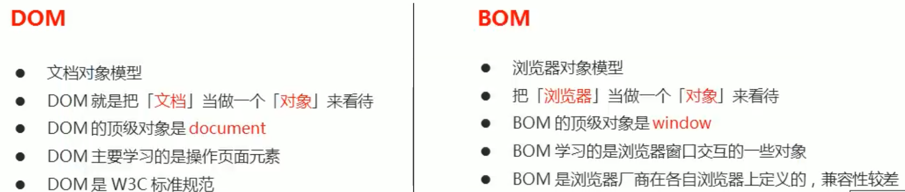
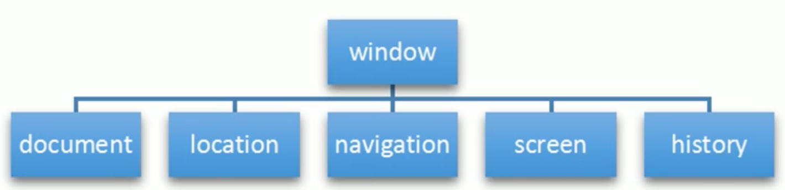
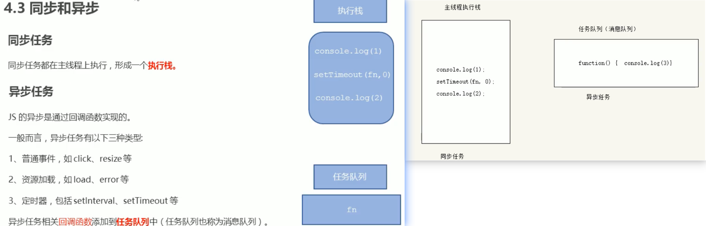
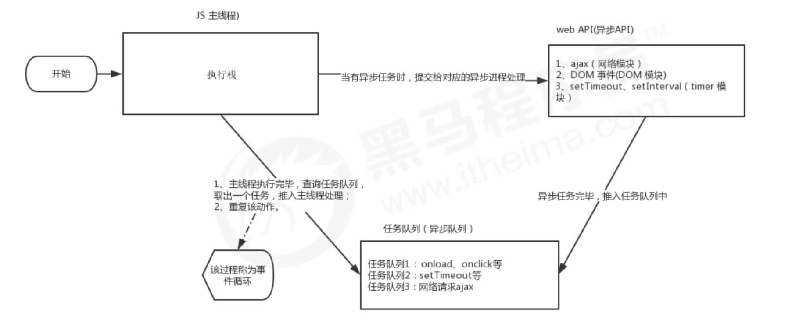

# WebAPI - BOM

## BOM 简介

BOM（Browser Object Model）即浏览器对象模型，它提供了独立于内容而与浏览器窗口进行交互的对象，其核心对象是 window。

BOM 由一系列相关的对象构成，并且每个对象都提供了很多方法与属性。BOM 缺乏标准，JavaScript 语法的标准化组织是 ECMA,DOM 的标准化组织是 W3C，BOM最初是 Netscape 浏览器标准的一部分。




### BOM 的构成

BOM 比 DOM 更大，它包含 DOM。



**window 对象是浏览器的顶级对象，它具有双重角色。**

- **它是 JS 访问浏览器窗口的一个接口。**
- **它是一个全局对象。定义在全局作用域中的变量、函数都会变成 window 对象的属性和方法。**
- **在调用的时候可以省略 window，前面学习的对话框都属于 window 对象方法，如 alert()、prompt()等。**

**注意：window 下的一个特殊属性 window.name**


## Windown 对象的常见事件

### 窗口加载事件

#### onload

```javascript
// window.onload 是窗口（页面）加载事件，当文档内容完全加载完成会触发该事件（包括图像、脚本文件、CSS文件等)，就调用的处理函数。
window.onload =function(){}    或者    window.addEventListener("load",function(){});
```

**window.onload 是窗口（页面）加载事件，当文档内容完全加载完成会触发该事件（包括图像、脚本文件、CSS文件等)，就调用的处理函数。**

**注意：**

- **有了 window.onload 就可以把 JS 代码写到页面元素的上方，因为 onload 是等页面内容全部加载完毕，再去执行处理函数。**
- **window.onload 传统注册事件方式只能写一次，如果有多个，会以最后一个 window.onload 为准。如果使用 addEventListener 则没有限制**


#### DOMContentLoaded

```javascript
document.addEventListener('DOMContentLoaded',function(){})
// DOMContentLoaded 事件触发时，仅当 DOM 加载完成,不包括样式表，图片，flash等等。le9以上才支持
```

**DOMContentLoaded 事件触发时，仅当 DOM 加载完成,不包括样式表，图片，flash等等。le9以上才支持**

**如果页面的图片很多的话，从用户访问到onload触发可能需要较长的时间，交互效果就不能实现，必然影响用户的体验，此时用 DOMContentLoaded 事件比较合适。**


### 调整窗口大小事件

```javascript
window.onresize = function(){}
window.addEventListener ("resize",function (){});
// window.onresize 是调整窗口大小加载事件，当触发时就调用的处理函数。
```

**注意：**

- **只要窗口大小发生像素变化，就会触发这个事件。**
- **我们经常利用这个事件完成响应式布局。window.innerWidth 当前屏幕的宽度**


### 定时器

#### window.setTimeout

```javascript
window.setTimeout(调用函数，[延迟的毫秒数]);
// setTimeout() 方法用于设置一个定时器，该定时器在定时器到期后执行调用函数。 ❗️❗️
注意：
 - 1.window 可以省略。
 - 2.这个调用函数可以直接写函数、函数名、采取字符串'函数名()'三种形式。第三种不推荐
 - 3.延迟的毫秒数省略默认是 0，如果写，必须是毫秒。
 - 4.因为定时器可能有很多，所以我们经常给定时器赋值一个标识符。

setTimeout() 这个调用函数我们也称为回调函数 callback
普通函数是按照代码顺序直接调用。而这个函数，需要等待时间，时间到了才去调用这个函数，因此称为回调函数。
简单理解：回调，就是回头调用的意思。上一件事干完，再回头再调用这个函数。
以前我们讲的 element.onclick=function(){} 或者 element.addEventListener('click',fn); 里面的函数也是回调函数。
```

#### 停止 setTimeout() 定时器

**window.clearTimeout (timeoutID)**

```javascript
clearTimeout() 方法取消了先前通过调用 setTimeout()建立的定时器。
注意：
 - 1.window 可以省略。
 - 2.里面的参数就是定时器的标识符。
```


#### window.setlnterval

```javascript
window.setInterval(回调函数，[间隔的毫秒数]）;
// setlnterval() 方法重复调用一个函数，每隔这个时间，就去调用一次回调函数。  ❗️❗️
注意： 
 - 1.window 可以省略。
 - 2.这个调用函数可以直接写函数，或者写函数名或者采取字符串 '函数名0' 三种形式。
 - 3.间隔的毫秒数省略默认是 0，如果写，必须是毫秒，表示每隔多少毫秒就自动调用这个函数。
 - 4.因为定时器可能有很多，所以我们经常给定时器赋值一个标识符。

区别：
setTimeout		延时时间到了，就去调用这个回调函数，只调用一次就结束了这个定时器
setInterval		每隔这个延时时间，就去调用这个回调函数，会调用很多次，重复调用这个函数
```

#### 停止 setlnterval() 定时器

```javascript
window.clearInterval(intervalID);
clearInterval() 方法取消了先前通过调用 setInterval() 建立的定时器。
注意：
 - 1.window 可以省略。
 - 2.里面的参数就是定时器的标识符。
```


### this

**this 的指向在函数定义的时候是确定不了的，只有函数执行的时候才能确定 this 到底指向谁，一般情况下 this 的最终指向的是那个调用它的对象**

- **全局作用域或者普通函数中 this 指向全局对象 window (注意定时器里面的 this 指向 window)**
- **方法调用中谁调用 this 指向谁**
- **构造函数中 this 指向构造函数的实例**


### JS 执行机制

#### JS 是单线程

**JavaScript 语言的一大特点就是单线程，也就是说，同一个时间只能做一件事。这是因为 Javascript 这门脚本语言诞生的使命所致——JavaScript 是为处理页面中用户的交互，以及操作 DOM 而诞生的。比如我们对某个 DOM 元素进行添加和删除操作，不能同时进行。应该先进行添加，之后再删除。**

**单线程就意味着，所有任务需要排队，前一个任务结束，才会执行后一个任务。这样所导致的问题是：如果 JS 执行的时间过长，这样就会造成页面的渲染不连贯，导致页面渲染加载阻塞的感觉。**


#### 同步和异步

**为了解决这个问题，利用多核 CPU 的计算能力，HTML5 提出 Web Worker 标准，允许 JavaScript 脚本创建多个线程。于是，JS 中出现了同步和异步。**

**同步：前一个任务结束后再执行后一个任务，程序的执行顺序与任务的排列顺序是一致的、同步的。比如做饭的同步做法：我们要烧水煮饭，等水开了（10分钟之后），再去切菜，炒菜。**

**异步：你在做一件事情时，因为这件事情会花费很长时间，在做这件事的同时，你还可以去处理其他事情。比如做饭的异步做法，我们在烧水的同时，利用这10分钟，去切菜，炒菜。**

**他们的本质区别：这条流水线上各个流程的执行顺序不同。**


```javascript
// 例子
console.log(1);
setTimeout(function () {
	console.log(3);
}, 0);
console.log(2);

// 执行结果 1 2 3
```




#### 执行机制

**1.先执行执行栈中的同步任务。**

**2.异步任务（回调函数）放入任务队列中。**

**3.一旦执行栈中的所有同步任务执行完毕，系统就会按次序读取任务队列中的异步任务，于是被读取的异步任务结束等待状态，进入执行栈，开始执行。**



**由于主线程不断的重复获得任务、执行任务、再获取任务、再执行，所以这种机制被称为事件循环（event loop）。**


## Location 对象

**window 对象给我们提供了一个 location 属性用于获取或设置窗体的 URL，并且可以用于解析 URL。因为这个属性返回的是一个对象，所以我们将这个属性也称为location 对象。**

### URL

**统一资源定位符（Uniform Resource Locator,URL) 是互联网上标准资源的地址。互联网上的每个文件都有**

**一个唯一的URL，它包含的信息指出文件的位置以及浏览器应该怎么处理它。**

URL的一般语法格式为：

```tex
protocol://host[:port]/path/[?query]#fragment
http://www.itcast.cn/index.html?name=andy&age=18#link
```

| 组成     | 说明                                                         |
| -------- | ------------------------------------------------------------ |
| protocol | 通信协议常用的 http,ftp,maito 等                             |
| host     | 主机（域名） www.itheima.com                                 |
| port     | 端口号可选，省略时使用方案的默认端口如 http 的默认端口为 80  |
| path     | 路径由零或多个/符号隔开的字符串，一般用来表示主机上的一个目录或文件地址 |
| query    | 参数以键值对的形式，通过&符号分隔开来                        |
| fragment | 片段#后面内容常见于链接锚点                                  |


### location 对象的属性

| location对象属性  | 返回值                            |
| ----------------- | --------------------------------- |
| location.href     | 获取或者设置整个 URL              |
| location.host     | 返回主机（域名）www.itheima.com   |
| location.port     | 返回端囗号   如果未写返回空字符串 |
| location.pathname | 返回路径                          |
| location.search   | 返回参数                          |
| location.hash     | 返回片段  #后面内容常见于链接锚点 |

### location 对象的方法

| location对象方法   | 返回值                                                       |
| ------------------ | ------------------------------------------------------------ |
| location.assign()  | 跟 href 一样，可以跳转页面（也称为重定向页面）记录历史，可以后退页面 |
| location.replace() | 替换当前页面，因为不记录历史，所以不能后退页面               |
| location.reload()  | 重新加载页面，相当于刷新按钮或者 f5 如果参数为 true 强制刷新 ctrl + f5 |


## Navigator 对象

navigator对象包含有关浏览器的信息，它有很多属性，我们最常用的是userAgent，该属性可以返回由客户机发送服务器的 user-agent头部的值。

下面前端代码可以判断用户那个终端打开页面，实现跳转

```javascript
if((navigator.userAgent.match(/(phone|pad|pod|iPhone|iPod|ios|iPad|Android|Mobile|BlackBerry|IEMobile|MQQBrowser|JUC|Fennec|wOSBrowser|BrowserNG|WebOS|Symbian|Windows Phone)/i))){
	window.location.href = "";	// 手机
} else {
	window.location.href = "";	// 电脑
}
```


## History 对象

**window 对象给我们提供了一个 history 对象，与浏览器历史记录进行交互。该对象包含用户（在浏览器窗口中）问过的 URL。**

| history 对象方法 | 作用                                                         |
| ---------------- | ------------------------------------------------------------ |
| back()           | 后退功能                                                     |
| forward()        | 前进功能                                                     |
| go(参数）        | 前进后退功能参数     如果是 1 前进 1 个页面如果是 -1 后退 1 个页面 |

