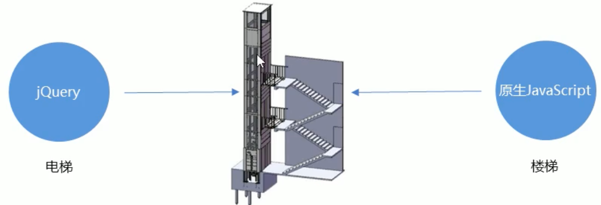
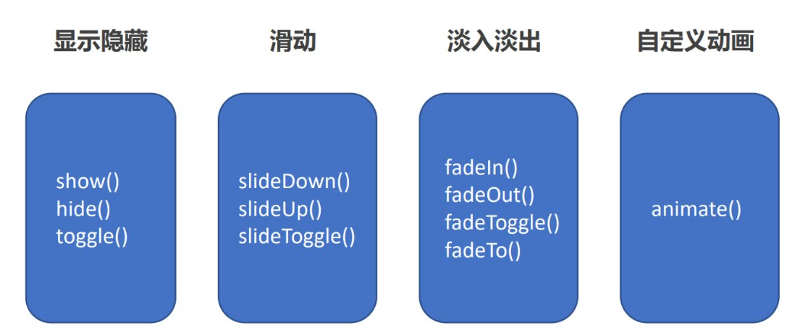
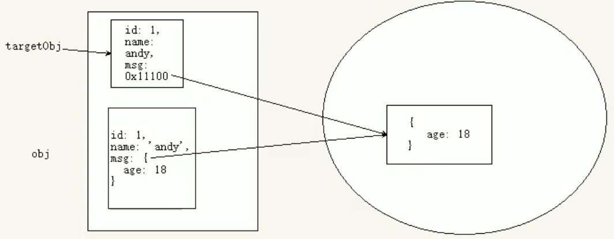
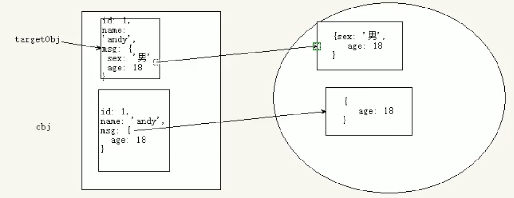

# jQuery

## 概述和基本使用

### JavaScript 库

**仓库：可以把很多东西放到这个仓库里面。找东西只需要到仓库里面查找到就可以了。**

**JavaScript库：即 library，是一个封装好的特定的集合（方法和函数）。从封装一大堆函数的角度理解库，就是在这个库中，封装了很多预先定义好的函数在里面，比如动画 animate、hide、show 比如获取元素等。**

**简单理解：就是一个JS文件，里面对我们原生js代码进行了封装，存放到里面。这样我们可以快速高效的使用这些封装好的功能了。**

**比如 jQuery，就是为了快速方便的操作 DOM，里面基本都是函数（方法）。**

**常见的 JavaScript 库**

- jQuery
- Prototype
- YUI
- Dojo
- Ext JS
- 移动端的 zepto

这些库都是对原生 JavaScript 的封装，内部都是用 JavaScript 实现的。


### jQuery

**jQuery 是一个快速、简洁的 JavaScript 库，其设计的宗旨是 "write Less, Do More"，即倡导写更少的代码，做更多的事情。**

j 就是 JavaScript；Query 查询；意思就是查询 js，把 js 中的 DOM 操作做了封装，我们可以快速的查询使用里面的功能。

**jQuery 封装了 JavaScript 常用的功能代码，优化了 DOM 操作、事件处理、动画设计和 Ajax 交互。**

**学习 jQuery 本质：就是学习调用这些函数（方法）。**

**jQuery 出现的目的是加快前端人员的开发速度，我们可以非常方便的调用和使用它，从而提高开发效率。**




> ### 优点
>
> - 轻量级。核心文件才几十 kb，不会影响页面加载速度
>
> - 跨浏览器兼容。基本兼容了现在主流的浏览器
>
> - 链式编程、隐式迭代
>
> - 对事件、样式、动画支持，大大简化了 DOM 操作
>
> - 支持插件扩展开发。有着丰富的第三方的插件，例如：树形菜单、日期控件、轮播图等
>
> - 免费、开源


### jQuery 入口函数

```javascript
# 方式 1
$(function () {
  // 此处是页面 DOM 加载完成的入口
  ...
});
  
# 方式 2
$(document).ready(function(){
	// 此处是页面 DOM 加载完成的入口
  ...
});
```

- 等着 DOM 结构渲染完毕即可执行内部代码，不必等到所有外部资源加载完成，jQuery 帮我们完成了封装。
- 相当于原生 js 中的 DOMContentLoaded。
- 不同于原生 js 中的 load 事件是等页面文档、外部的 js 文件、css 文件、图片加载完毕才执行内部代码。


### jQuery 的顶级对象 $

$ 是 jQuery 的别称，在代码中可以使用 jQuery 代替 $，但一般为了方便，通常都直接使用 $。

$ 是 jQuery 的顶级对象，相当于原生 JavaScript 中的 window。把元素利用 $ 包装成 jQuery 对象，就可以调用 jQuery 的方法。


### jQuery 对象和 DOM 对象

- **用原生 JS 获取来的对象就是 DOM 对象**
- **jQuery 方法获取的元素就是 jQuery 对象。**
  - **jQuery 对象本质是：利用 $ 对 DOM 对象包装后产生的对象（伪数组形式存储）。**

**注意：jQuery 对象只能使用 jQuery 方法，DOM对象则使用原生的 JavaScirpt 属性和方法**


**DOM 对象与 jQuery 对象之间是可以相互转换的。**

**因为原生 js 比 jQuery 更大，原生的一些属性和方法 jQuery 没有给我们封装.要想使用这些属性和方法需要把 jQuery 对象转换为 DOM 对象才能使用。**

```javascript
1.DOM 对象转换为 jQuery 对象：$（DOM 对象）
$('div')

2.jQuery 对象转换为 DOM 对象（两种方式）
index 是索引号
$('div')[index]
$('div').get(index) index 是索引号
```


## jQuery 常用 API

### jQuery 选择器

#### 基础选择器

原生 JS 获取元素方式很多，很杂，而且兼容性情况不一致，因此 jQuery 给我们做了封装，使获取元素统一标准。

```javascript
$("选择器")	// 里面选择器直接写 CSS 选择器即可，但是要加引号
```

| 名称              | 用法                  | 描述                       |
| ----------------- | --------------------- | -------------------------- |
| ID选择器          | $("#id")              | 获取指定 ID 的元素         |
| 全选选择器        | $("*")                | 匹配所有元素               |
| 类选择器          | $(".class")           | 获取同一类 class 的元素    |
| 标签选择器        | $("div")              | 获取同一类标签的所有元素   |
| 并集选择器        | $("div,p,li")         | 选取多个元素               |
| 交集选择器        | $("li.current")       | 交集元素                   |
| 拓展 - 选中选择器 | $('checkbox:checked') | 返回有多少个复选框被选中了 |

#### 层级选择器

| 名称       | 用法        | 描述                                                         |
| ---------- | ----------- | ------------------------------------------------------------ |
| 子代选择器 | $("ul>li"); | 使用 > 号，获取亲儿子层级的元素；注意，并不会获取孙子层级的元素 |
| 后代选择器 | $("ul li"); | 使用空格，代表后代选择器，获取 ul 下的所有 li 元素，包括孙子等 |

#### 筛选选择器

| 语法       | 用法          | 描述                                                         |
| ---------- | ------------- | ------------------------------------------------------------ |
| :first     | $('li:first') | 获取第一个 li 元素                                           |
| :last      | $('li:last')  | 获取最后一个 li 元素                                         |
| :eq(index) | $("li:eq(2)") | 获取到的 li 元素中，选择索引号为 2 的元素，索引号 index 从 0 开始。 |
| :odd       | $("li:odd")   | 获取到的 li 元素中，选择索引号为奇数的元素                   |
| :even      | $("li:even")  | 获取到的 li 元素中，选择索引号为偶数的元素                   |


#### 筛选方法

| 语法               | 用法                           | 说明                                                    |
| ------------------ | ------------------------------ | ------------------------------------------------------- |
| parent()           | $("li").parent();              | 查找父级                                                |
| parents()          | $('div').parents('选择器')     | 返回指定的祖先元素                                      |
| children(selector) | $("ul").children("li")         | 相当于 $("ul>li”)，最近一级（亲儿子)                    |
| find(selector)     | $("ul").find("li");            | 相当于 $("ul li")，后代选择器                           |
| siblings(selector) | $(".first").siblings("li");    | 查找兄弟节点，不包括自己本身                            |
| nextAll([expr])    | $(".first").nextAll()          | 查找当前元素之后所有的同辈元素                          |
| prevtAll([expr])   | $(".last").prevAll()           | 查找当前元素之前所有的同辈元素                          |
| eq(index)          | $("li").eq(2);                 | 相当于 $("li:eq(2)")  index 从 0 开始                   |
| hasClass(class)    | $('div').hasClass("protected") | 检查当前的元素是否含有某个特定的类，如果有，则返回 true |


#### jQuery 隐式迭代

**遍历内部 DOM元素（伪数组形式存储）的过程就叫做隐式迭代。**

**简单理解：给匹配到的所有元素进行循环遍历，执行相应的方法，而不用我们再进行循环，简化我们的操作，方便我们调用。**

#### jQuery 排他思想

想要多选一的效果，排他思想：当前元素设置样式，其余的兄弟元素清除样式。

```javascript
$(this).css( "color"," red" );
$(this).siblings().css( "color" ,"");

// 链式编程
$(this).css( "color"," red" ).siblings().css( "color" ,"");
```


#### 小知识

```javascript
$(this).index()			// jQuery 得到当前元素索引号 
```


### jQuery 样式操作

#### 操作 css 方法

**jQuery 可以使用 css 方法来修改简单元素样式；也可以操作类，修改多个样式。**

```javascript
1.参数只写属性名，则是返回属性值
$(this).css("color");

2.参数是属性名，属性值，逗号分隔，是设置一组样式，属性必须加引号，值如果是数字可以不用跟单位和引号
$(this).css("color","red");

3.参数可以是对象形式，方便设置多组样式。属性名和属性值用冒号隔开，属性可以不用加引号，
$(this).css({ "color":"white","font-size":"20px"});
```


#### 设置类样式方法

**用等同于以前的 classList，可以操作类样式，注意操作类里面的参数不要加点。**

```javascript
1.添加类
$("div").addClass("current");

2.移除类
$("div").removeClass("current");

3.切换类
$("div").toggleClass("current");
```


### jQuery 属性操作

#### 设置或获取元素固有属性值 prop()

```javascript
所谓元素固有属性就是元素本身自带的属性，比如 <a> 元素里面的 href，比如 <input> 元素里面的 type。
获取属性语法
prop（"属性"）

设置属性语法
prop("属性"，"属性值")
```

#### 设置或获取元素自定义属性值 attr()

```javascript
用户自己给元素添加的属性，我们称为自定义属性。比如给 div 添加 index="1"。
获取属性语法
attr("属性") // 类似原生 getAttribute()

设置属性语法
attr("属性"，"属性值") // 类似原生 setAttribute()
// 该方法也可以获取 H5 自定义属性
```

#### 数据缓存 data()

```javascript
data() 方法可以在指定的元素上存取数据，并不会修改 DOM 元素结构。一旦页面刷新，之前存放的数据都将被移除。
附加数据语法
data("name"，"value")	// 向被选元素附加数据

获取数据语法
date("name")	// 向被选元素获取数据
同时，还可以读取 HTML5 自定义属性 data-index，得到的是数字型
```


### jQuery 内容文本值

主要针对元素的内容还有表单的值操作。

```javascript
普通元素内容 html() 	// 相当于原生 innerHTML
html() // 获取元素的内容
html（"内容"）//设置元素的内容


普通元素文本内容 text()		// 相当与原生 innerText
text() //	获取元素的文本内容
text("文本内容")	// 设置元素的文本内容


表单的值 val() 		// 相当于原生 value
val() // 获取表单的值
val("内容") // 设置表单的值
```


### jQuery 元素操作

#### 遍历元素

**jQuery 隐式迭代是对同一类元素做了同样的操作。如果想要给同一类元素做不同操作，就需要用到遍历。**

```javascript
$("div").each(function (index, domEle) { xxx; })

- each() 方法遍历匹配的每一个元素。主要用 DOM 处理。
- each 每一个里面的回调函数有 2 个参数：index 是每个元素的索引号；demEle 是每个 DOM 元素对象，不是 jquery 对象，所以要想使用 		jquery 方法，需要给这个 dom 元素转换为 jquery 对象 $(domEle)


$.each(object, function (index, element) { xxx; })
- $.each() 方法可用于遍历任何对象。主要用于数据处理，比如数组，对象
- 里面的函数有 2 个参数：index 是每个元素的索引号；element 遍历内容
```

#### 创建元素

```javascript
$("<li></li>");
let li = $("<li></li>"); 	// 动态的创建了一个 <li>
```

#### 添加元素

- **内部添加**

  内部添加元素，生成之后，它们是父子关系。

  ```javascript
  element.append("内容")			// 把内容放入匹配元素内部最后面，类似原生 appendChild。
  element.prepend("内容")			// 把内容放入匹配元素内部最前面。
  ```

- **外部添加**

  外部添加元素，生成之后，他们是兄弟关系。

  ```javascript
  element.after("内容")			// 把内容放入目标元素后面
  element.before("内容") 		// 把内容放入目标元素前面
  ```

#### 删除元素

```javascript
element.remove()		   // 删除匹配的元素（本身）
element.empty()	 		 	 // 删除匹配的元素集合中所有的子节点
element.html("")			 // 清空匹配的元素内容
注意：remove 删除元素本身。empt() 和 html("") 作用等价，都可以删除元素里面的内容，只不过 html 还可以设置内容。
```


### jQuery 尺寸、位置操作

#### jQuery 尺寸

| 语法                                 | 用法                                                |
| ------------------------------------ | --------------------------------------------------- |
| width()  / height()                  | 取得匹配元素宽度和高度值只算 width / height         |
| innerWidth() / innerHieght()         | 取得匹配元素宽度和高度值包含 padding                |
| outerWidth() / outerHeight()         | 取得匹配元素宽度和高度值包含 padding、border        |
| outerWidth(true) / outerHeight(true) | 取得匹配元素宽度和高度值包含 padding、borde、margin |

- **以上参数为空，则是获取相应值，返回的是数字型。**

- **如果参数为数字，则是修改相应值。**

- **参数可以不必写单位。**


#### jQuery 位置

- **offset() 设置或获取元素偏移**

  ```javascript
  ① offset() 方法设置或返回被选元素相对于文档的偏移坐标，跟父级没有关系。
  ② 该方法有 2 个属性 left、top。
  		- offset().top 用于获取距离文档顶部的距离，
  		- offset().left 用于获取距离文档左侧的距离。
  ③ 可以设置元素的偏移：offset({top: 10, left: 30});
  ```

- **position() 获取元素偏移**

  ```javascript
  ① position() 方法用于返回被选元素相对于带有定位的父级偏移坐标，如果父级都没有定位，则以文档为准。
  ② 该方法有 2 个属性 left、top。
  		- position().top 用于获取距离定位父级顶部的距离
  		- position().left 用于获取距离定位父级左侧的距离。
  ③ 该方法只能获取。
  ```

- **scrollTop() / scrollLeft() 设置或获取元素被卷去的头部和左侧**

  ```javascript
  ① scrolITop() 方法设置或返回被选元素被卷去的头部。
  ② 不跟参数是获取，参数为不带单位的数字则是设置被卷去的头部。
  ```


### jQuery 效果

jQuery 给我们封装了很多动画效果，最为常见的如下：




#### 显示隐藏

```javascript
// 显示语法
show([speed,[easing],[fn]])
显示参数
- 参数都可以省略，无动画直接显示。
- speed：三种预定速度之一的字符串（"slow"，"normal"，or "fast"）或表示动画时长的毫秒数值（如：1000）。
- easing:(Optional) 用来指定切换效果，默认是"swing"，可用参数 "linear"。
- fn：回调函数，在动画完成时执行的函数，每个元素执行一次。

// 隐藏语法
hide([speed,[easing],[fn]])
隐藏参数
- 参数都可以省略，无动画直接显示。
- speed：三种预定速度之一的字符串（"slow"，"normal"，or "fast"）或表示动画时长的毫秒数值（如：1000）。
- easing:(Optional) 用来指定切换效果，默认是 "swing"，可用参数 "linear"。
- fn：回调函数，在动画完成时执行的函数，每个元素执行一次。

// 切换语法
toggle([speed, [easing], [fn]])
切换参数
- 参数都可以省略，无动画直接显示。
- speed：三种预定速度之一的字符串（"slow"，"normal"，or "fast"）或表示动画时长的毫秒数值（如：1000）。
- easing:(Optional) 用来指定切换效果，默认是 "swing"，可用参数 "linear"。
- fn：回调函数，在动画完成时执行的函数，每个元素执行一次。
```


#### 滑动

```javascript
// 下滑效果
slideDown([speed,[easing],[fn]])
下滑参数
- 参数都可以省略。
- speed:三种预定速度之一的字符串（"slow"，"normal"，or "fast"）或表示动画时长的毫秒数值（如：1000）。
- easing:(Optional) 用来指定切换效果，默认是 "swing"，可用参数 "linear"。
- fn：回调函数，在动画完成时执行的函数，每个元素执行一次。

// 上滑效果
slideUp([speed,[easing], [fn]])
上滑参数
- 参数都可以省略。
- speed：三种预定速度之一的字符串（"slow"，"normal"，or "fast"）或表示动画时长的毫秒数值（如：1000）。
- easing:(Optional) 用来指定切换效果，默认是 "swing"，可用参数 "linear"。
- fn：回调函数，在动画完成时执行的函数，每个元素执行一次。

// 滑动切换效果
slideToggle([speed,[easing],[fn]])
滑动切换参数
- 参数都可以省略。
- speed: 三种预定速度之一的字符串（"slow"，"normal"，or "fast"）或表示动画时长的毫秒数值（如：1000）。
- easing:(Optional) 用来指定切换效果，默认是 "swing"，可用参数 "linear"。
- fn：回调函数，在动画完成时执行的函数，每个元素执行一次。
```

**事件切换**

```javascript
hover([over,] out)
- over: 鼠标移到元素上要触发的函数（相当于 mouseenter）
- out: 鼠标移出元素要触发的函数(相当于 mouseleave)
- 如果只写一个函数，则鼠标经过和离开都会触发它
```

**动画或效果队列**

```javascript
动画或者效果一旦触发就会执行，如果多次触发，就造成多个动画或者效果排队执行。

stop()	// 停止排队
- stop() 方法用于停止动画或效果。
- 注意：stop() 写到动画或者效果的前面，相当于停止结束上一次的动画。
```

**例子**

```javascript
// 鼠标经过
$(".nav>li").mouseover(function() {
	$(this).children("ul").slideDown(200);
});
// 鼠标离开
$(".nav>li").mouseout(function(){
	$(this).children("ul").slideUp(200);
});

// ----------------------- 使用事件切换 -------------------------
$(".nav>li").hover(function(){
  $(this).children("ul").slideDown(200);
}, function(){
  $(this).children("ul").slideUp(200);
})

// 再优化 - 如果只写一个函数，则鼠标经过和离开都会触发它
$(".nav>li").hover(function(){
  $(this).children("ul").slideToggle(200);
})

// ----------------------- 动画效果排队问题解决 -------------------------
$(".nav>li").hover(function(){
  $(this).children("ul").stop().slideToggle(200); // 结束上一次的动画后执行当前动画，保证只会执行一次
})
```


#### 淡入淡出

```javascript
// 淡入效果
fadeIn([speed, [easing], [fn]])
淡入效果参数
- 参数都可以省略。
- speed: 三种预定速度之一的字符串（"slow"，"normal"，or "fast"）或表示动画时长的毫秒数值（如：1000）。
- easing: (Optional) 用来指定切换效果，默认是 "swing"，可用参数 "linear"。
- fn：回调函数，在动画完成时执行的函数，每个元素执行一次。

// 淡出效果
fadeOut([speed,[easing],[fn]])
淡出效果参数
- 参数都可以省略。
- speed: 三种预定速度之一的字符串（"slow"，"normal"，or"fast"）或表示动画时长的毫秒数值（如：1000）。
- easing: (Optional) 用来指定切换效果，默认是 "swing"，可用参数"linear”。
- fn：回调函数，在动画完成时执行的函数，每个元素执行一次。

// 淡入淡出切换效果
fadeToggle([speed,[easing], [fn]])
淡入淡出切换效果参数
- 参数都可以省略。
- speed: 三种预定速度之一的字符串（"slow"，"normal"，or "fast"）或表示动画时长的毫秒数值（如：1000）。
- easing: (Optional) 用来指定切换效果，默认是 "swing"，可用参数 "linear"。
- fn：回调函数，在动画完成时执行的函数，每个元素执行一次。

// 渐进方式调整到指定的不透明度
fadeTo([[speed], opacity, [easing], [fn]])
效果参数
- opacity 透明度必须写，取值 0～1 之间。
- speed: 三种预定速度之一的字符串（"slow"，"normal"，or "fast"）或表示动画时长的毫秒数值（如：1000）。必须写
- easing: (Optional) 用来指定切换效果，默认是 "swing"，可用参数 "linear"。
- fn：回调函数，在动画完成时执行的函数，每个元素执行一次。
```


#### 自定义动画

```javascript
animate(params, [speed], [easing], [fn])
参数
- params：想要更改的样式属性，以对象形式传递，必须写。属性名可以不用带引号，如果是复合属性则需要采取驼峰命名法 borderLeft。其余参数都可以省略。
- speed: 三种预定速度之一的字符串 ("slow"，"normal"，or "fast") 或表示动画时长的毫秒数值（如：1000）。
- easing: (Optional) 用来指定切换效果，默认是 "swing"，可用参数 "linear"。
- fn：回调函数，在动画完成时执行的函数，每个元素执行一次。
注意：只有元素才能做动画
```


### jQuery 对象拷贝

**如果想要把某个对象拷贝（合并）给另外一个对象使用，此时可以使用 $.extend() 方法**

```javascript
语法：
$.extend([deep], target, objectl, [objectN])
	- deep: 如果设为 true 为深拷贝，默认为 false 浅拷贝
	- target: 要拷贝的目标对象
	- object1: 待拷贝到第一个对象的对象。
	- objectN: 待拷贝到第 N 个对象的对象。
```

- **浅拷贝**

  **浅拷贝是把被拷贝的对象复杂数据类型中的地址拷贝给目标对象，修改目标对象会影响被拷贝对象。**

  

- **深拷贝**

  **深拷贝，前面加 true，完全克隆（拷贝的对象，而不是地址），修改目标对象不会影响被拷贝对象。**

  


### jQuery 多库共存

问题概述：jQuery 使用 $ 作为标示符，随着 jQuery 的流行，其他 js 库也会用这 $ 作为标识符，这样一起使用会引起冲突。

客观需求：需要一个解决方案，让 jQuery 和其他的 js 库不存在冲突，可以同时存在，这就叫做多库共存。

jQuery 解决方案：

- 把里面的$符号统一改为 jQuery。比如 jQuery("div")
- jQuery 变量规定新的名称：$.noConflict()     var xx = $.noConflict();


### jQuery 插件

**jQuery 功能比较有限，想要更复杂的特效效果，可以借助于 jQuery 插件完成。**

**注意：这些插件也是依赖于 jQuery 来完成的，所以必须要先引入 jQuery 文件，因此也称为 jQuery 插件。**

**jQuery 插件常用的网站：**

- jQuery 插件库 http://www.jq22.com/
- jQuery 之家 http://www.htmleaf.com/

**jQuery 插件使用步骤：**

- 引入相关文件。 ( jQuery 文件和插件文件）
- 复制相关 html、css、js（调用插件）。

**jQuery 插件演示：**

- 瀑布流

- 图片懒加载（图片使用延迟加载在可提高网页下载速度。它也能帮助减轻服务器负载）当我们页面滑动到可视区域，再显示图片。我们使用 jquery 插件库EasyLazyload。注意，此时的 js 引入文件和 js 调用必须写到 DOM 元素（图片）最后面

- 全屏滚动 (fullpage.js)

  gitHub: https://github.com/alvarotrigo/fullPage.js

  中文翻译网站：http://www.dowebok.com/demo/2014/77/

**bootstrap JS 插件：**

bootstrap 框架也是依赖于 jQuery 开发的，因此里面的js插件使用，也必须引入 jQuery 文件。


## jQuery 事件

### jQuery 事件注册

**单个事件注册**

```javascript
语法：
	element.事件(function(){})
		- $("div").click(function(){事件处理程序})
  	- 其他事件和原生基本一致。比如 mouseover、mouseout、blur、focus、change、keydown、keyup、resize、scroll 等
```


### jQuery 事件处理

**事件处理 on() 绑定事件，on() 方法在匹配元素上绑定一个或多个事件的事件处理函数**

```javascript
语法：
	element.on(events, [selector], fn) 
		- events:一个或多个用空格分隔的事件类型，如 "click" 或 "keydown"。
		- selector: 元素的子元素选择器。
		- fn: 回调函数即绑定在元素身上的侦听函数。

// 优点 1 		‼️
可以绑定多个事件，多个处理事件处理程序。
$("div").on({
  mouseover: function(){},
  mouseout: function(){},
  click: function(){}
});
如果事件处理程序相同
$("div").on("mouseover mouseout", function() {
	$(this).toggleClass("current");
});

// 优点 2 		‼️
可以事件委派操作。事件委派的定义就是把原来加给子元素身上的事件绑定在父元素身上，就是把事件委派给父元素。
在此之前有bind()、live()、delegate() 等方法来处理事件绑定或者事件委派，最新版本的请用 on 替代他们。
$('ul').on('click', 'li', function() {
  alert ('hello world!');
});


// 优点 3 		‼️
动态创建的元素，click() 没有办法绑定事件，on() 可以给动态生成的元素绑定事件
$("div").on("click", "p", function() {
	alert（"俺可以给动态生成的元素绑定事件")
});
$("div").append($("<p>我是动态创建的p</p>"));
```


**off() 解绑事件，off() 方法可以移除通过 on() 方法添加的事件处理程序。**

```javascript
$("p").off()									// 解绑 p 元素所有事件处理程序
$("p").off("c1ick")						// 解绑 p 元素上面的点击事件后面的 foo 是侦听函数名
$("ul").off("click","li");		// 解绑事件委托


如果有的事件只想触发一次，可以使用 one() 来绑定事件。			‼️
// 例子
$("div").one("click", "p", function() {
	alert（"俺可以给动态生成的元素绑定事件")
});
```


**自动触发事件 trigger()**

有些事件希望自动触发，比如轮播图自动播放功能跟点击右侧按钮一致。可以利用定时器自动触发右侧按钮点击事件，不必鼠标点击触发。

```javascript
element.click()									// 第一种简写形式
element.trigger("type")					// 第二种自动触发模式

  $("p").on("click", function() {
    alert ("hi ~");
  })；
  $("p").trigger("click");				// 此时自动触发点击事件，不需要鼠标点击

element.triggerHandler(type) 		// 第三种自动触发模式
triggerHandler 模式不会触发元素的默认行为，这是和前面两种的区别。
```


### jQuery 事件对象

事件被触发，就会有事件对象的产生。

```javascript
element.on (events, [selector],function(event) {})
  阻止默认行为:	event.preventDefault()	或者	return false
  阻止冒泡:	event.stopPropagation()
```

