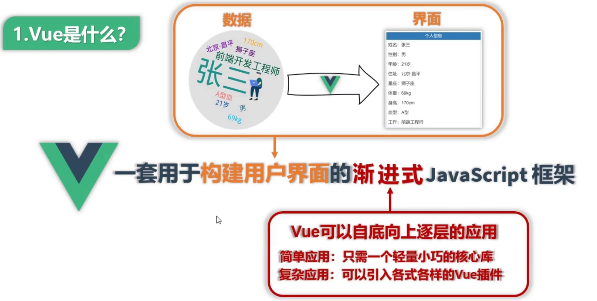

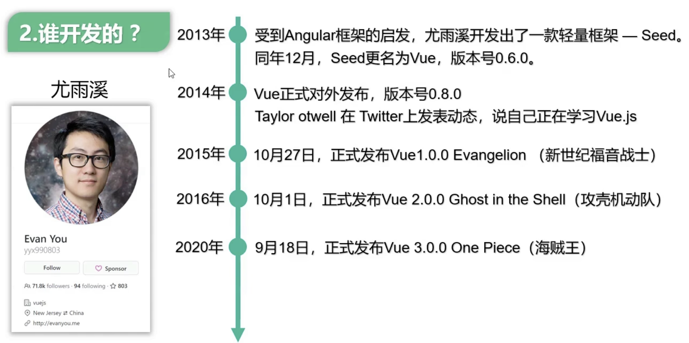

### Vue 的特点

- **采用组件化模式，提高代码复用率、且让代码更好维护**

  

  

- **声明式编码，让编码人员无需直接操作 DOM，提高开发效率**

  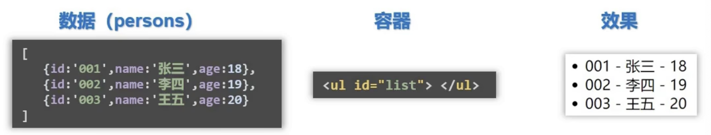

  

  

- **使用虚拟 DOM + 优秀的 Diff 算法，尽量复用 DOM 节点。**

  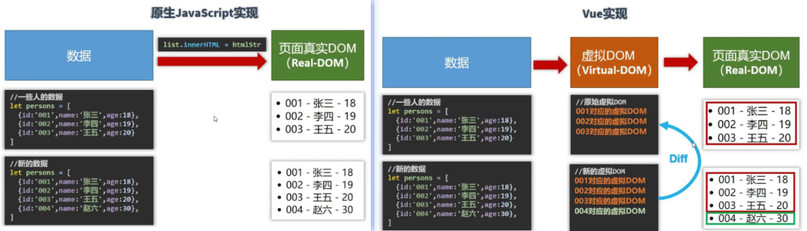

### MVVM 模型

**M：模型（Model）	——  	对应 data 中的数据**

**V：视图（View）——	模板**

**VM：视图模型（ViewModel）——	Vue 实例对象**

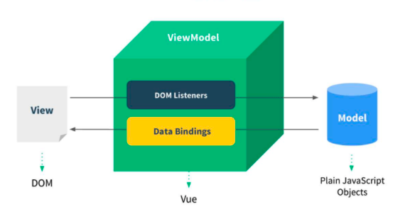

### 数据代理

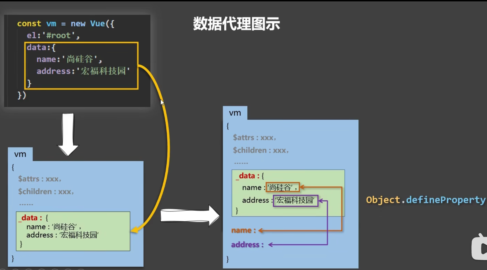

### key 的原理

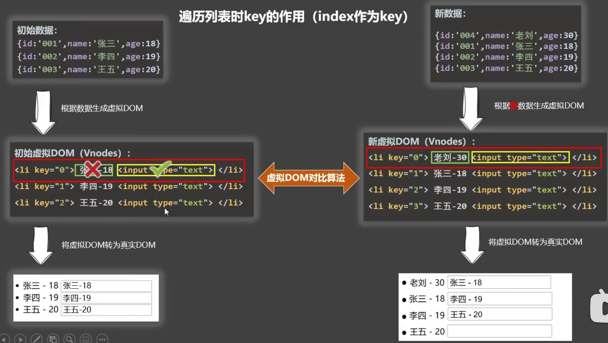

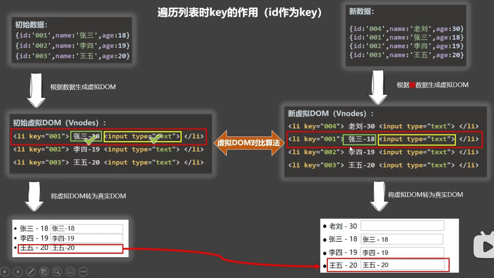

### CooKie 

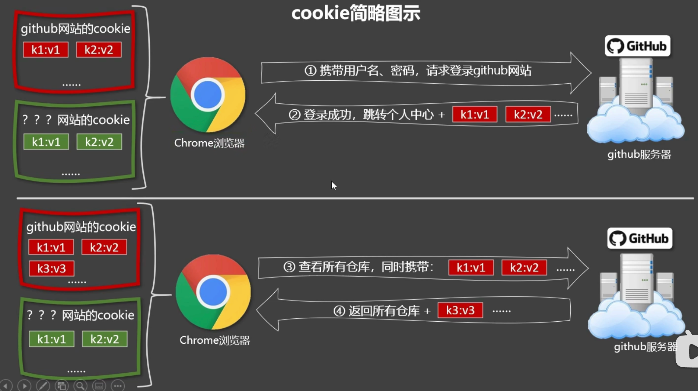

### 生命周期

### 组件

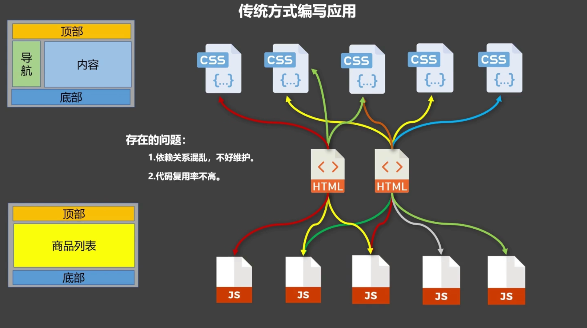

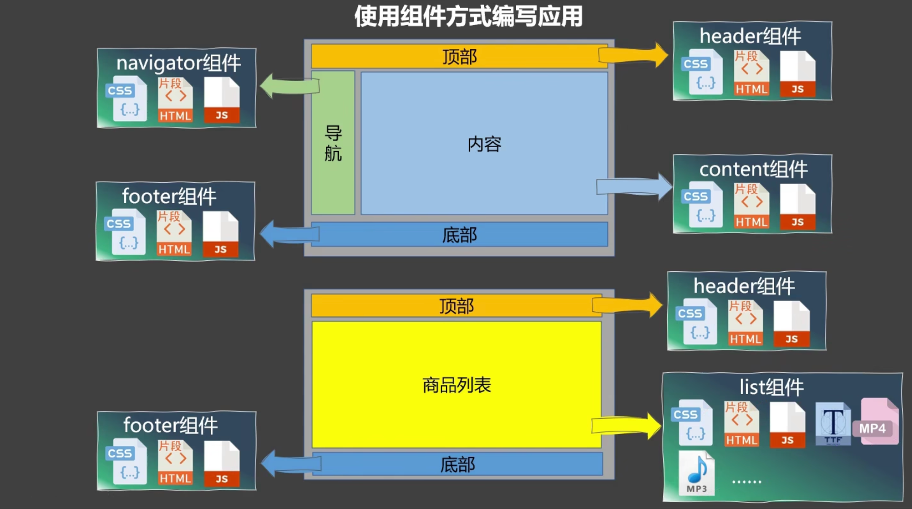

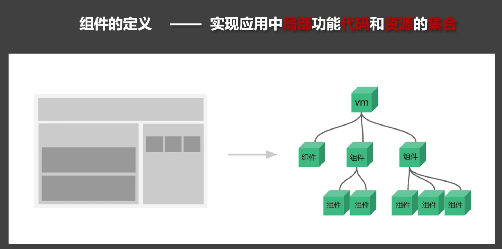

**Vue 与 VueComponent 的关系**

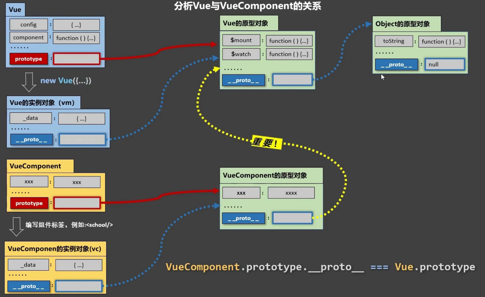

### 多组件共享数据

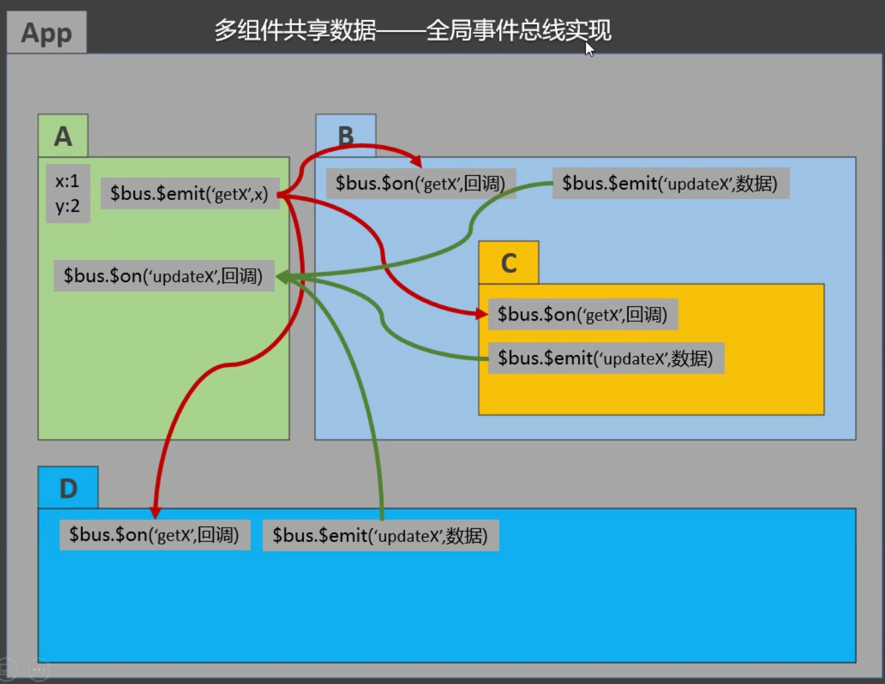

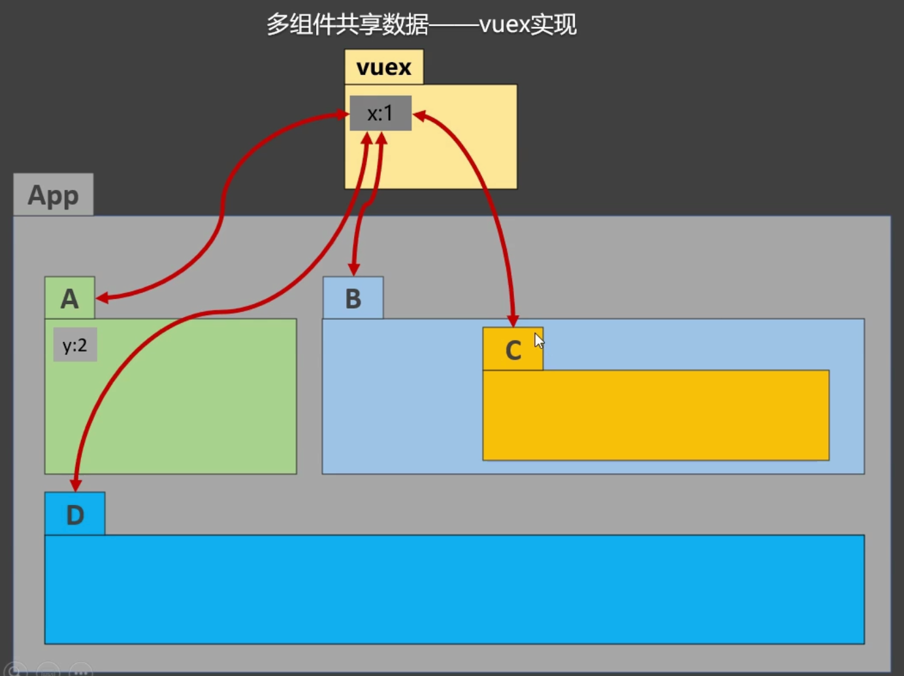

### VueX
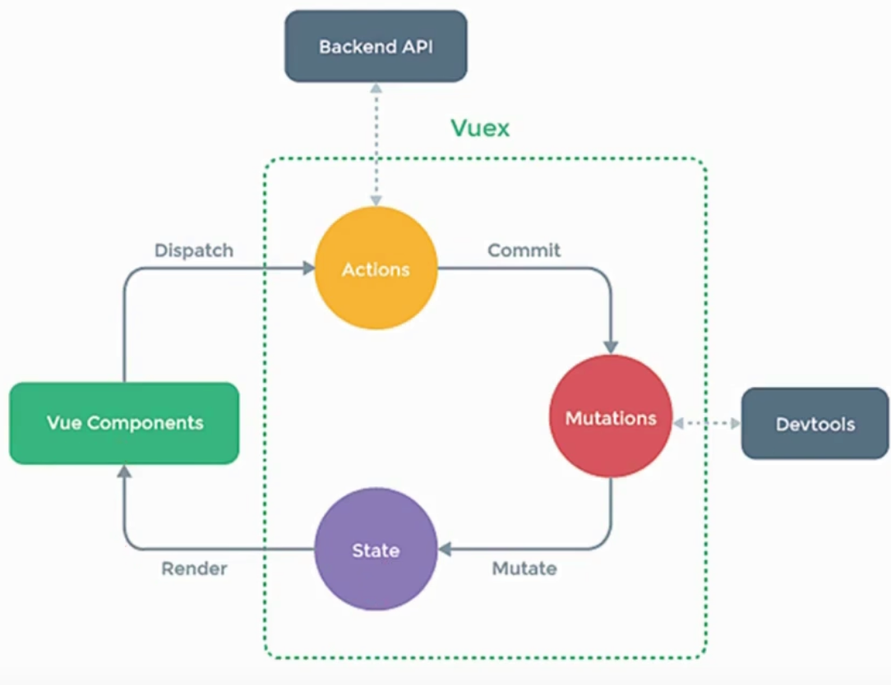

### 路由
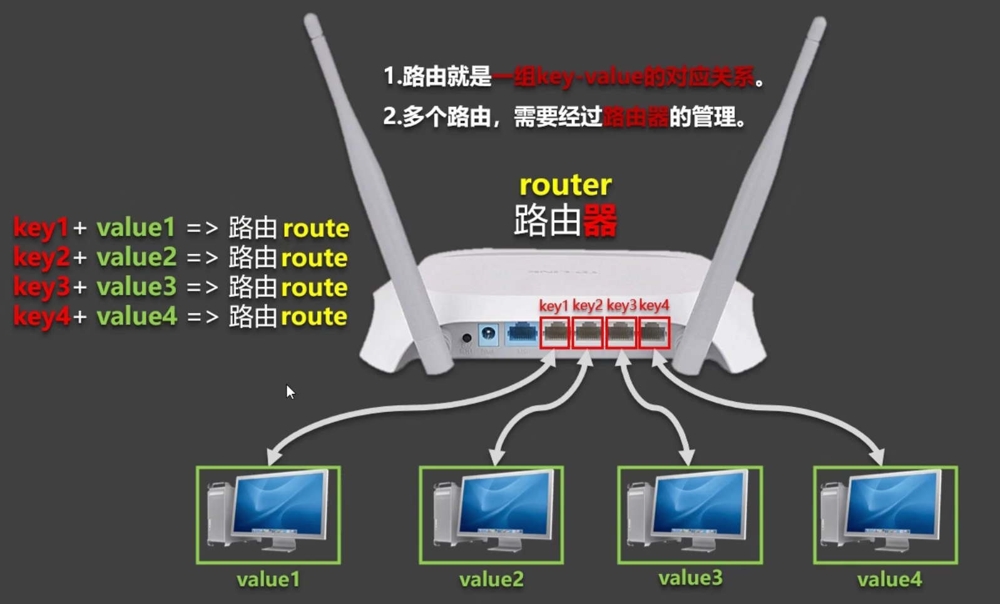

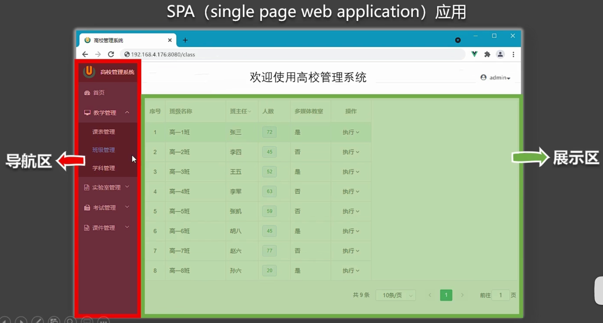

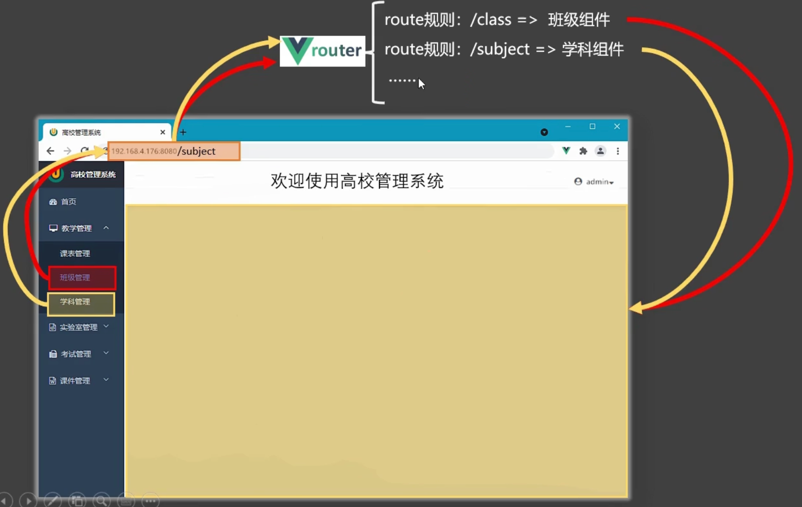